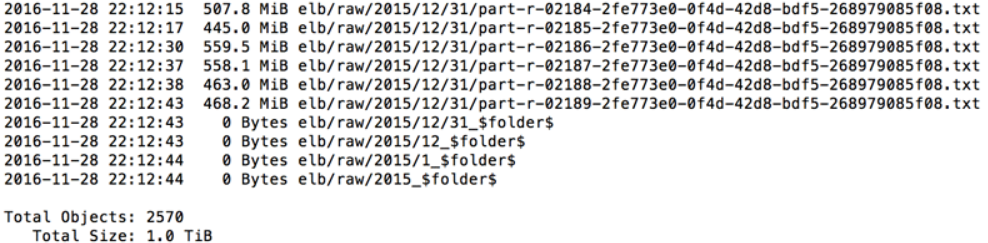
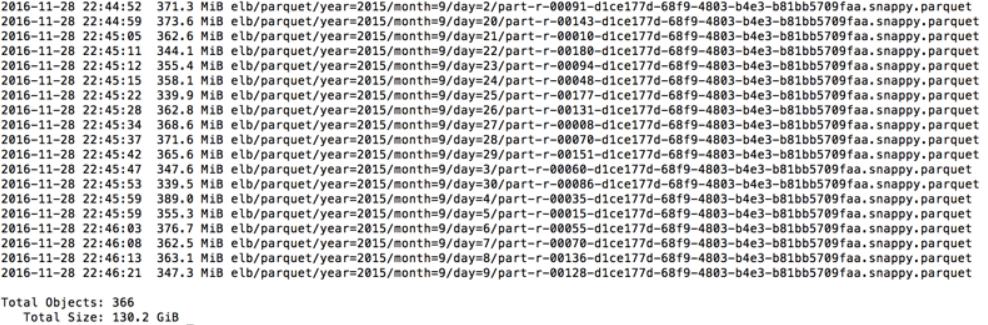
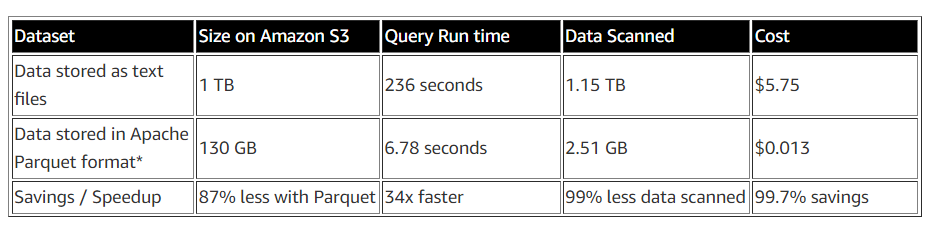

# Athena

## Analyzing Data in S3 using Amazon Athena

Source: [https://aws.amazon.com/blogs/big-data/analyzing-data-in-s3-using-amazon-athena/](https://aws.amazon.com/blogs/big-data/analyzing-data-in-s3-using-amazon-athena/)

What's Athena?
- **Interactive query service** that makes it easy to **analyze data directly from Amazon S3** using **standard SQL**
- **serverless**, so no infra setup or management needed, can **start analyzing data immediately**
- **loading data into Athena, ETL not necessary**
- uses 
    - **Presto**
        - distributed SQL engine to run queries
    - **Hive**
        - create, drop and alter tables and partitions

What can we do with Athena?
- Write **Hive-compliant DDL statements** and **ANSI SQL statements** in the Athena query editor. 
- You can also use **complex joins, window functions and complex datatypes** on Athena. 
- Uses an approach known as **schema-on-read**, which allows you to **project your schema on to your data at the time you execute a query**. This **eliminates the need for any data loading or ETL.**

[Athena Pricing](https://aws.amazon.com/athena/pricing/)
- Charges you by the **amount of data scanned per query**.
- Save on costs and get better performance if you **partition the data, compress data, or convert it to columnar formats such as Apache Parquet**

### Tutorial

#### Intro

Use Athena on logs from Elastic Load Balancers, generated as text files in a [pre-defined format](https://docs.aws.amazon.com/elasticloadbalancing/latest/application/load-balancer-access-logs.html#access-log-entry-format) 
- Create a table
- partition the data in a format used by Athena
- convert it to Parquet
- compare query performance

For this example, the raw logs are stored on Amazon S3 in the following format. There is a separate prefix for year, month, and date, with 2570 objects and 1 TB of data.



#### [Creating Table](https://docs.aws.amazon.com/athena/latest/ug/creating-tables.html)

We can create tables by writing the **DDL statement** on the query editor, or by using the wizard or JDBC driver.

```SQL
CREATE EXTERNAL TABLE IF NOT EXISTS elb_logs_raw_native (
  request_timestamp string, 
  elb_name string, 
  request_ip string, 
  request_port int, 
  backend_ip string, 
  backend_port int, 
  request_processing_time double, 
  backend_processing_time double, 
  client_response_time double, 
  elb_response_code string, 
  backend_response_code string, 
  received_bytes bigint, 
  sent_bytes bigint, 
  request_verb string, 
  url string, 
  protocol string, 
  user_agent string, 
  ssl_cipher string, 
  ssl_protocol string ) 
ROW FORMAT SERDE 'org.apache.hadoop.hive.serde2.RegexSerDe'
WITH SERDEPROPERTIES (
         'serialization.format' = '1',
         'input.regex' = '([^ ]*) ([^ ]*) ([^ ]*):([0-9]*) ([^ ]*)[:\-]([0-9]*) ([-.0-9]*) ([-.0-9]*) ([-.0-9]*) (|[-0-9]*) (-|[-0-9]*) ([-0-9]*) ([-0-9]*) \\\"([^ ]*) ([^ ]*) (- |[^ ]*)\\\" (\"[^\"]*\") ([A-Z0-9-]+) ([A-Za-z0-9.-]*)$'
         ) 
LOCATION 's3://athena-examples/elb/raw/';
```

Note that table `elb_logs_raw_native` points towards the prefix `s3://athena-examples/elb/raw/`. Therefore, **when we add more data under the prefix, e.g., a new month,s data, the table automatically grows.**

The first time we create a table, we'll have to specify a location to save results: [https://docs.aws.amazon.com/athena/latest/ug/querying.html](https://docs.aws.amazon.com/athena/latest/ug/querying.html)

We can specify any **regular expression**, which **tells Athena how to interpret each row of the text**.

We can also use Athena to query other data formats, such as JSON. 

**A regular expression is not required if we're processing CSV, TSV or JSON formats.**

After the statement succeeds, the table and the schema appears in the **data catalog** (left pane).  

Athena has an **internal data catalog used to store information about the tables, databases, and partitions**. It's **highly durable and requires no management**. We can interact with the catalog using DDL queries or through the console.

Let's run another query:

```SQL
SELECT * 
  FROM elb_logs_raw_native 
 WHERE elb_response_code = '200' 
 LIMIT 100;
```

We now have the ability to query all the logs, without the need to set up any infrastructure or ETL.

#### Partitioning Data

Customers often store their data in time-series formats and need to query specific items within a day, month, or year. 
> - Without a partition, Athena scans the entire table while executing queries. 
> - With partitioning, you can restrict Athena to specific partitions, thus reducing the amount of data scanned, lowering costs, and improving performance.

Athena uses Apache Hive–style [data partitioning](https://docs.aws.amazon.com/athena/latest/ug/partitions.html). We can partition our data across multiple dimensions ― e.g., month, week, day, hour, or customer ID ― or all of them together.

> To use partitions, we first need to change our schema definition to include partitions, then load the partition metadata in Athena. Use the same CREATE TABLE statement but **with partitioning enabled**.

```SQL
CREATE EXTERNAL TABLE IF NOT EXISTS elb_logs_raw_native_part (
  request_timestamp string, 
  elb_name string, 
  request_ip string, 
  request_port int, 
  backend_ip string, 
  backend_port int, 
  request_processing_time double, 
  backend_processing_time double, 
  client_response_time double, 
  elb_response_code string, 
  backend_response_code string, 
  received_bytes bigint, 
  sent_bytes bigint, 
  request_verb string, 
  url string, 
  protocol string, 
  user_agent string, 
  ssl_cipher string, 
  ssl_protocol string ) 
PARTITIONED BY(year string, month string, day string)
ROW FORMAT SERDE 'org.apache.hadoop.hive.serde2.RegexSerDe'
WITH SERDEPROPERTIES (
         'serialization.format' = '1','input.regex' = '([^ ]*) ([^ ]*) ([^ ]*):([0-9]*) ([^ ]*)[:\-]([0-9]*) ([-.0-9]*) ([-.0-9]*) ([-.0-9]*) (|[-0-9]*) (-|[-0-9]*) ([-0-9]*) ([-0-9]*) \\\"([^ ]*) ([^ ]*) (- |[^ ]*)\\\" (\"[^\"]*\") ([A-Z0-9-]+) ([A-Za-z0-9.-]*)$' )
LOCATION 's3://athena-examples/elb/raw/';
```

The [ALTER TABLE ADD PARTITION](https://cwiki.apache.org/confluence/display/Hive/LanguageManual+DDL#LanguageManualDDL-AddPartitions) statement allows you to load the metadata related to a partition. For example to load the data from the `s3://athena-examples/elb/raw/2015/01/01/` bucket, you can run the following:

```SQL
ALTER TABLE elb_logs_raw_native_part ADD PARTITION (year='2015',month='01',day='01') location 's3://athena-examples/elb/raw/2015/01/01/'
```

To see the partitions, run

```SQL
SHOW PARTITIONS elb_logs_raw_native_part
```

Now we can **restrict each query by specifying the partitions in the WHERE clause**. 

> In this case, Athena scans less data and finishes faster. Here is an example:

```SQL
SELECT distinct(elb_response_code),
         count(url)
FROM elb_logs_raw_native_part
WHERE year='2015'
        AND month= '01'
        AND day='01'
GROUP BY  elb_response_code
```

If we have a large number of partitions, specifying them manually can be cumbersome. We can automate this process using a JDBC driver. We don't need to do this if our data is already in Hive-partitioned format.

#### Converting data to columnar formats

```SQL
CREATE EXTERNAL TABLE IF NOT EXISTS elb_logs_pq (
  request_timestamp string,
  elb_name string,
  request_ip string,
  request_port int,
  backend_ip string,
  backend_port int,
  request_processing_time double,
  backend_processing_time double,
  client_response_time double,
  elb_response_code string,
  backend_response_code string,
  received_bytes bigint,
  sent_bytes bigint,
  request_verb string,
  url string,
  protocol string,
  user_agent string,
  ssl_cipher string,
  ssl_protocol string )
PARTITIONED BY(year int, month int, day int) 
STORED AS PARQUET
LOCATION 's3://athena-examples/elb/parquet/'
tblproperties ("parquet.compress"="SNAPPY");
```

Athena allows you to use **open source columnar formats** such as Apache Parquet and Apache ORC. Converting your data to columnar formats not only helps you improve query performance, but also save on costs.

There are several ways to convert data into columnar format. In this post, you can take advantage of a [PySpark script, about 20 lines long, running on Amazon EMR to convert data into Apache Parquet](https://github.com/aws-samples/aws-big-data-blog/tree/master/aws-blog-spark-parquet-conversion). The script also partitions data by year, month, and day. At the time of publication, a 2-node r3.x8large cluster in US-east was able to convert 1 TB of log files into 130 GB of compressed Apache Parquet files (87% compression) with a total cost of $5.

Layout of file on Amazon S3 after converting to Parquet:



Note the layout of the files. This format of partitioning, specified in the ***key=value* format, is automatically recognized by Athena as a partition.** It allows you to load all partitions automatically by using the command `msck repair table <tablename>`. This is similar to how Hive understands partitioned data as well. 

> If the data is not the key-value format specified above, load the partitions manually as discussed earlier.

Create a table on the Parquet data set. Note that your schema remains the same and you are compressing files using Snappy.

To allow the catalog to recognize all partitions, run `msck repair table elb_logs_pq`. After the query is complete, you can list all your partitions using `show partitions elb_logs_pq`

#### Comparing performance

You can compare the performance of the same query between text files and Parquet files.

Query on compressed, partitioned, and columnar data:

```SQL
SELECT elb_name,
       uptime,
       downtime,
       cast(downtime as DOUBLE)/cast(uptime as DOUBLE) uptime_downtime_ratio
FROM 
    (SELECT elb_name,
        sum(case elb_response_code
        WHEN '200' THEN
        1
        ELSE 0 end) AS uptime, sum(case elb_response_code
        WHEN '404' THEN
        1
        ELSE 0 end) AS downtime
    FROM elb_logs_pq
    GROUP BY  elb_name)
```

Query on raw text files:

```SQL
SELECT elb_name,
       uptime,
       downtime,
       cast(downtime as DOUBLE)/cast(uptime as DOUBLE) uptime_downtime_ratio
FROM 
    (SELECT elb_name,
        sum(case elb_response_code
        WHEN '200' THEN
        1
        ELSE 0 end) AS uptime, sum(case elb_response_code
        WHEN '404' THEN
        1
        ELSE 0 end) AS downtime
    FROM elb_logs_raw_native
    GROUP BY  elb_name)
```



------------------------------------------------------------------------------------------------------------------------------------

## Top 10 Performance Tuning Tips for Amazon Athena

Source: [https://aws.amazon.com/blogs/big-data/top-10-performance-tuning-tips-for-amazon-athena/](https://aws.amazon.com/blogs/big-data/top-10-performance-tuning-tips-for-amazon-athena/)

------------------------------------------------------------------------------------------------------------------------------------

## Working with Athena in Python using Boto3

Source: [WORKING WITH ATHENA IN PYTHON USING BOTO3](https://hands-on.cloud/working-with-athena-in-python-using-boto3/)

------------------------------------------------------------------------------------------------------------------------------------

## SQL Query Amazon Athena using Python

Source: [SQL Query Amazon Athena using Python](https://gist.github.com/sysboss/d40ea8a7a12f510e61d7980269323b36)

------------------------------------------------------------------------------------------------------------------------------------

