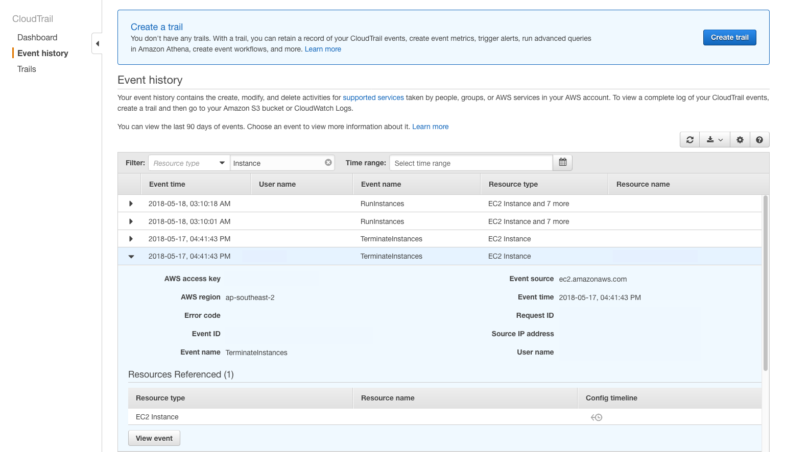

# EC2 Reference

## EC2 Instance's Public IP keeps changing - How to keep it static?

Create an Elastic IP address and assign it to the EC2 instance.
- [https://docs.aws.amazon.com/AWSEC2/latest/UserGuide/elastic-ip-addresses-eip.html#using-instance-addressing-eips-allocating](https://docs.aws.amazon.com/AWSEC2/latest/UserGuide/elastic-ip-addresses-eip.html#using-instance-addressing-eips-allocating)

Remember to release the Elastic IP address after you terminate the EC2 instance to not incur charges for the IP address:
- [https://aws.amazon.com/premiumsupport/knowledge-center/elastic-ip-charges/](https://aws.amazon.com/premiumsupport/knowledge-center/elastic-ip-charges/)

-----------------------------------------------------------------------------------------------------

## Create EC2 instance with Public IP address because it can't be added later on

Source: [https://serverfault.com/questions/706560/assign-public-ip-not-elastic-ip-after-instance-launched](https://serverfault.com/questions/706560/assign-public-ip-not-elastic-ip-after-instance-launched)


The instance that you launched without a public IP will stay without one as it is only assignable when you launch the instance. Even having a subnet with `auto assign public IP` switched on will not assign a public IP to your instance if, when you launched the instance you chose not to have a public IP.

The only way I know is to select `assign a public IP` **before** launching the instance or having the subnet set up to auto assign public IPs which will do that only when you launch a new instance.

So to summarize: It is not possible to `assign a public IP` after launching that instance unless you use EIPs.

-----------------------------------------------------------------------------------------------------

## Multiple EC2 security groups - permissive or restrictive?

Source: [https://serverfault.com/questions/483938/multiple-ec2-security-groups-permissive-or-restrictive](https://serverfault.com/questions/483938/multiple-ec2-security-groups-permissive-or-restrictive)

If an instance has multiple security groups, it has the sum of all rules in the various groups.

> For example, lets say I have a class of instances that will only ever talk to other instances in the same account. I also have a class of instances that will only accept traffic via http (port 80).

This is a perfect situation for AWS Virtual Private Cloud. Put the internal instances in private subnets, and the public-facing instances in public subnets.

-----------------------------------------------------------------------------------------------------

## Check Event History of Possibly Deleted EC2 Instance

Source: [https://superuser.com/questions/1137766/how-do-i-check-the-event-history-of-a-possibly-deleted-ec2-instance](https://superuser.com/questions/1137766/how-do-i-check-the-event-history-of-a-possibly-deleted-ec2-instance)

Answer:

You should be able to use Amazon CloudTrail if you have access. There you can use filters to select EC2 instance history, for example, and see which account was responsible for its deletion, as well as other things like volume attachment, when it was spun up, etc! Sorry if that's two years too late.

Example of CloudTrail Dashboard:



-----------------------------------------------------------------------------------------------------

## Setting up Infra for Training Deep Learning Models

Select EC2 instance - g4dn.2xlarge	

Select Deep Learning AMI (Ubuntu 18.04) Version 61.0

Create Elastic IP and associate with this instance

Create keypair for SSH access

Set inbound rules - allow traffic from my IP address

SSH into instance (using Putty or the command-line)

Activate TensorFlow conda environment (comes with the Ubuntu DL AMI)

Open Python REPL and check if TensorFlow can be imported and if GPU is available

```Python
import tensorflow as tf
tf.config.list_physical_devices('GPU')
```

`boto3` comes pre-installed in the environment.

The EC2 instance comes with `aws-cli` and `git` pre-installed.

-----------------------------------------------------------------------------------------------------

## Start EC2 instance from AWS CLI

```bash
aws ec2 start-instances --instance-ids i-1234567890abcdef0
```

-----------------------------------------------------------------------------------------------------

## Private keys and connecting to EC2

Only the keys (.ppk/.pem) associated with an EC2 instance can be used for connecting to the instance.

-----------------------------------------------------------------------------------------------------

## Connect to EC2 with SSH in Mac

Source: [https://asf.alaska.edu/how-to/data-recipes/connect-to-ec2-with-ssh-mac-os-x/](https://asf.alaska.edu/how-to/data-recipes/connect-to-ec2-with-ssh-mac-os-x/)

-----------------------------------------------------------------------------------------------------

## Connect to your Linux instance using SSH

Source: [https://docs.aws.amazon.com/AWSEC2/latest/UserGuide/AccessingInstancesLinux.html](https://docs.aws.amazon.com/AWSEC2/latest/UserGuide/AccessingInstancesLinux.html)

-----------------------------------------------------------------------------------------------------

