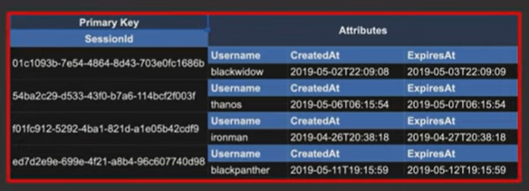
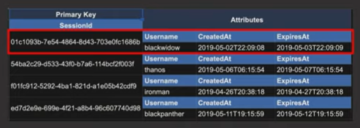
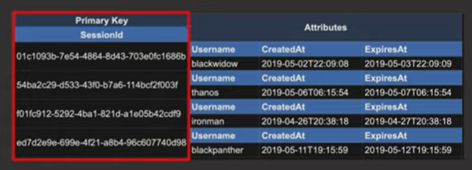
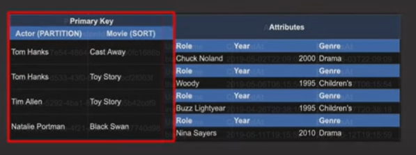
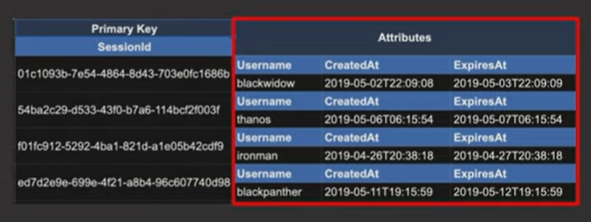
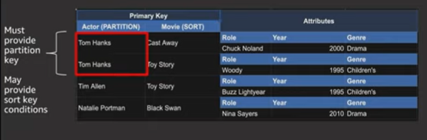

# [AWS re:Invent 2019 Data modeling with Amazon DynamoDB (CMY304)](https://www.youtube.com/watch?v=DIQVJqiSUkE)

Source: [https://www.youtube.com/watch?v=DIQVJqiSUkE](https://www.youtube.com/watch?v=DIQVJqiSUkE)

Contents:
- What is Amazon DynamoDB?
- Key Concepts
- Data Modeling Strategies

## What is Amazon DynamoDB?

- NoSQL DB
- Fully managed by AWS
- HTTPS with AWS IAM auth
- Fast, consistent performance as it scales

### Hyperscale

DynamoDB is made for hyperscale use cases. This is when we're throwing so much data at the DB and accessing it so fast that a relational DB can't keep up. Eg. websites like Amazon, apps like Lyft

### Hyper-ephemeral Compute

When we have compute like AWS Lambda and AWS AppSync that scale up and down really fast, relational DBs don't work well.

DynamoDB works well with these because of its HTTPS connection model and global request-router layer.

## Key Concepts

- Table
    -  
    - All the data together is called a table
    - Similar to table in relational DB/document in MongoDB
- Item
    -  
    - Single record
- Primary Key
    - 
    - Should be included in every item that goes into the table
    - Should uniquely identify each item in the table
    - Types
        - Simple Primary Key (partition key) - shown in the image above
        - Composite Primary key (partition key + sort key) - example:
            - 
    - *All our access patterns are going to be driven off our primary keys*
- Attributes
    - 
    - Similar to columns, but flexible

### API Actions

We usually interact with DynamoDB using the AWS SDK. *It's very API driven, rather than query-driven.*

Split into 3 main buckets:
- Item-based actions - writing, updating, deleting
    - Must provide **entire primary key**
- Query actions - read-only
    - Powerful because it allows us to fetch multiple items in a single request
    - Must provide **partition key**
    - May optionally provide **sort key conditions**
    - 
- Scan actions 
    - Full-table scan. *Looks at every item in the table.*
    - Avoid as much as we can. Expensive at scale.
        - Expensive in terms of 
            - how long it takes to respond to requests
            - how much capacity we need to service that request
    - May be needed in cases like doing an export in an ETL.

### Secondary Indexes

> *What happens when we have 5 access patterns and we've designed a Primary Key that works for 2 of them, but it doesn't work for the other 3 access patterns?*

- We can use Secondary Indexes to address this issue.
- Secondary Indexes can be declared on our table and we give it a new primary key or a key schema.
- Now, when an item is written into our table, it's going to be replicated into that secondary index in that new shape. So, we don't have to worry about dual writing to 2 tables in 2 different formats. Replication is going to be handled for us and gives us those additional query patterns on those secondary indexes.