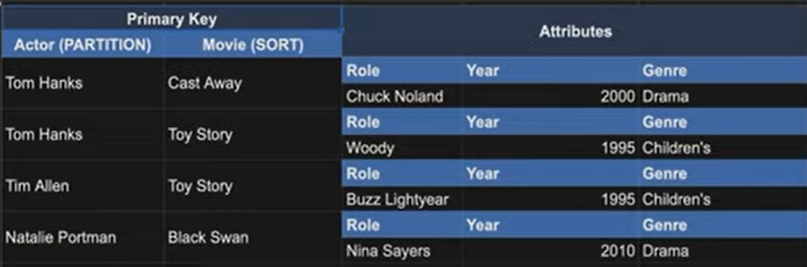
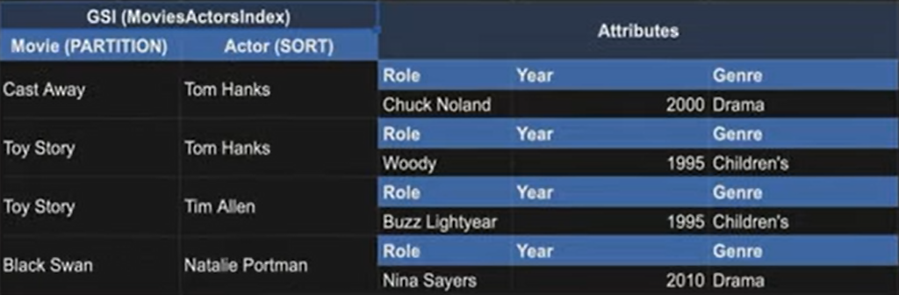

# [AWS re:Invent 2019 Data modeling with Amazon DynamoDB (CMY304)](https://www.youtube.com/watch?v=DIQVJqiSUkE)

Source: [https://www.youtube.com/watch?v=DIQVJqiSUkE](https://www.youtube.com/watch?v=DIQVJqiSUkE)

## Contents:
1. What is Amazon DynamoDB?
2. Key Concepts
3. Data Modeling Strategies
4. Summary

## 1. What is Amazon DynamoDB?

- NoSQL DB
- Fully managed by AWS
- Uses HTTPS connection with AWS IAM for authentication unlike most other DBs which use a TCP connection
- Fast, consistent performance as it scales

### Hyperscale

DynamoDB is made for hyperscale use cases. This is when we're throwing so much data at the DB and accessing it so fast that a relational DB can't keep up. Eg. websites like Amazon, apps like Lyft

### Hyper-ephemeral Compute

When we have compute like AWS Lambda and AWS AppSync that scale up and down really fast, relational DBs don't work well.

DynamoDB works well with these because of its HTTPS connection model and global request-router layer.

## 2. Key Concepts

- Table
    -  
    - All the data together is called a table
    - Similar to table in relational DB/document in MongoDB
- Item
    -  
    - Single record
- Primary Key
    - 
    - Should be included in every item that goes into the table
    - Should uniquely identify each item in the table
    - Types
        - Simple Primary Key (partition key) - shown in the image above
        - Composite Primary key (partition key + sort key) - example:
            - 
    - *All our access patterns are going to be driven off our primary keys*
    - We need to do a lot of thinking about
        - how we're going to access our data
        - how we model that data
        - how we model our Primary Keys
- Attributes
    - 
    - Similar to columns, but flexible. Don't have to be defined upfront. Can differ across items in the table.

### API Actions

We usually interact with DynamoDB using the AWS SDK. *It's very API driven, rather than query-driven.*

Split into 3 main buckets:
1. *Item-based actions - writing, updating, deleting*
    - Must provide **entire primary key**
2. *Query actions - read-only*
    - Powerful because it allows us to fetch multiple items in a single request
    - Must provide **partition key**
    - May optionally provide **sort key conditions**
    - 
3. *Scan actions*
    - Full-table scan. *Looks at every item in the table.*
    - Avoid as much as we can. Expensive at scale in terms of
        - time taken to respond to the request
        - capacity needed to service the request
    - May be needed in cases like doing an export in an ETL.

### Secondary Indexes

> *What happens when we have 5 access patterns and we've designed a Primary Key that works for 2 of them, but it doesn't work for the other 3 access patterns?*

- We can use Secondary Indexes to address this issue.
- Secondary Indexes can be declared on our table and we give it a new primary key or a key schema.
- Now, when an item is written into our table, it's going to be replicated into that secondary index in that new shape. So, we don't have to worry about dual writing to 2 tables in 2 different formats. Replication is going to be handled for us and gives us those additional query patterns on those secondary indexes. We can use query, scan operations on secondary indexes just like we could with our Primary Key.

Why might this be useful?

We've seen how to query for actors and actressess, but what if we wanted to flip it? i.e. Query by movie name and get all the actors and actresses in that movie?

> *We can flip the partition key and the sort key.*

We can now query the index directly by movie and ask for all the actors and actresses that are in the movie.

### [Aside: Improving Data Access with Secondary Indexes](https://docs.aws.amazon.com/amazondynamodb/latest/developerguide/SecondaryIndexes.html)

## Data Modeling Example

## Summary

1. DynamoDB is a NoSQL DB fully managed by AWS. It uses a HTTPS connection with AWS IAM for authentication.
2. DynamoDB is made for **Hyperscale use cases** and it works well with **Hyper-Ephemeral Compute** like AWS Lambda and AWS AppSync which scale up and down really fast.
3. DynamoDB works well with Hyper-Ephemeral Compute because of its HTTPS connection model and its global request-router layer.
4. 6 Key concepts - Table, Item, Primary Key, Attributes, API Actions, Secondary Indexes
- Table - All the data together.
- Item - A single record.
- Primary Key - The column that uniquely identifies each item in the table. Should be included in every item of the table. All our access patterns are driven off our Primary Keys. Can be either
    - Simple (partition key)
    - Composite (partition key + sort key)
- Attributes - Similar to columns, but don't have to be defined upfront and can differ across items in the table.
- DynamoDB is very much API-driven, rather than query-driven. The API actions are split into Item-based (write, update, delete), Query (read-only) and Scan actions.
- Item-based actions require the **entire primary key.**
- Query actions allow us to fetch multiple items in a single request. It requires a **partition key** and optionally **sort key conditions**.
- Scan looks at every item in the table. It is expensive in terms of the time taken to respond to the request and capacity needed to serve the request. So, it has to be avoided as much as possible.
- 
5. We need to do a lot of thinking about how we're going to access our data, how we model that data and how we model our Primary Keys.