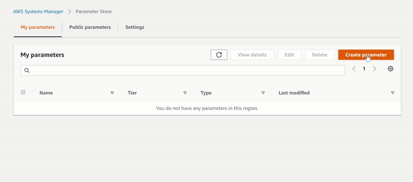

# AWS SSM Reference

## AWS SSM Parameter Store "Hello World!"

Create a `HELLO_WORLD_STRING` parameter from the AWS Console:



Now, we can get the value in this parameter using the following Python code:

```Python
import boto3

ssm = boto3.client('ssm', region_name="<ENTER_REGION_NAME>")

parameter_value = ssm.get_parameter(Name='HELLO_WORLD_STRING')['Parameter']['Value']
```

Creating and getting parameters can also be done using `boto3` and the `aws cli`. 

See: [A complete guide to using the AWS Parameter Store](https://seanjziegler.com/a-complete-guide-to-using-the-aws-systems-manager-parameter-store/)

