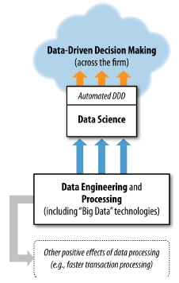

# Data Science for Business

## Table of Contents

1. Topics and Techniques related to Data Science and Data Mining
    1. Introduction: Data-Analytic Thinking
    2. Business Problems and Data Science Solutions
2. Introduction to Predictive Modeling: From Correlation to Supervised Segmentation
3. Fitting a Model to Data
4. Overfitting and its Avoidance
5. Similarity, Neighbors and Clusters
6. Decision Analytic Thinking I: What is a Good Model?
7. Visualizing Model Performance
8. Evidence and Probabilities
9. Representing and Mining Text
10. Decision Analytic Thinking II: Toward Analytical Engineering
11. Other Data Science Tasks and Techniques
12. Data Science and Business Strategy
13. Conclusion

## Preface

We believe there is a relatively small set of fundamental concepts or principles that underlie techniques for extracting useful knowledge from data.

These concepts serve as the foundation for many well-known algorithms of data mining. They underlie the analysis of data-centered business problems, the creation and evaluation of data science solutions, and the evaluation of general data science strategies and proposals.

Ideally, we envision a book that any data scientist would give to his collaborators from the development or business teams, effectively saying: if you really want to design/implement top-notch data science solutions to business problems, we all need to have a common understanding of this material.

### Our Conceptual Approach to Data Science

The concepts fit into three general types:
1. Concepts about how data science fits in the organization and the competitive landscape, including 
- ways to attract, structure, and nurture data science teams
- ways for thinking about how data science leads to competitive advantage
- tactical concepts for doing well with data science projects
2. General ways of thinking data-analytically.
- These help in identifying appropriate data and consider appropriate methods.
- The concepts include the data mining processes as well as the collection of different high-level data mining tasks.
3. General concepts for actually extracting knowledge from data, which undergird the vast array of data science tasks and their algorithms.

Eg. One fundamental concept is that of determining the similarity of two entities described by data.
- Forms the basis for various specific aspects.
    - May be used directly to find customers similar to a given customer.
    - Forms the core of several prediction algorithms that estimate a target value such as the expected resource usage of a client or the probability of a customer to respond to an offer.
    - Forms the basis for clustering techniques, which group entities by their shared features without a focused objective.
    - Forms the basis of information retrieval, in which documents or webpages relevant to a search query are retrieved.
    - Underlies several common algorithms for recommendation.

We believe that explaning data science around such fundamental concepts not only aids the reader, it also facilitates communcation between business stakeholders and data scientists.

It provides a shared vocabulary and enables both parties to understand each other better. The shared concepts lead to deeper discussions that may uncover critical issues otherwise missed.

## 1. Introduction: Data-Analytic Thinking

The broad availability of data has led to increasing interest in data science (methods for extracting useful information and knowledge from data)
- The broad availability of data today is due to the following factors:
    - Extensive investments in business infrastructure over the past 15 years, which have improved the ability to collect data throughout the enterprise.
        - Every **aspect of business** is now open to data collection and often even instrumented for data collection. Eg.
            - operations
            - manufacturing
            - supply-chain management
            - customer behavior
            - marketing campaign performance
            - workflow procedures
        - Information is widely available on **external events**. Eg.
            - market trends
            - industry news
            - competitors' movements

### The Ubiquity of Data Opportunities

Widespread business application of data science principles and data-mining techniques focused on exploiting data for competitive advantage is possible because of
- Computers becoming far more powerful
- Networking becoming ubiquitous
- Development of algorithms for that can connect datasets to enable broader and deeper analyses than previously possible.

Example of application of data science in different areas of business
- Marketing (has the widest applications in business)
    - Targeted Marketing
    - Online advertising
    - Recommendations for cross selling
- Customer Relationship Management
    - Analyze Customer Behavior
        - Manage Attrition
        - Maximize Expected Customer Value
- Finance
    - Credit Scoring
    - Trading
    - Operations
        - Fraud Detection
        - Workforce Management

Major retailers from Walmart to Amazon apply data mining throughout their business. Many firms have differentiated themselves strategically with data science. Some companies have evolved into data mining companies.

> Goal of this book: Help you view business problems from a data perspective and understand principles of extracting useful knowledge from data.

Data-analytic thinking 
- has
    - fundamental structure
    - basic principles
    - areas that require
        - intuition
        - creativity
        - common sense
        - domain knowledge

> As you get better at data-analytic thinking, you'll develop intuition as to how and where to apply creativity and domain knowledge.

| Data Science                                                                       | Data Mining                                           |
|:-----------------------------------------------------------------------------------|:------------------------------------------------------|
| Fundamental set of **principles** that guide the extraction of knowledge from data.| Extraction of knowledge from data via **technologies** that incorporate data science principles |

If you understand data science, you'll be able to spot 
- obvious flaws
- unrealistic assumptions
- missing pieces

Example business problem we'll keep coming back to throughout the book:
- **Predicting Customer Churn**
    - Churn: Customers switching from one company to another
        - Expensive all around
            - One company must spend on incentives to attract a customer
            - Another company loses revenue when the customer departs
    - Let's say marketing has already designed a special retention offer.
    - Your task is to **devise a precise, step-by-step plan** for how the data science team should use your company's vast resources to **decide which customers should be offered the special retention deal prior to the expiration of their contracts**.

> In reality, customer retention has been a major use of data mining technologies - especially in **telecommunications and finance businesses**. These more generally were some of the **earliest and widest adopters** of data mining technologies.

### Data Science, Engineering, and Data-Driven Decision Making

