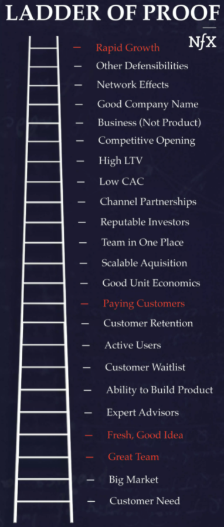

# The Ladder of Proof: Uncovering How VC's See Your Startup

Source: [https://www.nfx.com/post/ladder-of-proof/](https://www.nfx.com/post/ladder-of-proof/)

> You have to build up credibility. For example, when a tech investor looks at a startup, the first thing they want to see is evidence of product progress. They don’t just want to see a slide deck. Product progress is the entrepreneur’s resume. It’s an unfake-able resume. You have to do the work. To use a crypto analogy, you have to have proof of work. If you have that and you truly have something interesting, then you shouldn’t hesitate to put it together in an email and send it. Even then, when asking for a meeting, you want to be actionable. - Naval Ravikant, [https://nav.al/rich](https://nav.al/rich)

23 Rungs on The Ladder of Proof: (non-exhaustive)

- Each rung represents a predictor of risk or success. Red rungs are more powerful than others.
- Understand my audience. Different VCs emphasize different rungs.
- My job as a founder is to know where I am on the ladder, where I need to get next and how to clearly communicate that.
    - How much have I de-risked my company so it’s more attractive to an investor? 
    - How much have I proven that I've identified an exceptional opportunity? 
    - Can I grab that opportunity?
    - I also have to prove to myself that I'm capable of climbing these rungs.
- **My life’s energies should be focused on the best project I can find.**

