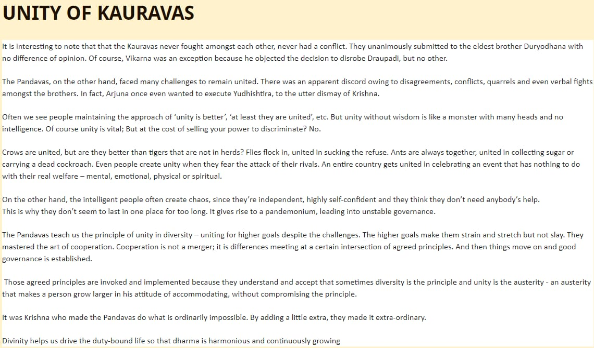
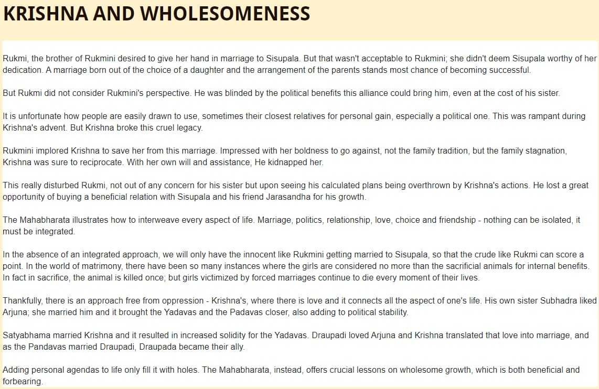
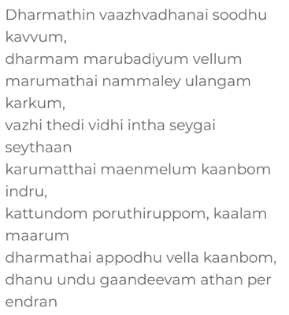

# Lessons from India

----------------------------------------------------------------------------------------------------------------------------------

यान्ति न्याय प्रवृत्तस्य तिर्यञ्चोSपि सहायताम्    ।  
अपन्थानं  तु  गच्छन्तं  सोदरोSपि   विमुन्चते ॥  (1)  

*To a person following the path of justice and righteousness, even the beasts and animals are helpful. But if he follows the path of injustice and treachery even his own brother abandons him. - A lesson from Ramayana. Source: http://mcjoshi21.blogspot.com/2013/09/to-days-subhashita.html*

----------------------------------------------------------------------------------------------------------------------------------

पापानां वा शुभानां वा वधार्हाणां प्लवङ्गम ।  
कार्यं कारुण्यमार्येण न कश्चिन्नापराध्यति   ॥  (2)  

*Kindness is to be shown by a noble person either towards a sinner or to a virtuous person or even to a person who deserves death, for, there is none who never commits a wrong. - Ramayana*

----------------------------------------------------------------------------------------------------------------------------------

अहिंसा प्रथमं पुष्पं  पुष्पं इन्द्रियनिग्रह      ।  
सर्वभूत दया पुष्पं क्षमा पुष्पं विशेषत       ॥  
ज्ञान पुष्पं तप पुष्पं शान्ति पुष्पं तथैवच     ।  
सत्यं अष्टविदं पुष्पो विष्णो : प्रीतिकरं भवेत्  ॥  (3)  

1. Ahimsa - Non-Violence.   
2. Indriya Nigraha: - Sense Control.
3. Sarva Bhuta Daya - Love to all Living Beings.   
4. Kshama - Forgiveness.
5. Jnanam - Knowledge.     
6. Tapas - Austerities / Meditation
7. Shanti - Peace. Peace arises when we realize that all things happen by God's will.
8. Satyam - Truth. Truth is Sri Vishnu Himself.  To abide by truth and never swerving from it is the final (8th) flower offering to Vishnu. 

Bhagavan Sri Vishnu is indeed pleased by offering the above mentioned eight flowers. (Vishno: preetikaram bhaveth!) By inculcating these Sattwa  Gunas in us, we'll become dear to the lord. 

----------------------------------------------------------------------------------------------------------------------------------

विद्या विवादाय धनं मदाय शक्तिः परेश्हां पर-पीडनाय   ।  
खलस्य साधोर्-विपरीतम्-एतत् ज्नानाय दानाय च रक्षणाय ॥  (4)  

*For the wicked, knowledge is for arguments, wealth is for arrogance, and power is for tormenting others; for the virtuous, they are just for the opposite: wisdom, charity and protection. - Ramayana*

----------------------------------------------------------------------------------------------------------------------------------

तपो न कल्कोऽध्ययनं न कल्कः स्वाभाविको वेदविधिर्न कल्कः  ।  
प्रसह्य वित्ताहरणं न कल्कस्तान्येव भावोपहतानि कल्कः       ॥  (5)  

*Tapa is innocent, study is harmless, the ordinance of the Vedas prescribed for all the tribes are harmless, the acquisition of wealth by exertion is harmless; But when they are abused in their practices it is then that they become sources of evil. - Mahabharata*

----------------------------------------------------------------------------------------------------------------------------------

----------------------------------------------------------------------------------------------------------------------------------