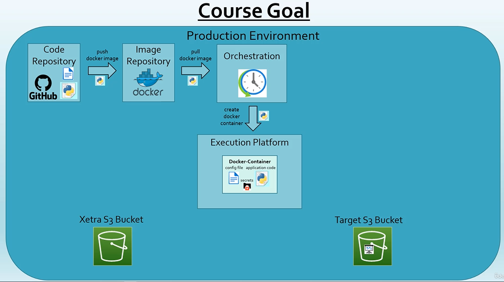
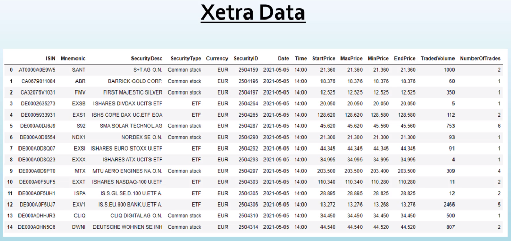
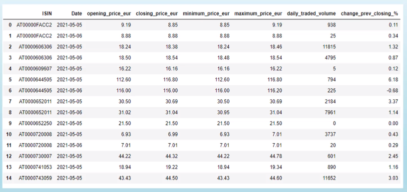

# ETL

## Udemy - [Writing production-ready ETL pipelines in Python / Pandas](https://www.udemy.com/course/writing-production-ready-etl-pipelines-in-python-pandas/)

### Contents
1. Introduction
2. Quick and Dirty Solution
3. Functional Approach
4. Object Oriented Approach
5. Setup and Class Frame Implementation
6. Code Implementation
7. Finalizing the ETL Job
8. Summary

### 1. Introduction



You will learn:
- Each step of the ETL pipeline in Python from scratch to Production
- How to use the necessary tools and packages (6)
    - Python 3.9
    - Jupyter Notebook
    - Git/GitHub
    - VSCode
    - Docker/Docker Hub
    - Python pacakges (9): pandas, boto3, pyyaml, awscli, jupyter, pylint, moto, coverage, memory-profiler
- How to apply functional and object-oriented programming
- How to do a proper code design
- How to use a meta file for job control
- Best practices in developing Python code (13):
    - Design Principles
    - Clean Coding
    - Virtual Environments
    - Project/Folder Setup
    - Configuration
    - Logging
    - Exception Handling
    - Linting
    - Dependency Management
    - Performance Tuning with Profiling
    - Unit testing
    - Integration Testing 
    - Dockerization

#### Task Description

| Source Data                           | Target Data           |
|:-------------------------------------:|:---------------------:|
|  |  |


We want a weekly ETL job that grabs data from the Xetra S3 bucket *since the last run of the job* and saves the report to a target S3 bucket.

Requirements
- Target format parquet
- First data of the report should be given as input
- Auto-detection of the source files to be processed
- Configurable production-ready Python job 

#### Production Environment


#### Task Steps

1. Set up a virtual environment
2. Set up AWS
3. Understanding the source data using Jupyter Notebook
4. Quick and dirty solution using Jupyter Notebook
5. Functional vs OOP 
6. Importance of testing
7. Functional approach with the quick and dirty solution
8. OOP Design Principles and further requirements - configuration, logging, metadata
9. OOP Code Design
10. Set up development environment (Github, Python project, VSCode)
11. Implement Class Frame
12. Implement Logging
13. Coding (Clean Code, functionality, linting, unit tests, integration tests)
14. Setup dependency management with pipenv
15. Performance tuning with profiling and timing
16. Create Dockerfile + push docker image to Docker Hub
17. Run application in production using Minikube and argo workflows

### 2. Quick and Dirty Solution

#### Why use a virtual environment?

Makes it easy to switch between projects without uninstalling and reinstalling packages.

There's no limit to the number of environments we can create.

Standard library for virtual environments
- pyenv (upto python 3.5)
- venv (python 3.6+)
Third party libraries
- virtualenv
- pyenv
- pyenv-virtualenv
- virtualenvwrapper
- pyenv-virtualenvwrapper
- pipenv 

Use `pipenv` while developing Python applications and not libraries or packages.

We'll use `pipenv` because
- it's recommended by Python.org for application dependency management. 
- Combines pip and virtualenv in one tool.
- Replaces requirements.txt and solves issues that occur while using requirements.txt and multiple environments.

#### Virtual Environment Setup

Install `pipenv` in our system-wide python installation using
- `pip install pipenv`

Create a folder for this project and `cd` into it

Create a virtual environment using the command

`pipenv shell`

This should create and activate a virtual environment.

To install packages inside this environment, install them using `pipenv install <PACKAGE_NAME>`

To see what packages have been installed in this environment, run `pip list`

`pipenv` uses `Pipfile` instead of `requirements.txt`. If `requirements.txt` is found, `pipenv` will convert it to a `Pipfile`.

To see the location where the virtual environment was created, run the command `pipenv --venv`

To deactivate the environment, simply exit the shell using the `exit` command.

#### Read a CSV file from AWS S3

```Python
from io import StringIO

import boto3
import pandas as pd

# get all objects from bucket for date 2022-01-28
s3 = boto3.resource('s3')
bucket = s3.Bucket('xetra-1234')
bucket_objects = bucket.objects.filter(Prefix="2022-01-28/")

# convert to list
objects = list(bucket_objects)

# read one of the csv objects and convert to it to a dataframe
csv_obj = bucket.Object(key="2022-01-28/2022-01-28_BINS_XETR15.csv").get().get("Body").read().decode('UTF-8')
data = StringIO(csv_obj)
df = pd.read_csv(data, sep=",")
```

#### Access all data from S3 for a particular day

```Python
from io import StringIO
from rich.progress import track

import boto3
import pandas as pd

# Get all objects from bucket for date 2022-01-28
s3 = boto3.resource('s3')
bucket = s3.Bucket('xetra-1234')
bucket_objects = bucket.objects.filter(Prefix='2022-01-28/')

objects = list(bucket_objects)

# Create a dataframe with all data for a single day
df_all = pd.DataFrame()
for obj in track(objects, description="Appending to dataframe ..."):
    csv_obj = bucket.Object(key=obj.key).get().get("Body").read().decode("UTF-8")
    data = StringIO(csv_obj)
    df = pd.read_csv(data, sep=",")
    df_all = df_all.append(df, ignore_index=True)

# Keep only columns we're interested in
columns_of_interest = ['ISIN', 'Date', 'StartPrice', 'EndPrice', 'MinPrice', 'MaxPrice', 'TradedVolume']
df_all = df_all.loc[:, columns_of_interest]

# Drop any rows with missing values
df_all = df_all.dropna()
```
