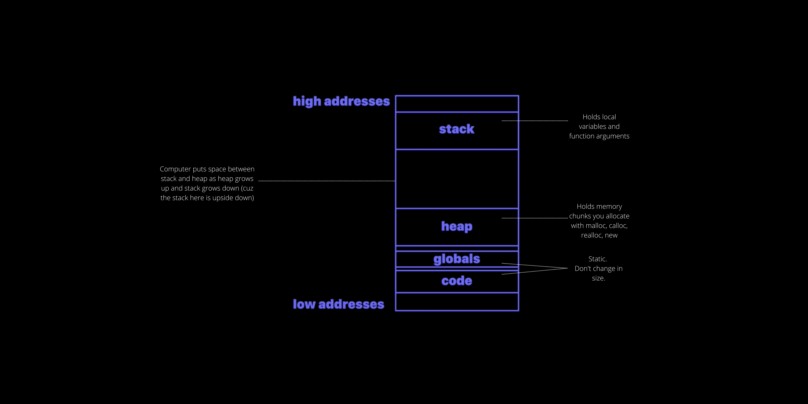

# Writing Great Code

## [Torvalds' quote about good programmer](https://softwareengineering.stackexchange.com/questions/163185/torvalds-quote-about-good-programmer#comment312412_163185)

It might help to consider what Torvalds said right before that:

> git actually has a simple design, with stable and reasonably well-documented data structures. In fact, I'm a huge proponent of designing your code around the data, rather than the other way around, and I think it's one of the reasons git has been fairly successful […] I will, in fact, claim that the difference between a bad programmer and a good one is whether he considers his code or his data structures more important.

What he is saying is that good data structures make the code very easy to design and maintain, whereas the best code can't make up for poor data structures.

If you're wondering about the git example, a lot of version control systems change their data format relatively regularly in order to support new features. When you upgrade to get the new feature, you often have to run some sort of tool to convert the database as well.

For example, when DVCS first became popular, a lot of people couldn't figure out what about the distributed model made merges so much cleaner than centralized version control. The answer is absolutely nothing, except distributed data structures had to be much better in order to have a hope of working at all. I believe centralized merge algorithms have since caught up, but it took quite a long time because their old data structures limited the kinds of algorithms they could use, and the new data structures broke a lot of existing code.

In contrast, despite an explosion of features in git, its underlying data structures have barely changed at all. Worry about the data structures first, and your code will naturally be cleaner.

------------------------------------------------------------------------------------------------------------------------------------

Torvalds is not alone in this, by the way: *"Show me your flowchart and conceal your tables, and I shall continue to be mystified. Show me your tables, and I won't usually need your flowchart; it'll be obvious."* – Fred Brooks, The Mythical Man-Month. *"Show me your code and conceal your data structures, and I shall continue to be mystified. Show me your data structures, and I won't usually need your code; it'll be obvious."* and *"Smart data structures and dumb code works a lot better than the other way around."* – Eric S. Raymond, The Cathedral and The Bazaar.

------------------------------------------------------------------------------------------------------------------------------------

"A wise engineering solution would produce—or better, exploit—reusable parts." - Doug McIlroy

## Other References

- [Software exoskeletons - John D. Cook](https://www.johndcook.com/blog/2011/07/21/software-exoskeletons/)
- [Book Summary: A Philosophy of Software Design](https://freshman.tech/philosophy-of-software-design-summary/)
- [Book notes: A Philosophy of Software Design](https://danlebrero.com/2021/02/24/philosophy-of-software-design-summary/#ch-5)
- [Programming Paradigms: A must know for all Programmers](https://hackr.io/blog/programming-paradigms)
- [Boundaries - A talk by Gary Bernhardt from SCNA 2012](https://www.destroyallsoftware.com/talks/boundaries)
- [On the criteria to be used in decomposing systems into modules](https://blog.acolyer.org/2016/09/05/on-the-criteria-to-be-used-in-decomposing-systems-into-modules/)
- [Out of the Tar Pit](https://blog.acolyer.org/2015/03/20/out-of-the-tar-pit/)
- [SOLID: The First 5 Principles of Object Oriented Design](https://www.digitalocean.com/community/conceptual_articles/s-o-l-i-d-the-first-five-principles-of-object-oriented-design)
- [Open-source Software Engineering and Leadership principles - Make better decisions using principles - For Software Engineers and technical leaders who want better results.](https://principles.dev/)
- [More shell, less egg](https://leancrew.com/all-this/2011/12/more-shell-less-egg/)
- [Side effect (computer science)](https://en.wikipedia.org/wiki/Side_effect_(computer_science))
- [Pure function](https://en.wikipedia.org/wiki/Pure_function)
- [What is a side-effect of a function in Python?](https://dev.to/dev0928/what-is-a-side-effect-of-a-function-in-python-36ei)
- [Duck Typing in Python](https://www.pythonmorsels.com/duck-typing/)
- [Structure and Interpretation of Computer Programs](https://www.goodreads.com/book/show/43713.Structure_and_Interpretation_of_Computer_Programs)
- [How to Design Programs](https://htdp.org/)

## Reading Code Written by Brilliant Engineers

- [How to Approach a New Codebase](https://amberwilson.co.uk/blog/how-to-approach-a-new-codebase/)
- [The Architecture of Open Source Applications](http://aosabook.org/en/index.html)
- [Reading Great Code](https://python-guide-cn.readthedocs.io/en/latest/writing/reading.html)
- [Code Style](https://python-guide-cn.readthedocs.io/en/latest/writing/style.html#code-style)
- [howdoi - GitHub](https://github.com/gleitz/howdoi)
- [Click - GitHub](https://github.com/pallets/click)
- [PostgreSQL Database Management System - GitHub](https://github.com/postgres/postgres)
    - [Welcome to the PostgreSQL Wiki!](https://wiki.postgresql.org/wiki/Main_Page)
- [Flask - GitHub](https://github.com/pallets/flask)
- [Rusty's API Design Manifesto](http://sweng.the-davies.net/Home/rustys-api-design-manifesto)

## Views and Comments

Great code should be an expression of what needs to be done, not how to do it, abstracts away implementation details.

Values don't have side effects.

## Functional Programming Design Patterns

Source: [Functional Programming Design Patterns](https://fsharpforfunandprofit.com/fppatterns/)

## Courses
- [MIT 6.006 Introduction to Algorithms, Fall 2011](https://www.youtube.com/playlist?list=PLUl4u3cNGP61Oq3tWYp6V_F-5jb5L2iHb)
- [Stanford - Programming Abstractions](https://www.youtube.com/playlist?list=PLFE6E58F856038C69)

## Code Review

- [How to Make Your Code Reviewer Fall in Love with You](https://mtlynch.io/code-review-love/)

## Call Stack

- [The Call Stack and Stack Overflows (example in C)](https://www.youtube.com/watch?v=jVzSBkbfdiw&ab_channel=JacobSorber)
- [A Deep Dive into Python Stack Frames](https://www.youtube.com/watch?v=smiL_aV1SOc&ab_channel=PyGotham2018)

## The Factory Method Pattern and Its Implementation in Python

Source: https://realpython.com/factory-method-python/

## Strategy Design Pattern

- https://refactoring.guru/design-patterns/strategy/python/example
- https://refactoring.guru/design-patterns/strategy
- https://pytorch-lightning.readthedocs.io/en/stable/extensions/strategy.html

## Dependency Injection

- https://en.wikipedia.org/wiki/Dependency_injection#:~:text=In%20software%20engineering%2C%20dependency%20injection,leading%20to%20loosely%20coupled%20programs.

## Principle of Least Power

- https://www.lihaoyi.com/post/StrategicScalaStylePrincipleofLeastPower.html

## The Call Stack and Stackoverflow

The stack is the place in memory where all your
- local variables
- function arguments 

go

The program's address space looks like this:



How the stack grows:


- Everytime a function is called, it gets its own **StackFrame** in the stack.
- A stackframe is a chunk of memory we added in the stack for a function call.
- This StackFrame holds function arguments and local variables for a function call as well as the return address.
    - The return address is the place in code the program has to jump back to when the function is finished executing.
- When another function is called, we overwrite the old StackFrames with new StackFrames.
- **Frame pointer** helps us keep track of where the different StackFrames begin and end.
- **Stackoverflow** occurs when we allow our stack to get too big and it overflows the memory the OS is willing to give us.
    - Common causes are very deep recursion and very large stack variables (eg. creating local array variables that are too large).

**Looking at stack traces is really handy for helping us see how we got where we are. It's useful when debugging.**

Source: [The Call Stack and Stack Overflows (example in C)](https://www.youtube.com/watch?v=jVzSBkbfdiw&ab_channel=JacobSorber)

## Race Conditions Explained

Source: https://www.baeldung.com/cs/race-conditions

## Multithreading: Critical Section in Synchronization

Source: https://www.geeksforgeeks.org/g-fact-70/

## Opportunistic Programming

> Opportunistic Programming is a method of software development that **emphasizes speed and ease of development** over **code robustness and maintainability**. 

*Coding in this way allows individuals to explore many ideas quickly, which has an important place in the overall sofware engineering process.*

Steps like prototyping, ideation and discovery are often best accomplished by building a functional piece of software quickly and easily without the typical concerns of a broader-scale software engineering project. Through fieldwork and a laboratory study, we are focusing on five characteristics of opportunistic programming: building software from scratch using high-level tools, adding new functionality through copy-and-paste, atypically rapid iteration, considering code to be impermanent, and facing a unique set of debugging challenges. Using results from these two projects, we plan on developing tools aimed at opportunistic programming that focus on debugging, code foraging and reuse, and documentation.

Source: https://hci.stanford.edu/research/opportunistic/

## Pure function

Pure functions don't have any side effects. They always return the result if the same arguments are passed.

## Partial Functions

A partial function is a function that is not defined for all possible arguments of the specified type.

Eg.

```python
def div(x, y):
    return x/y
```

The above function blows up when `y = 0`, so it is not defined for that case.

## Rule of least power

The Rule of Least Power is the notion that a programmer should use the least powerful programming language required to code for a given requirement.

