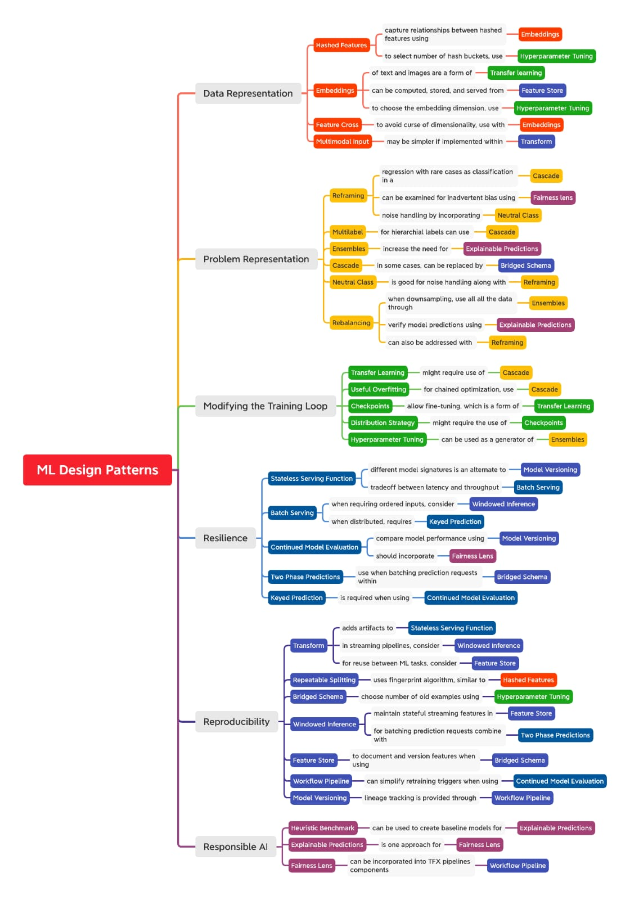

# Machine Learning Design Patterns - Solutions to Common Challenges in Data Preparation, Model Building and MLOps

## Patterns Reference

### ---------------------------- Data Representation ----------------------------

| Design Pattern | Problem Solved | Solution |
|:---------------|:---------------|:---------|
| Hashed Feature | Problems associated with categorical features such as **incomplete vocabulary**, **size due to cardinality**, and **cold start**. | **Bucket** a deterministic and portable hash of string representation and accept the **trade-off** of collisions in the data representation. |
| Embeddings     | **High-cardinality** features where **closeness relationships** are important to preserve. | **Learn** a data representation that **maps** high-cardinality data into a **lower-dimensional** space in such a way that the information relevant to the learning problem is preserved. |
| Feature Cross | **Model complexity insufficient to learn feature relationships.** | Help models learn relationships between inputs faster by **explicitly making each combination of input values a separate feature.** |
| Multimodal Input | How to **choose between** several potential **data representations**. | **Concatenate** all the available data representations. |

### ---------------------------- Problem Representation ----------------------------

| Design Pattern | Problem Solved | Solution |
|:---------------|:---------------|:---------|
| Reframing      | Several problems including **confidence for numerical prediction, ordinal categories, restricting prediction range** and **multitask learning**. | **Change** the **representation of the output** of a ML problem; eg. representing a regression problem as classification (and vice-versa) |
| Multilabel     | More than one label applies to a given training example. | **Encode the label** using a **multi-hot** array, and use **k sigmoids** as the output layer. |
| Ensembles      | **Bias-variance trade-off** on small and medium-scale problems. | Combine multiple ML models and **aggregate their results** to make predictions. |
| Cascade        | **Maintainability** or **drift issues** when a **ML problem is broken into a series of ML problems.** | Treat an ML system as a **unified workflow** for the purposes of training, evaluation and prediction. |
| Neutral Class  | The **class label** for some **subset** of examples is essentially **arbitrary**. | Introduce an **additional label** for a classification model, **disjoint from the current labels**. |
| Rebalancing    | Heavily imbalanced data. | Downsample, upsample, or use a weighted loss function depending on different considerations. |

### ---------------------------- Resilience ----------------------------

| Design Pattern | Problem Solved | Solution |
|:---------------|:---------------|:---------|
| Stateless Serving Function | Production ML system must be able to **synchronously** handle thousands to **millions of prediction requests per second**. | Export the machine learning model as a stateless function so that it can be **shared by multiple clients in a scalable way**. |
| Batch Serving | Carrying out model **predictions over large volumes of data** using an **endpoint that is designed to handle requests one at a time** will overwhelm the model. | Use software infrastructure commonly used for **distributed data processing** to carry out inference asynchronously on a large number of instances at once. |
| Continued Model Evaluation | **Model performance of deployed models degrades over time** either due to data drift, concept drift or other changes to the pipelines which feed data to the model. | Detect when a deployed model is no longer fit-for-purpose by **continually monitoring model predictions and evaluating model performance**. |
| Two-phase Predictions | **Large, complex models** must be kept **performant** when they are deployed at the **edge or on distributed devices**. | **Split the use case into two phases** with
only the **simpler phase being carried out on the edge**. |
| Keyed Predictions | How to map the model predictions that are returned to the corresponding model input when submitting large prediction jobs. | Allow the model to pass through a **client-supported key during prediction** that can be used to join model inputs to model predictions. |