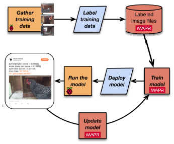

# [Machine Learning Logistics](https://www.oreilly.com/library/view/machine-learning-logistics/9781491997628/)

Authors: Ted Dunning, Ellen Friedman

Example Implementation: 
- [Machine learning models on AWS with the Rendezvous architecture](https://medium.com/bigdatarepublic/machine-learning-models-on-aws-with-the-rendezvous-architecture-23a597699597)
- [https://github.com/ddotabma/rendezvous-on-aws](https://github.com/ddotabma/rendezvous-on-aws)

Machine Learning Logistics: 
- Manage the overall *flow* of data and work across organizations.
- Handle multiple models.
- Collect and analyze metrics throughout the lifecycle of models.
- Key to making the next generation of advances in Machine Learning truly valuable.

## Lessons Learned

1. How well prepared will we be when we need to build Machine Learning systems? - The question we need to ask ourselves.
2. DataOps shows how *team structure* and *communication* change to meet Machine Learning at scale.
3. **Rendezvous architecture** makes it easier to manage Machine Learning logistics.
4. **"Semi-supervised kind of learning + distribution of base models"** approach makes it easier to apply advanced Machine Learning to practical problems with only a few examples for training.
    - use deep learning to build a base model from very large amounts of unlabeled data or even labeled examples for some generic task, then, refine the base model by retraining with a relatively small number of examples that are labeled for our specific task.
    - this approach makes it easier to apply advanced Machine Learning to practical problems with only a few examples for training
    - will lead to drop in entry costs of building complex Machine Learning systems as this approach becomes more prevalent
        - will in turn lead to an even larger stampede of people jumping into Machine Learning to build new systems
5. Advances in Reinforcement Learning will help computers truly interact with real world.

## Why Model Management?

1. 90% of the effort in successful ML is about logistics aka Model Management.
2. Projects differ in terms of *goals, settings, types of data, scale, SLAs.* Try out many Machine Learning tools to build and evaluate models for any particular goal. 5 to 12 Machine Learning tools typically used.
3. In some ways, the best tool for machine learning is the data platform we use to deal with the logistics. With the right capabilities, the underlying data platform can handle the logistics across a variety of machine learning systems in a unified way. It doesn't have to be handled at the application level.
4. Lessons learned from Ian's toy project:
- 
- Important to 
    - recognize
        - what data is available to be collected
        - how decisions can be structured
    - define
        - sufficiently narrow goal so that it is practical to carry out
    - possess domain knowledge
- The design 
    - provides a reasonable way to collect data for training
    - takes advantage of simplified model development by 
        - using pre-trained model 
            - as it is sufficient for the goals of this project
            - deployable to the IoT edge.
    - SLA
        - classification time can be reduced from 30 seconds to 5 seconds by running model on MapR edge cluster
    - takes into account the need to retrain/update new models
        - strategy needs to be determined 
        - requires domain knowledge to recognize concept drift
- The power of Machine Learning is such that once we see what we can do, we may begin to notice new ways that Machine Learning can produce useful results.
5. Model management in the real world is a powerful and fluid process that deals with
- large-scale changing data
- changing goals
- models in isolation so that they can be evaluated in environments that are specifically
    - customized
    - controlled
6. Models replacement will have to be done smoothly, without interruptions to service if possible.
7. Mission creep - once we have one win by fielding a successful model, we'll be expected to build on it and repeat it in new areas.
8. Pretty soon, we'll have models depending on models in a much more complex system than we planned for initially.

### Sample Questions we should ask about Model Management

1. Is there a way to **save data in raw-ish form** to use in training
later models? We don’t always know what features will be valuable
as we move forward. Saving raw data preserves data characteristics
valuable for multiple projects.
2. Does our system adequately and conveniently **support multitenancy**,
including sharing the same data without interference?
3. Do we have a way to **efficiently deploy models and share data**
across data centers or edge processing in different locations, on
premises, in cloud, or with a hybrid design?
4. Is there a way to **monitor and evaluate performance in development** as well as to **compare models**?
5. Can our system **deploy models to production with ongoing validation of performance** in this setting?
6. Can we **stage models into the production system** for testing
**without disturbing system operation**?
7. Does our system easily **handle hot hand-offs** so new models can seamlessly replace a model in production?
8. Do we have **automated fall back**? (for instance, if a model is not responding within a specified time, is there an automated step that will go to a secondary model instead?)
9. Are our models functioning in a **precisely specified and documented environment**?

## What Matters In Model Management

