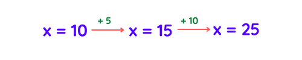

# Python Reference

## Python `logging` JSON Formatter

Turn log messages into correct JSON format in Python using the builtin logging module:

```Python
import logging
import json


class JSONFormatter(logging.Formatter):
	def __init__(self):
		super().__init__()
	def format(self, record):
		record.msg = json.dumps(record.msg)
		return super().format(record)

logger = logging.getLogger(__name__)
logger.setLevel(logging.DEBUG)
loggingStreamHandler = logging.StreamHandler()
# loggingStreamHandler = logging.FileHandler("test.json",mode='a') #to save to file
loggingStreamHandler.setFormatter(JSONFormatter())
logger.addHandler(loggingStreamHandler)
logger.info({"data":123})
```

Source: [https://everythingtech.dev/2021/03/python-logging-with-json-formatter/](https://everythingtech.dev/2021/03/python-logging-with-json-formatter/)

## `logging` inherit contextual information

```Python
# myapp.py
import logging
import mylib


class ContextFilter(logging.Filter):
    def __init__(self, filter_name, extra):
        super(ContextFilter, self).__init__(filter_name)
        self.connid = extra

    def filter(self, record):
        record.connid = self.connid
        return True


def main():
    logging.basicConfig(filename='myapp.log',level=logging.INFO,
                        format='%(levelname)s:%(name)s:[%(connid)s] %(message)s')
    logger = logging.getLogger('test')
    cf = ContextFilter(filter_name='add_conn_id', extra='123')
    logger.addFilter(cf)
    logger.info('Started')
    mylib.do_something()
    logger.info('Finished')

if __name__ == '__main__':
    main()
```
My log output now looks like this:

```bash
INFO:test:[123] Started
INFO:test:[123] Doing something
INFO:test:[123] Finished
```

Source: [https://stackoverflow.com/questions/46895678/python-logging-inherit-contextual-information](https://stackoverflow.com/questions/46895678/python-logging-inherit-contextual-information)

## Solving `psutil` error while running Jupyter Notebooks

If you run into the error `ModuleNotFoundError: No module named 'psutil'` while running Jupyter Notebooks, uninstall and reinstall psutil using pip.

## Marshmallow - Object Serialization

Source: [Marshmallow Documentation](https://marshmallow.readthedocs.io/en/stable/)


## Attrs Schema Validation Examples

Source: 
- [Attrs Examples](https://www.attrs.org/en/stable/examples.html)
- [Validators](https://www.attrs.org/en/stable/examples.html#validators)

## Attrs - Dataclasses

Source: [Attrs, Dataclasses and Pydantic](https://stefan.sofa-rockers.org/2020/05/29/attrs-dataclasses-pydantic/)

## Templating SQL Queries with JinjaSQL

- [Simple Approach](https://towardsdatascience.com/a-simple-approach-to-templated-sql-queries-in-python-adc4f0dc511)
- [Advanced Approach](https://towardsdatascience.com/advanced-sql-templates-in-python-with-jinjasql-b996eadd761d)
- [JinjaSQL Source Code](https://github.com/sripathikrishnan/jinjasql)

## ImportError: cannot import name 'Markup' from 'jinja2'

- [ImportError: cannot import name 'Markup' from 'jinja2'](https://stackoverflow.com/questions/71645272/importerror-cannot-import-name-markup-from-jinja2)

## JSON/Dictionary Valdiation

- [Validation using jsonschema](https://pynative.com/python-json-validation/)
- [Only allow properties that are declared in JSON schema](https://stackoverflow.com/questions/17530762/only-allow-properties-that-are-declared-in-json-schema)
- [How to Validate Your JSON Using JSON Schema](https://towardsdatascience.com/how-to-validate-your-json-using-json-schema-f55f4b162dce)

## Conda - unable to completely delete environment

Command-line options can only go so far, unless you get very specific; perhaps the simplest approach is to delete things manually:

1. Locate Anaconda folder; I'll use `"D:\Anaconda\"`
2. In envs, delete environment of interest: `"D:\Anaconda\envs\myenv"`. Are you done? Not quite; even while in myenv, conda will still sometimes install packages to the base environment, in `"D:\Anaconda\pkgs\"`; thus, to clean traces of myenv,
3. Delete packages installed to myenv that ended up in `"D:\Anaconda\pkgs\"`
4. (If above don't suffice) Anaconda Navigator -> Environments -> myenv -> Remove
5. (If above don't suffice) Likely corrupted Anaconda; make note of installed packages, completely uninstall Anaconda, reinstall.
Note: step 3 is redundant for the goal of simply removing myenv, but it's recommended to minimize future package conflicts.

Source: [https://stackoverflow.com/questions/58736579/conda-unable-to-completely-delete-environment](https://stackoverflow.com/questions/58736579/conda-unable-to-completely-delete-environment)

## How do I prevent Conda from activating the base environment by default?

`conda config --set auto_activate_base false`

Source: [https://stackoverflow.com/questions/54429210/how-do-i-prevent-conda-from-activating-the-base-environment-by-default?rq=1](https://stackoverflow.com/questions/54429210/how-do-i-prevent-conda-from-activating-the-base-environment-by-default?rq=1)

## How do I format a string using a dictionary in python-3.x?

```Python
geopoint = {'latitude':41.123,'longitude':71.091}
print('{latitude} {longitude}'.format(**geopoint))
```

Source: [https://stackoverflow.com/questions/5952344/how-do-i-format-a-string-using-a-dictionary-in-python-3-x](https://stackoverflow.com/questions/5952344/how-do-i-format-a-string-using-a-dictionary-in-python-3-x)

## Keep your SQL queries DRY with Jinja templating

- [https://geoffruddock.com/sql-jinja-templating/](https://geoffruddock.com/sql-jinja-templating/)

## JinjaSQL

- [JinjaSQL - GitHub](https://github.com/sripathikrishnan/jinjasql)

## Jinja Templating

- [https://docs.preset.io/docs/jinja-templating](https://docs.preset.io/docs/jinja-templating)

## Difference between "raise" and "raise e"?

There is no difference in this case. `raise` without arguments will always raise the last exception thrown (which is also accessible with `sys.exc_info()`).

The reason the bytecode is different is because Python is a dynamic language and the interpreter doesn't really "know" that `e` refers to the (unmodified) exception that is currently being handled. But this may not always be the case, consider:
```Python
try:
    raise Exception()
except Exception as e:
    if foo():
        e = OtherException()
    raise e
```

What is `e` now? There is no way to tell when compiling the bytecode (only when actually running the program).

In simple examples like yours, it might be possible for the Python interpreter to "optimize" the bytecode, but so far no one has done this. And why should they? It's a micro-optimization at best and may still break in subtle ways in obscure conditions. There is a lot of other fruit that is hanging a lot lower than this and is more nutritious to boot ;-)

- [https://stackoverflow.com/questions/36153805/difference-between-raise-and-raise-e](https://stackoverflow.com/questions/36153805/difference-between-raise-and-raise-e)

## Abstract base classes

Source: [abc — Abstract Base Classes](https://docs.python.org/3/library/abc.html)

## Return libraries the current shell has imported

```Python
import sys

print(sys.modules)
```

Source: [https://www.geeksforgeeks.org/python-sys-module/](https://www.geeksforgeeks.org/python-sys-module/)

## raise JSONDecodeError("Expecting value", s, err.value) from None >JSONDecodeError: Expecting value

Use `json.dumps()` to convert to JSON-readable string and then read it back using `json.loads()`

## Get a random value from range

`random.randint(start: int, end: int)`

## Randomly choose 'n' items from sequence

`random.sample(seq, n)`

## Analyzing Python Code with Python

- [Analyzing Python Code with Python](https://rotemtam.medium.com/analyzing-python-code-with-python-589b0836fb2c)

## How to get current date and time in Python?

### Get today's date
```python
from datetime import date

today = date.today()
print("Today's date:", today)
```

### Current date in different formats
```python
from datetime import date

today = date.today()

# dd/mm/YY
d1 = today.strftime("%d/%m/%Y")
print("d1 =", d1)

# Textual month, day and year	
d2 = today.strftime("%B %d, %Y")
print("d2 =", d2)

# mm/dd/y
d3 = today.strftime("%m/%d/%y")
print("d3 =", d3)

# Month abbreviation, day and year	
d4 = today.strftime("%b-%d-%Y")
print("d4 =", d4)
```

Output:
```bash
d1 = 16/09/2019
d2 = September 16, 2019
d3 = 09/16/19
d4 = Sep-16-2019
```

Get the current date and time
```python
from datetime import datetime

# datetime object containing current date and time
now = datetime.now()
 
print("now =", now)

# dd/mm/YY H:M:S
dt_string = now.strftime("%d/%m/%Y %H:%M:%S")
print("date and time =", dt_string)	
```

output:
```bash
now = 2021-06-25 07:58:56.550604
date and time = 25/06/2021 07:58:56
```

Source: [How to get current date and time in Python?](https://www.programiz.com/python-programming/datetime/current-datetime)

## Fugue and DuckDB: Fast SQL Code in Python
- [Fugue and DuckDB: Fast SQL Code in Python](https://towardsdatascience.com/fugue-and-duckdb-fast-sql-code-in-python-e2e2dfc0f8eb)

## List all available modules

```Python
print(help('modules'))
```

Can also try for older versions of pip:

```Python
import pip
installed_packages = pip.get_installed_distributions()
installed_packages_list = sorted(["%s==%s" % (i.key, i.version)
     for i in installed_packages])
print(installed_packages_list)
```

Source: 
- [Python: List Modules, Search Path, Loaded Modules](http://xahlee.info/python/standard_modules.html)
- [How do I get a list of locally installed Python modules?](https://stackoverflow.com/questions/739993/how-do-i-get-a-list-of-locally-installed-python-modules)

## Convert string dictionary to dictionary

Using `json.loads()`

```python
import json

string_dict = '{"a": "apple", "z": "zebra"}'
d = json.loads(string_dict)

print(type(d))
```

Using `ast.literal_eval()`

```python
import ast

string_dict = '{"a": "apple", "z": "zebra"}'
d = ast.literal_eval(string_dict)

print(type(d))
```

Source: [Python | Convert string dictionary to dictionary](https://www.geeksforgeeks.org/python-convert-string-dictionary-to-dictionary/)

## Calculate Size of all Installed Packages

```Python
import os
import pkg_resources

def calc_container(path):
    total_size = 0
    for dirpath, dirnames, filenames in os.walk(path):
        for f in filenames:
            fp = os.path.join(dirpath, f)
            total_size += os.path.getsize(fp)
    return total_size


dists = [d for d in pkg_resources.working_set]

for dist in dists:
    try:
        path = os.path.join(dist.location, dist.project_name)
        size = calc_container(path)
        if size/1000 > 1.0:
            print (f"{dist}: {size/1000} KB")
            print("-"*40)
    except OSError:
        '{} no longer exists'.format(dist.project_name)
```

## Pandas - Drop Duplicates

```Python
df.drop_duplicates()

# drop all duplicates except the last occurrence
df.drop_duplicates(keep="last")

# drop all duplicates
df.drop_duplicates(keep=False)

# reset index
df.drop_duplicates(keep=False, ignore_index=True)

# drop duplicate rows based on column
df.drop_duplicates(subset=["Name"])
```

Source: [https://theprogrammingexpert.com/drop-duplicates-pandas/](https://theprogrammingexpert.com/drop-duplicates-pandas/)

## Pandas - "ValueError: columns overlap but no suffix specified: Index([<list of columns>], dtype=’object’)"

```Python
df1.join(df2, how = 'left', lsuffix = '_left', rsuffix = '_right')

# alternative solution: Use the merge method. It will give priority to the columns of the DataFrame that you provided in the ‘how’ argument.
df1.merge(df2, how = 'left')
```

Source: [https://www.roelpeters.be/solve-pandas-columns-overlap-but-no-suffix-specified/](https://www.roelpeters.be/solve-pandas-columns-overlap-but-no-suffix-specified/)

## Pandas - append dataframes

```Python
combined = pd.concat([df1, df2, df3], ignore_index=True)
```

Source: [https://www.statology.org/pandas-append-two-dataframes/](https://www.statology.org/pandas-append-two-dataframes/)

## Abstact Data Loader

Create and use abstract data loader class for code to not know environment differences.

## Abstract Base Class

Source: [https://docs.python.org/3/library/abc.html](https://docs.python.org/3/library/abc.html)

## PyPDF - Python Library for working with PDFs

Source: [https://pypi.org/project/PyPDF2/](https://pypi.org/project/PyPDF2/)

## Round to 2 decimals using fstring

```Python
number = 3.1415926
print(f"The number rounded to two decimal places is {number:.2f}")
```

Source: [https://stackoverflow.com/questions/20457038/how-to-round-to-2-decimals-with-python](https://stackoverflow.com/questions/20457038/how-to-round-to-2-decimals-with-python)

## Pretty Print a Dictionary in Python

```Python
import pprint

dct_arr = [
  {'Name': 'John', 'Age': '23', 'Country': 'USA'},
  {'Name': 'Jose', 'Age': '44', 'Country': 'Spain'},
  {'Name': 'Anne', 'Age': '29', 'Country': 'UK'},
  {'Name': 'Lee', 'Age': '35', 'Country': 'Japan'}
]

pprint.pprint(dct_arr)
```

```Python
import json

dct_arr = [
  {'Name': 'John', 'Age': '23', 'Country': 'USA'},
  {'Name': 'Jose', 'Age': '44', 'Country': 'Spain'},
  {'Name': 'Anne', 'Age': '29', 'Country': 'UK'},
  {'Name': 'Lee', 'Age': '35', 'Country': 'Japan'}
]

print(json.dumps(dct_arr, sort_keys=False, indent=4))
```

```Python
import yaml

dct_arr = [
  {'Name': 'John', 'Age': '23', 'Residence': {'Country':'USA', 'City': 'New York'}},
  {'Name': 'Jose', 'Age': '44', 'Residence': {'Country':'Spain', 'City': 'Madrid'}},
  {'Name': 'Anne', 'Age': '29', 'Residence': {'Country':'UK', 'City': 'England'}},
  {'Name': 'Lee', 'Age': '35', 'Residence': {'Country':'Japan', 'City': 'Osaka'}}
]

print(yaml.dump(dct_arr, sort_keys=False, default_flow_style=False))
```

Source: [https://www.delftstack.com/howto/python/python-pretty-print-dictionary](https://www.delftstack.com/howto/python/python-pretty-print-dictionary)

## How to apply a function to two columns of Pandas dataframe

```Python
df['col_3'] = df.apply(lambda x: f(x.col_1, x.col_2), axis=1)
```

Source: [https://stackoverflow.com/questions/13331698/how-to-apply-a-function-to-two-columns-of-pandas-dataframe](https://stackoverflow.com/questions/13331698/how-to-apply-a-function-to-two-columns-of-pandas-dataframe)

## Convert a string representation of list into list

```Python
ini_list = "[1, 2, 3, 4, 5]"
  
# printing initialized string of list and its type
print ("initial string", ini_list)
print (type(ini_list))
  
# Converting string to list
res = ini_list.strip('][').split(', ')
  
# printing final result and its type
print ("final list", res)
print (type(res))
```

```Python
import ast
  
# initializing string representation of a list
ini_list = "[1, 2, 3, 4, 5]"
  
# printing initialized string of list and its type
print ("initial string", ini_list)
print (type(ini_list))
  
# Converting string to list
res = ast.literal_eval(ini_list)
  
# printing final result and its type
print ("final list", res)
print (type(res))
```

```Python
import json
  
# initializing string representation of a list
ini_list = "[1, 2, 3, 4, 5]"
  
# printing initialized string of list and its type
print ("initial string", ini_list)
print (type(ini_list))
  
# Converting string to list
res = json.loads(ini_list)
  
# printing final result and its type
print ("final list", res)
print (type(res))
```

Source: [https://www.geeksforgeeks.org/python-convert-a-string-representation-of-list-into-list/](https://www.geeksforgeeks.org/python-convert-a-string-representation-of-list-into-list/)

## Pandas/Python: Set value of one column based on value in another column

one way to do this would be to use indexing with `.loc`

Example

In the absence of an example dataframe, I'll make one up here:
```Python
import numpy as np
import pandas as pd

df = pd.DataFrame({'c1': list('abcdefg')})
df.loc[5, 'c1'] = 'Value'

>>> df
      c1
0      a
1      b
2      c
3      d
4      e
5  Value
6      g
```

Assuming you wanted to create a new column c2, equivalent to c1 except where c1 is Value, in which case, you would like to assign it to 10:

First, you could create a new column c2, and set it to equivalent as c1, using one of the following two lines (they essentially do the same thing):

```Python
df = df.assign(c2 = df['c1'])
# OR:
df['c2'] = df['c1']
```

Then, find all the indices where c1 is equal to 'Value' using .loc, and assign your desired value in c2 at those indices:

```Python
df.loc[df['c1'] == 'Value', 'c2'] = 10
```
And you end up with this:
```Python
>>> df
      c1  c2
0      a   a
1      b   b
2      c   c
3      d   d
4      e   e
5  Value  10
6      g   g
```

If, as you suggested in your question, you would perhaps sometimes just want to replace the values in the column you already have, rather than create a new column, then just skip the column creation, and do the following:
```Python
df['c1'].loc[df['c1'] == 'Value'] = 10
# or:
df.loc[df['c1'] == 'Value', 'c1'] = 10
```
Giving you:

```Python
>>> df
      c1
0      a
1      b
2      c
3      d
4      e
5     10
6      g
```

Source: [https://stackoverflow.com/questions/49161120/pandas-python-set-value-of-one-column-based-on-value-in-another-column](https://stackoverflow.com/questions/49161120/pandas-python-set-value-of-one-column-based-on-value-in-another-column)

## Select rows from a Pandas DataFrame based on values in a column

```Python
import pandas as pd

# Create some dummy data
raw_data = {'name': ['Willard Morris', 'Al Jennings', 'Omar Mullins', 'Spencer McDaniel'],
'age': [20, 19, 22, 21],
'favorite_color': ['blue', 'blue', 'yellow', "green"],
'grade': [88, 92, 95, 70]}

df = pd.DataFrame(raw_data)
df.head()
'''
age	favorite_color	grade	name
0	20	blue	88	Willard Morris
1	19	blue	92	Al Jennings
2	22	yellow	95	Omar Mullins
3	21	green	70	Spencer McDaniel
'''
# Select rows based on column value:
#To select rows whose column value equals a scalar, some_value, use ==:
df.loc[df['favorite_color'] == 'yellow']
'''
age	favorite_color	grade	name
2	22	yellow	95	Omar Mullins
'''
# Select rows whose column value is in an iterable array:
#To select rows whose column value is in an iterable array, which we'll define as array, you can use isin:
array = ['yellow', 'green']
df.loc[df['favorite_color'].isin(array)]
'''
age	favorite_color	grade	name
2	22	yellow	95	Omar Mullins
3	21	green	70	Spencer McDaniel
'''
# Select rows based on multiple column conditions:
#To select a row based on multiple conditions you can use &:
array = ['yellow', 'green']
df.loc[(df['age'] == 21) & df['favorite_color'].isin(array)]
'''
age	favorite_color	grade	name
3	21	green	70	Spencer McDaniel
'''

# Select rows where column does not equal a value:
#To select rows where a column value does not equal a value, use !=:
df.loc[df['favorite_color'] != 'yellow']
'''
age	favorite_color	grade	name
0	20	blue	88	Willard Morris
1	19	blue	92	Al Jennings
3	21	green	70	Spencer McDaniel
'''
# Select rows whose column value is not in an iterable array:
#To return a rows where column value is not in an iterable array, use ~ in front of df:
array = ['yellow', 'green']
df.loc[~df['favorite_color'].isin(array)]
'''
age	favorite_color	grade	name
0	20	blue	88	Willard Morris
1	19	blue	92	Al Jennings
'''
```

Source: [https://www.interviewqs.com/ddi-code-snippets/rows-cols-python](https://www.interviewqs.com/ddi-code-snippets/rows-cols-python)

## How to filter Pandas dataframe using 'in' and 'not in' like in SQL

You can use pd.Series.isin.

For "IN" use: `something.isin(somewhere)`

Or for "NOT IN": `~something.isin(somewhere)`

As a worked example:

```Python
import pandas as pd

>>> df
  country
0        US
1        UK
2   Germany
3     China
>>> countries_to_keep
['UK', 'China']
>>> df.country.isin(countries_to_keep)
0    False
1     True
2    False
3     True
Name: country, dtype: bool
>>> df[df.country.isin(countries_to_keep)]
  country
1        UK
3     China
>>> df[~df.country.isin(countries_to_keep)]
  country
0        US
2   Germany
```

Source: [https://stackoverflow.com/questions/19960077/how-to-filter-pandas-dataframe-using-in-and-not-in-like-in-sql](https://stackoverflow.com/questions/19960077/how-to-filter-pandas-dataframe-using-in-and-not-in-like-in-sql)

## Ways to filter Pandas DataFrame by column values

```Python
options = ['Science', 'Commerce'] 
    
# selecting rows based on condition 
rslt_df = dataframe[dataframe['Stream'].isin(options)] 
    
print('\nResult dataframe :\n',
      rslt_df)
```

```Python
# selecting rows based on condition
rslt_df = dataframe.loc[dataframe['Percentage'] > 70]
	
print('\nResult dataframe :\n',
	rslt_df)
```

Source: [https://www.geeksforgeeks.org/ways-to-filter-pandas-dataframe-by-column-values/](https://www.geeksforgeeks.org/ways-to-filter-pandas-dataframe-by-column-values/)

## Python JSON Benchmarking - orjson, ujson

- `ujson` is 3 times faster than the standard json library
- `orjson` is over 6 times faster than the standard json library

Source: [https://dollardhingra.com/blog/python-json-benchmarking/](https://dollardhingra.com/blog/python-json-benchmarking/)

## pandas-stubs: Public type stubs for pandas

```Python
pip install pandas-stubs
```

## Debugging Python with pdb

The PDB module in Python gives us gigantic highlights for compelling debugging of Python code. This incorporates:  
- Pausing of the program
- Looking at the execution of each line of code
- Checking the values of variables

This module is already installed with installing of python. So, we only need to import it into our code to use its functionality. Before that we must know some concepts which are mentioned below:
1. To import we simply use import pdb in our code.
2. For debugging, we will use pdb.set_trace() method. Now, in Python 3.7 breakpoint() method is also available for this.
3. We run this on Python idle terminal (you can use any ide terminal to run).

Sources: 
- [https://www.geeksforgeeks.org/debugging-in-python-with-pdb/](https://www.geeksforgeeks.org/debugging-in-python-with-pdb/)
- [https://realpython.com/python-debugging-pdb/](https://realpython.com/python-debugging-pdb/)

## How to create a density plot in matplotlib?

```Python
import numpy as np
import seaborn as sns
data = [1.5]*7 + [2.5]*2 + [3.5]*8 + [4.5]*3 + [5.5]*1 + [6.5]*8
sns.set_style('whitegrid')
sns.kdeplot(np.array(data), bw=0.5)
```

Source: [https://stackoverflow.com/questions/4150171/how-to-create-a-density-plot-in-matplotlib](https://stackoverflow.com/questions/4150171/how-to-create-a-density-plot-in-matplotlib)

## "Rich" library in Python - Progress, Color, Font

Track progress

```Python
import time
from rich.progress import track

for i in track(range(20), description="Processing..."):
    time.sleep(1)  # Simulate work being done
```

```Python
import time

from rich.progress import Progress

with Progress() as progress:

    task1 = progress.add_task("[red]Downloading...", total=1000)
    task2 = progress.add_task("[green]Processing...", total=1000)
    task3 = progress.add_task("[cyan]Cooking...", total=1000)

    while not progress.finished:
        progress.update(task1, advance=0.5)
        progress.update(task2, advance=0.3)
        progress.update(task3, advance=0.9)
        time.sleep(0.02)
```

References:
- https://www.freecodecamp.org/news/use-the-rich-library-in-python/

## Pandas – Append a List as a Row to DataFrame

```Python
list = ["Bigdata", 27000, "40days", 2800]
df2 = df.append(pd.DataFrame([list], 
     columns=["Courses","Fee","Duration","Discount"]), 
     ignore_index=True)
```

You can append a list as a row to the DataFrame at a specified Index using iloc

```Python
df.loc[index]=list
```

Source: [https://sparkbyexamples.com/pandas/pandas-append-list-as-a-row-to-dataframe/](https://sparkbyexamples.com/pandas/pandas-append-list-as-a-row-to-dataframe/)

## Creating Pandas dataframe using list of lists

```Python
# Import pandas library
import pandas as pd

# initialize list of lists
data = [[1, 5, 10], [2, 6, 9], [3, 7, 8]]

# Create the pandas DataFrame
df = pd.DataFrame(data)

# specifying column names
df.columns = ['Col_1', 'Col_2', 'Col_3']

# print dataframe.
print(df, "\n")

# transpose of dataframe
df = df.transpose()
print("Transpose of above dataframe is-\n", df)
```

Source: [https://www.geeksforgeeks.org/creating-pandas-dataframe-using-list-of-lists/](https://www.geeksforgeeks.org/creating-pandas-dataframe-using-list-of-lists/)

## How to Validate Your JSON Using JSON Schema

- https://towardsdatascience.com/how-to-validate-your-json-using-json-schema-f55f4b162dce
- https://python-jsonschema.readthedocs.io/en/stable/validate/
- https://json-schema.org/understanding-json-schema/reference/string.html
- https://akaphenom.medium.com/json-schema-to-validate-objects-for-downstream-consumers-5708147de2be
- https://antenna.io/blog/2018/12/keep-your-sanity-and-use-json-schema-to-validate-nested-json-documents/
- https://cswr.github.io/JsonSchema/spec/basic_types/
- https://json-schema.org/understanding-json-schema/reference/object.html
- https://stackoverflow.com/questions/26532137/jsonschema-multiple-values-for-string-property

## PyDantic Automatic JSON Schema Creation

https://pydantic-docs.helpmanual.io/usage/schema/

## Python Requests - No connection adapters

You need to include the protocol scheme:
```Python
'http://192.168.1.61:8080/api/call'
```

Without the http:// part, requests has no idea how to connect to the remote server.

Note that the protocol scheme must be all lowercase; if your URL starts with HTTP:// for example, it won’t find the http:// connection adapter either.

Source: https://stackoverflow.com/questions/15115328/python-requests-no-connection-adapters

## Get response statuscode

`response.status_code`

## What's the best way to parse a JSON response from the requests library?

```Python
import json
import requests

response = requests.get(...)
json_data = json.loads(response.text)
```

Source: https://stackoverflow.com/questions/16877422/whats-the-best-way-to-parse-a-json-response-from-the-requests-library

## How to extract HTTP response body from a Python requests call?

```Python
r = requests.get("http://www.google.com")
print(r.content)
```

Source: https://stackoverflow.com/questions/9029287/how-to-extract-http-response-body-from-a-python-requests-call


## importlib and reloading within session

```Python
importlib.reload
```

```Python
import __builtin__
from IPython.lib import deepreload
__builtin__.reload = deepreload.reload
```

Source: https://ipython.org/ipython-doc/3/api/generated/IPython.lib.deepreload.html

## Configure git

```bash
$ git config --global user.name "John Doe"
$ git config --global user.email johndoe@example.com
```

## Push git branch to remote

```bash
$ git push -u origin feature
```

## Git Squash All Commits on a Branch

Soft-reset all changes

```bash
$ git log
commit a856ee456967a942ab379b27a4839962f88b92ce (HEAD -> feature/long-features)
Author: Cuong Nguyen
Date:   Mon Dec 27 20:53:18 2021 +0700

    Feature 2.3

commit 6f1599a18691906ed148dc40d2d290aaeceeaa5c
Author: Cuong Nguyen
Date:   Mon Dec 27 20:53:03 2021 +0700

    Subfeature 2

commit 94e35bae85f395c62fdaaa1aeaedbb11d2c94375
Author: Cuong Nguyen
Date:   Mon Dec 27 20:52:39 2021 +0700

    Subfeature 1

commit 9265e3bd97863fde0a13084f04163ceceff9a9d0 (grafted, tag: v1.0.0, branch-off-from-tag-v1.0.0)
Author: Cuong Nguyen
Date:   Sun Dec 19 19:33:07 2021 +0700

    Merge pull request #1 from stwarts/feature/shared-branch
```

```bash
$ git reset --soft 9265e3bd97863fde0a13084f04163ceceff9a9d0
$ git status
On branch feature/long-features
Changes to be committed:
  (use "git restore --staged <file>..." to unstage)
	new file:   sub_feature_1.txt
	new file:   sub_feature_2.txt
```

Add Back the Changes

`git add -A`

The final step is to use git commit -m <message> to generate a new commit.

```bash
$ git commit -m 'Squash 3 commits into 1'
[feature/long-features 8cc336c] Squash 3 commits into 1
 2 files changed, 2 insertions(+)
 create mode 100644 sub_feature_1.txt
 create mode 100644 sub_feature_2.txt
$ git log
commit 8cc336c6d1b2e6ed55470f99b040d6835ec655e5 (HEAD -> feature/long-features)
Author: Cuong Nguyen <cuong.nguyen@oivan.com>
Date:   Mon Dec 27 21:07:54 2021 +0700

    Squash 3 commits into 1

commit 9265e3bd97863fde0a13084f04163ceceff9a9d0 (grafted, tag: v1.0.0, branch-off-from-tag-v1.0.0)
Author: Nguyễn Phú Cường <npcuong.011308@gmail.com>
Date:   Sun Dec 19 19:33:07 2021 +0700

    Merge pull request #1 from stwarts/feature/shared-branch
```

Source: https://www.delftstack.com/howto/git/git-squash-all-commits-on-a-branch/

## Regression Testing Script

Source: https://www.oreilly.com/library/view/programming-python-second/0596000855/ch04s04.html

## 4 Types of Comprehension in Python

1. List Comprehension: `my_list = [<expression> for <item> in <iterable> if <condition>]`
2. Dictionary Comprehension: `my_dict = [<key>:<value> for <item> in <iterable> if <condition>]`
3. Set Comprehension: `my_set = {<expression> for <item> in <iterable> if <condition>}`
4. Generator Comprehension: `my_gen = (<expression> for <item> in <iterable> if <condition>)`

Source: [https://towardsdatascience.com/4-types-of-comprehensions-in-python-2fbeafdf2fda](https://towardsdatascience.com/4-types-of-comprehensions-in-python-2fbeafdf2fda)

## A Deep Dive into Python Stack Frames


Frame Evaluation Python Code
```Python
def PyEval_EvalFrameEx(f):
    code = f.f_code
    while True:
        op = next_instruction()
        if op == CALL_FUNCTION:
            call_function(...)
    t.frame = f.f_back

def call_function(...):
    fast_function()

def fast_function():
    t = PyThreadState_GET()
    f = PyFrameObject()
    f.f_back = t.frame
    t.frame = f
    ...
    PyEval_EvalFrameEx(f)
    del f
```

Source: https://www.youtube.com/watch?v=smiL_aV1SOc&ab_channel=PyGotham2018

## Python Threading Lock - Guide to Race-condition

### Race condition example:

```Python
import threading
import time
 
x = 10
 
def increment(increment_by):
    global x  # x is a shared resource
 
    local_counter = x
    local_counter += increment_by
 
    time.sleep(1)  # we make the function sleep for a second so that both threads have enough time to finish execution
 
    x = local_counter  # update the shared resource
    print(f'{threading.current_thread().name} increments x by {increment_by}, x: {x}')
 
# creating threads
t1 = threading.Thread(target=increment, args=(5,))
t2 = threading.Thread(target=increment, args=(10,))
 
# starting the threads
t1.start()
t2.start()
 
# waiting for the threads to complete
t1.join()
t2.join()
 
print(f'The final value of x is {x}')
```

Let’s understand the code above:
1. We have imported the threading and time module of python in the first lines.
2. A variable x = 10 , is acting like a shared resource for threads t1 and t2. 
3. Two threads t1 and t2 are created using the threading module, with target function pointing to increment.
4. t1 and t2 will try to modify the value of x in the increment function with 5 and 10 of increment as specified in args tuple. 
5. start will intitiate the threads while join will wait for them to finish the execution as they will sleep for 1 sec in the increment function.
6. t1 increments x to 15 and store/replace it in x.
7. t2 modified x(which is 10 for t2) to 20 and then store/replace it in x.
8. Then we will endup with x = 20 as **t2 will replace/overwrite t1's incremented value**.
9. This is the race condition, **both t1 and t2 race to see who will write the value last.**

Output:
```bash
Thread-1 increments x by 5, x: 15
Thread-2 increments x by 10, x: 20
The final value of x is 20 
```

### Solution using threading's Lock

Intended Outcome



**Race condition brings unpredictability to the shared variable/resource.**This is due to the order in which threads run. If each thread is executed individually, the expected outcome can be achieved.

A mechanism that ensures only one program has access to the shared resource(here x) at a time, this region will be called the **critical section**. It is possible through *locking*.


Locking is a **synchronization** (between two or more threads) mechanism. *One process can lock the shared resource and make it inaccessible to others if operating on it.*

Locking has two states:
- **Locked** – means critical section is **occupied**, in binary i.e. 1
- **Unlocked** – means critical section is **vacant**, in binary i.e 0

```Python
import threading
from threading import Lock
import time
 
x = 10
 
def increment(increment_by, lock):
    global x  # x is a shared resource
 
    lock.acquire()
 
    local_counter = x
    local_counter += increment_by
 
    time.sleep(1) # thread gets locked while sleeping
 
    x = local_counter  # update the shared resource
    print(f'{threading.current_thread().name} increments x by {increment_by}, x: {x}')
 
    lock.release()
 
lock = Lock()
 
# creating threads
t1 = threading.Thread(target=increment, args=(5, lock))
t2 = threading.Thread(target=increment, args=(10, lock))
 
# starting the threads
t1.start()
t2.start()
 
# waiting for the threads to complete
t1.join()
t2.join()
 
print(f'The final value of x is {x}')
```

Let’s try to understand the code above:
1. To avoid the race condition we have imported the Lock class of threading module and created an instance/object of it, named lock.
2. Lock has methods namely **acquire** and **release**, which as the name suggests acquires and releases the lock.
3. For instance, in increment function **t1 aquires the lock and rights to operate on shared resource(here x). t2 can’t modify or interfere in the operation until the lock gets released for t1.**
4. Firstly t1 completes its increment and finally t2 completes its increment on x, hence we obtain the intended value as the result.

Output:
```bash
Thread-1 increments x by 5, x: 15
Thread-2 increments x by 10, x: 25
The final value of x is 25
```

Alternatively, we can thread lock using a context manager

Context managers are a way of allocating and releasing some sort of resource exactly where you need it.

```Python
import threading
from threading import Lock
import time
 
x = 10
 
lock = Lock()
 
def increment(increment_by,lock):
    global x
 
    with lock:
        local_counter = x
        local_counter += increment_by
 
        time.sleep(1)
 
        x = local_counter
        print(f'{threading.current_thread().name} increments x by {increment_by}, x: {x}')
 
# creating threads
t1 = threading.Thread(target=increment, args=(5,lock))
t2 = threading.Thread(target=increment, args=(10,lock))
 
# starting the threads
t1.start()
t2.start()
 
# waiting for the threads to complete
t1.join()
t2.join()
 
print(f'The final value of x is {x}')
```

Source: https://www.pythonpool.com/python-threading-lock/

## Race condition with a shared variable

Source: https://superfastpython.com/thread-race-condition-shared-variable/

## Global Interpreter Lock (GIL)

- https://www.geeksforgeeks.org/what-is-the-python-global-interpreter-lock-gil/
- [Understanding the Python GIL](https://www.youtube.com/watch?v=Obt-vMVdM8s&ab_channel=DavidBeazley)

## Lock Critical Sections

Source: https://www.geeksforgeeks.org/python-how-to-lock-critical-sections/

## Implementing Python Lock in Various Circumstances

Source: https://www.pythonpool.com/python-lock/

## How to lock a variable in Python

Source: https://superfastpython.com/lock-variable-in-python/

## Global Variables are bad

This has nothing to do with Python; global variables are bad in any programming language.

However, global constants are not conceptually the same as global variables; global constants are perfectly harmless. In Python the distinction between the two is purely by convention: `CONSTANTS_ARE_CAPITALIZED` and `globals_are_not`.

The reason global variables are bad is that they enable functions to have hidden (non-obvious, surprising, hard to detect, hard to diagnose) side effects, leading to an increase in complexity, potentially leading to [Spaghetti code](https://en.wikipedia.org/wiki/Spaghetti_code).

However, sane use of global state is acceptable (as is local state and mutability) even in functional programming, either for algorithm optimization, reduced complexity, caching and memoization, or the practicality of porting structures originating in a predominantly imperative codebase.

All in all, your question can be answered in many ways, so your best bet is to just google "why are global variables bad". Some examples:
- [Global Variables Are Bad - Wiki Wiki Web](http://wiki.c2.com/?GlobalVariablesAreBad)
- [Why is Global State so Evil? - Software Engineering Stack Exchange](https://softwareengineering.stackexchange.com/questions/148108/why-is-global-state-so-evil)
- [Are global variables bad?](https://stackoverflow.com/questions/484635/are-global-variables-bad)

If you want to go deeper and find out why side effects are all about, and many other enlightening things, you should learn Functional Programming:
- [Side effect (computer science) - Wikipedia](https://en.wikipedia.org/wiki/Side_effect_(computer_science))
- [Why are side-effects considered evil in functional programming - Software Engineering Stack Exchange](https://softwareengineering.stackexchange.com/questions/15269/why-are-side-effects-considered-evil-in-functional-programming)
- [Functional programming - Wikipedia](https://en.wikipedia.org/wiki/Functional_programming)

Source: https://stackoverflow.com/questions/19158339/why-are-global-variables-evil

