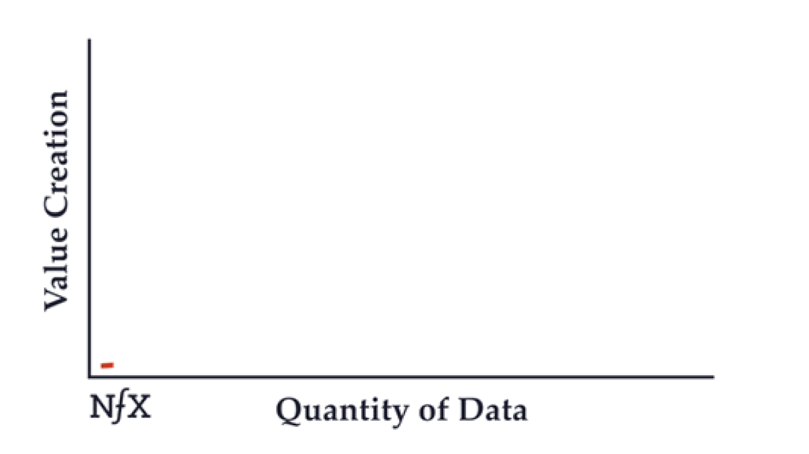
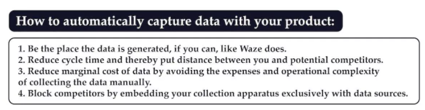
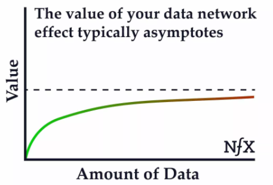

# What Makes Data Valuable: The Truth About Data Network Effects

Source: [https://www.nfx.com/post/truth-about-data-network-effects/](https://www.nfx.com/post/truth-about-data-network-effects/)

Data is not inherently valuable. Most data doesn’t produce a real data network effect, and most data network effects aren’t that powerful even once established.

> *Building a truly iconic company is about building true defensibility.*

## 3 Broad Approaches to Making Data Valuable

1. Data Network Effects 
    - product’s value grows as a result of more usage via the accretion of data
    - highly valuable, very rare
2. Data Scale
    - Next best thing to Network effects because scale effects are linear and asymptote quickly, while network effects are nonlinear and create increasing returns.
    - Eg. The scale of data with Yelp (number of restaurants and local businesses it covers) and Amazon (breadth of products) makes it hard for a new competitor to challenge them
    - Caution: Data is NOT an ongoing insight engine.
        - In practice, most of the valuable insights you will glean from a scaled-up dataset in a particular domain will come early on. More data just confirms those insights. 
        - Further, the number of insights that will matter enough for customers to pay you or choose me over other providers is typically small. 
        - So data scale can give you these early 1-3 key insights, but I typically need to develop other aspects of my defensibility to build an important company.
3. Data Embedding
    - Data embedding is the idea that by holding more and more of my clients’/users’ data, the harder I am to remove, and that gives me some defensibility.
    - This is NOT a network effect because the value the clients get from me working with the other clients is typically a small part of the value I provide and is not the reason clients would stay with me. 
    - The greater part of my value is that the more data I hold for them embedded in their operations, the harder it would be to remove me. That gives me defensibility.

## 6 elements of Data Network Effects

1. Constant Data Capture from customer usage (may or may not be automatic)
    - Be on a "data treadmill". 
        - i.e. Collect and create value from data that is constantly changing and old data is not very valuable.
    - The data treadmill gives the company defensibility from competitors.
    - 
    -  Real network effects are flywheels that lead to runaway value creation. Best not to constrain that flywheel with manual effort in your operations.
2. Product value should increase automatically as more data is added
    - Captued data should result in increased value for existing users, thereby completing the **positive feedback loop** that drives a data network effect.
    - This has to be **automatic** and **continuous** for a true data network effect.
    - Collecting data to make product improvements or finding insights is a **manual** and **periodic** process and they get harder to find over time. Thus they're not network effects.
3. High threshold for the amount of data needed before the product starts providing value. Provides a scale defensibility against competitors entering the market.
    - Don't overestimate how unique and valuable my dataset is.
    - It's often the case that competitors can get similar, but different, sometimes even smaller datasets to produce similar value in their product.
    - Double check that I have real threshold defensibility:
        - dataset size
        - value
        - uniqueness
4. Sign of a good network effect is when competitors find it hard to provide the same value without a similar size user base. This happens if the value of incremental data set doesn't asymptote quickly (maybe because of the real-time nature of the service).
    -  
    -  
    - Exception: Real-time data networks, applications of machine learning require enormous datasets.
    - Real-time data network effects require a constant feed of data, which means that bigger networks of users have a big advantage over smaller networks. The corpus of data ages so quickly that it doesn’t have time to hit the point of diminishing returns — new data is always valuable.
    - Search engines, for example, require enormous datasets.
5. Value created by data is central to the product value.
    - Peripheral data network effects like recommendation engines at Netflix are not powerful. 
6. Value created by data is perceived by the customer as valuable.
    - Makes the product more defensible against competition.

## Advice from James Currier

- James' website Tickle created a structured dataset of 24 billion answers from 150 million users, but realized that the data was difficult to monetize.
- After two years of trying, clever use of the data made Tickle's core products maybe 20% better. Even 40% better doesn’t typically move the needle in growth or in defensibility against competitors.
- In a world of abundant data, it's getting harder to differentiate on the basis of data quantity alone.
- Make sure to understand the methods for creating real value with my data.

Mind Map: Coming Soon!