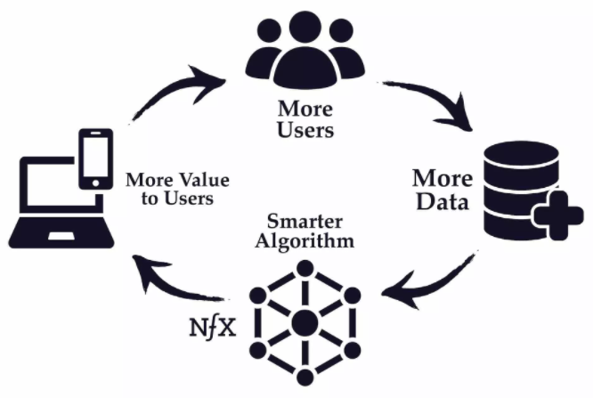

# What Makes Data Valuable: The Truth About Data Network Effects

Source: [https://www.nfx.com/post/truth-about-data-network-effects/](https://www.nfx.com/post/truth-about-data-network-effects/)

Data is not inherently valuable. Most data doesn’t produce a real data network effect, and most data network effects aren’t that powerful even once established.

## 3 Broad Approaches to Making Data Valuable

1. Data Network Effects 
    - product’s value grows as a result of more usage via the accretion of data
    - highly valuable, very rare
2. Data Scale
3. Data Embedding

## 6 elements of Data Network Effects

1. Constant Data Capture from customer usage (may or may not be automatic)
    - Be on a "data treadmill". 
        - i.e. Collect and create value from data that is constantly changing and old data is not very valuable.
    - The data treadmill gives the company defensibility from competitors.
2. Product value should increase automatically as more data is added
3. High threshold for the amount of data needed before the product starts providing value. Provides a scale defensibility against competitors entering the market.
4. Sign of a good network effect is when competitors find it hard to provide the same value without a similar size user base. This happens if the value of incremental data set doesn't asymptote quickly (maybe because of the real-time nature of the service).
5. Value created by data is central to the product value.
6. Value created by data is perceived by the customer as valuable.

