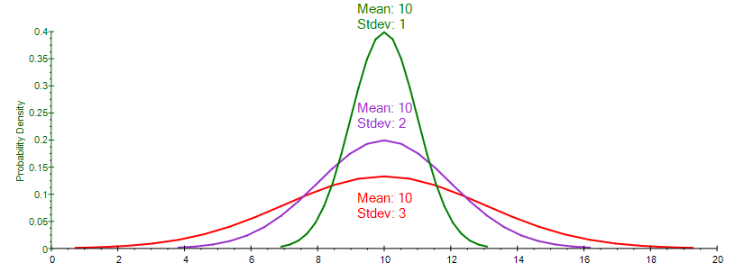
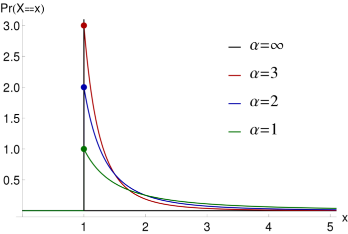

# Product Management's Sacred 7 - The Skills Required to be a World-Class PM

Authors: Neel Mehta, Parth Detroja, Aditya Agashe

# V. Data Science

We'll cover
- Choosing the right data to care about
- Measuring data
- Moving the numbers we care about

## 20. Distributions of data

1. I have to be able to read the **shapes and patterns** in data to find **insights**.
2. Normal Distribution - N($\mu$, $\sigma$), where $\mu$ represents mean and $\sigma$ represents the standard deviation of the distribution
    - Shows spread of data that clusters around an average and falls off above and below that average. Shaped like a bell curve.
    - In tech, ratings are often normally distributed
    - Try to understand the reason why the distribution might be fatter on one side
    - Higher standard deviations lead to taller peaks around the mean and thinner tails
    - 
    - **68-95-99.7 rule** - 68% of data points fall within 1 $\sigma$ of $\mu$, 95% within 2 $\sigma$ and 99.7% within 3 $\sigma$
3. Skewed Distributions
    - Normal distributions that are fatter on one side or otherwise lopsided. 
    - Asymmetrical distribution, but still looks like a bell curve.
        - So, median is a more useful metric than mean as "median" represents the "middle" better in asymmetric distributions.
        - Long right tail - mean dragged higher than median and vice versa. i.e. *mean moves towards direction of tail*
    - Found frequently in usage data, social media followers data or financial data like customer spending.
    - **Extremistan**: *Those with a small edge meet with outsized success because many human institutions provide non-linear rewards.* These are right-skewed distributions.
4. Power-law Distributions: y = a $x^{-b}$, where input variable x is raised to a "power".
    - 
    - Extremely skewed, peaks right around zero, with a very long tail to the right.
    - Doesn't look like a bell curve.
    - Very common when we're **ranking** things.
        - Eg. Ranking websites by number of visitors, Ranking apps by number of downloads
    - Winner-takes-all effect: *The most successful are many times more successful than the rest.* 
    - Identifying and Naming Power-law distributions: (think in terms of revenue and impact)

| Name                               | Industry                    | Explanation                                                                     |
|:-----------------------------------|:----------------------------|:-------------------------------------------------------------------------------|
| Pareto Principle a.k.a. 80/20 rule | Universal. Key to many products' business models. | The top 20% of a distribution contributes about 80% of the output. |
| Whales                             | Gaming, free-to-play games, any company that earns variable amounts of money from a customer (eg. Slack).  | Extremely profitable customers are called whales. Whales will be the source of most of the company's profit. Gaming studios' strategies revolve around finding and cultivating whales, who effectively pay for the massive pod of free-tier players. |
| 90-9-1 rule                        | Social media, other user-generated content products. | 90% of users are  **"lurkers"**, who *post very little*, 9% are **"contributors"**, who *comment onor share posts but don't make many posts of their own*, 1% are **"creators"**, who *actively create content*. |

## 21. Experiments

## 22. Metrics

## 23. Metric Models

## 24. Storytelling with Data

----------------------------------------------------------------------------------------------------------------------------------

Data Science Mind Map: Coming Soon!

----------------------------------------------------------------------------------------------------------------------------------