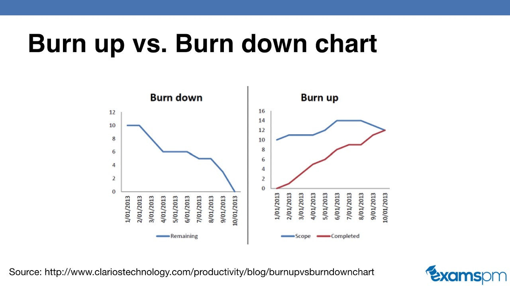
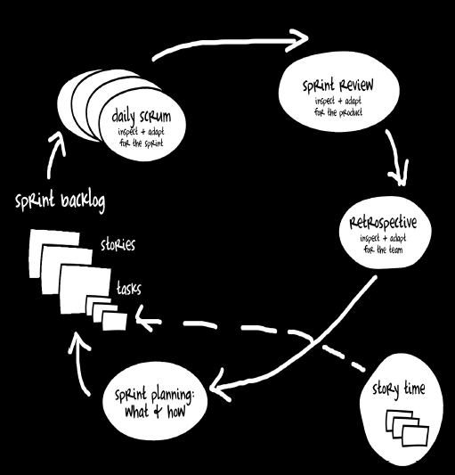
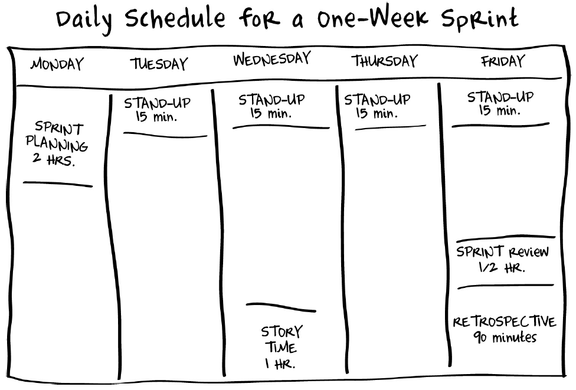

# Scrum: A Breathtakingly Brief and Agile Introduction - Chris Sims & Hillary Louise Johnson

Contents
1. What is Scrum?
2. Roles
3. Scrum Artifacts
4. The Sprint Cycle
5. Appendix: Values & Principles

## 1. What is Scrum?

Lightweight framework designed to **help**
- small
- close-knit teams of **people**
- **develop** complex **products**

> "Inspect and adapt" - One of Scrum's mantras 

Not inherently technical. Can be used in any industry.

Typical Scrum team - 7+/-2 people working together with an intense focus on **continuous improvement** of
- process
- product

Sprints - Short, sustainable bursts of activity carried out by the team

## 2. Roles

Scrum has only 3 distinct roles
- product owner
- scrum master
- team member

### Product Owner
- Responsible for maximizing ROI (Return-on-Investment)
- Directs team toward the most valuable work, and away from less valuable work
- Controls the order/priority of items in the team's backlog
- Makes sure the team fully understands the requirements
    - only then the team will build the right thing and not waste time building the wrong thing
- responsible for recording the requirements, often in the form of user stories, and add them to the product backlog
    - each user story, when completed, will incrementally increase the value of the product
        - user story template: "As a [type of user], I want to [do something], so that [some value is created]."
- represents the customers
- represents the interests of the business
- holds the vision for the product
- is available to answer team members' questions

### Scrum Master
- Deliverable: high-performing, self-organizing team
- team's good sheperd, champion, guardian, facilitator, scrum expert
- helps the team learn and apply scrum and related agile practices to the team's best advantage
- constantly available to the team to help them remove any impediments or road-blocks that are keeeping them from doing their work
- not the team's boss, but a peer, set apart by knowledge and responsibilities and not rank

### Team Member
- Have total authority over how the work gets done
- Decide tools and techniques to use
- Decide which team member will work on which tasks
- Theory: People who do the work are the highest authorities on how best to do it
- Create schedule estimates
- Should possess all the skills required to create a potentially shippable product
- A team of specialists
- Help the team deliver potentially shippable product in each sprint
    - best way to do this is by contributing work in their area of speciality
    - often times, will have to work outside their area of specialty to best remove backlog items
    - mindset shifts -> "doing my job" to "doing the job", "what we are doing(work)" to "what is getting done(results)"

## 3. Scrum Artifacts

> Tools scrum practitioners use to make our process visible.
> 1. Product Backlog
> 2. Sprint Backlog
> 3. Burn Charts
> 4. Task Board

### The Product Backlog

Cumulative list of **desired deliverables** for the project. Includes **"backlog items" aka "user stories"**.
- features
- bug fixes
- documentation changes
- and anything else that will be meaningful and valuable to produce.

Order of items:
- most important story (the one that the team should do next) is at the top of the list - should be small and well understood
- descending order of importance
- stories near the top should be small and well understood while the ones at the bottom can be large and less well understood

Each item should include
- who the story is for (which users will benefit from this story)
- what needs to be built (a brief description of the desired functionality)
- why we should do it (the reason why the story is valuable)
- how much work the story requires to implement it (estimate)
- acceptance criteria that will help us know when it has been implemented correctly

### The Sprint Backlog

Team's todo list for the sprint.

Has a finite life-span: the length of the current sprint.

Includes stories that the team has committed to delivering this spring and their associated tasks.

Stories are deliverables 
- units of value
- delivered by team
- requires many tasks

Tasks are things that be done to deliver the stories 
- units of work
- delivered by a person

### Burn Charts

Time (X-axis) vs scope (Y-axis) relationship chart

Burn up chart vs Burn down chart
- Burn up chart shows how much has the team gotten done
- Burn down chart shows how much is left to do

### Task Board

Visible to everyone from across the room.
- Helps team inspect current situation and adapt as needed
- Helps stakeholders see the progress that the team is making

Simplest task board consists of 3 columns:
- To do
- Doing
- Done

## 4. The Sprint Cycle

### Definition of Done

To avoid confusion, good scrum teams create their own definition of the word "done" when it is applied to a user story.

This may include things like
- code written
- unit tests passing
- regression tests passing
- documentation written
- product owner sign-off
- ...

### It's all about Rhythm

> The sprint cycle is the foundational rhythm of the scrum process.

Sprint/cycle/iteration - a fixed period of time within which you bite off small bits of your project and finish them before returning to bite off a few more.

> At the end of your sprint, you will be demnonstrating working software.

> The more frequently the team delivers a potentially shippable product increment, the greater freedom the business has in deciding when and what to ship. Also, the more frequently the team gets feedback - fuels the inspect and adapt cycle.

There are 2 decisions to be made:
1. For the team: is the product potentially shippable? i.e. is the quality high enough that the business could ship it?
2. For the business: does it make business sense to ship what we have at this time? i.e. is there enough incremental value present to take the current product to market?

> 2-week sprints are the most common.

### Sprint Planning Meeting

Marks the beginning of the sprint.

Has 2 parts
1. Team commits to a set of deliverables for the sprint. (What will we do?)
- this meeting is lead by the product owner
- presents stories in priority order
- as each story is presented, team members discuss the story with product owner and review acceptance criteria to make sure they have a common understanding of what is expected
- team members decide if they can commit to delivering that story by the end of the sprint
- process repeats for each story, until the team feels that they can't commit to any more work
- product owner: decides which stories will be considered
- team members: decide how much work they can take on
2. Team identifies the tasks that must be completed in order to deliver the agreed upon user stories. (How will we do it?)
- tasks are things like
    - get additional input from users
    - design a new screen
    - add new columns to the database
    - do black-box testing of the new feature
    - write help text
    - get the menu items translated for our target locales
    - run the release scripts
- product owner should be available during this meeting to answer questions
- team members may realize that they've signed up for too much or too few stories and adjust the list of stories they're committing to
- output: spring backlog, list of all the committed stories with their associated tasks
- product owner agrees not to ask for additional stories during the sprint, unless the team specifically asks for more, commits to being available to answer questions about the stories, negotiate their scope, provide product guidance until the stories are acceptable and can be considered done.

> 1-2 hours of sprint planning per week of development recommended.

### Daily Scrum aka Standup Meeting

Brief. Pointed. No more than 15 minutes. Discourage the kind of tangents and discursions that make for meeting hell.

Each participant quickly shares:
- What tasks I've completed since the last daily scrum
- What tasks I expect to complete by the next daily scrum
- What obstacles are slowing me down

Goal: inspect and adapt the work the team members are doing, in order to successfully complete the stories that the team has committed to deliver. Needn't resolve problems in the meeting, simply surface issues and decide which team members will address them.

### Story Time

Discuss and improve stories in product backlog. Not stories in the current sprint.

1 hour per week.

Team works with product owner to:
- Define and refine acceptance criteria (pass/fail conditions that help us know when the story is implemented as intended, could be demonstrated with examples)
- Story sizing (a guess at how much work will be required to get the story completely done)
- Story splitting - small and well defined stories at the top, larger and less well defined stories at the bottom. Break larger stories and define them better as they make their way up the list.
    - Product owner gets help from the whole team

### Sprint Review

Public end of sprint. Invite all stakeholders to meeting.

Team's chance to show off its accomplishments, the stories that have met the team's definition of done. Stakeholders' opportunity to see how the product has been incrementally improved over the course of the sprint.

Also share stories that the team committed to but did not complete. Then, present the stories that got done.

Feedback and ideas
- provided by stakeholders
- gathered by product owner and team members

Not a decision-making meeting.

30 minutes - 1 hour meeting.

### Retrospective

Team's private meeting. Held at the end of each and every sprint. Dedicated time for the team to focus on what was learned during the sprint and how the learning can be applied to make some improvement.

1-2 hours per week.

Identify no more than 1 or 2 strategic changes to make in the next sprint.

It's about process improvement.

### Abnormal Sprint Termination

> In scrum, the basic agreement between management and the team is that management won't change up requirements during a sprint.

Still, every once in a while something happens that invalidates everything in the sprint plan.

Termination decision made by product owner.

If terminating, team will back out any changes that they have made during the sprint to avoid the problems that come from half-done work.

Important to hold a retrospective after a sprint is abnormally terminated so that the team can learn from the experience.

### Inspect & Adapt, Baby!

We do development work in short cycles to learn. Experience is the best teacher.

The scrum cycle is designed to provide me with multiple opportunities to receive feedback from
- customers
- team
- market  
and learn from it.

Learnings from one cycle informs planning for the next cycle. aka inspect and adapt aka continuous improvement.

## 5. Appendix: Values and Principles

### Agile Principles

Our highest priority is to satisfy the customer through early and continuous delivery of valuable software.

Welcome changing requirements, even late in development. 

Agile processes harness change for the customer’s competitive advantage.

Deliver working software frequently, from a couple of weeks to a couple of months, with a preference to the shorter timescale.

Business people and developers must work together daily throughout the project.

Build projects around motivated individuals. 

Give them the environment and support they need, and trust them to get the job done.

The most efficient and effective method of conveying information to and within a development team is face-to-face conversation.

Working software is the primary measure of progress.

Agile processes promote sustainable development.

The sponsors, developers, and users should be able to maintain a constant pace indefinitely.

Continuous attention to technical excellence and good design enhances agility.

Simplicity, the art of maximizing the amount of work not done, is essential.

The best architectures, requirements, and designs emerge from self-organizing teams.

At regular intervals, the team reflects on how to become more effective, then tunes and adjusts its behavior accordingly.

### Agile Values

Individuals and interactions over processes and tools.

Working software over comprehensive documentation.

Customer collaboration over contract negotiation.

Responding to change over following a plan.