# The Compound Effect - Darren Hardy

## Introduction

Success is never easy or quick.  
This book teaches you the core fundamentals of success.  
The author is a successful businessman and his personal experience has proven him that, no matter what you learn or what tactic you employ, success comes as the result of the operating system of the Compound Effect.

> "There are no new fundamentals. Truth is not new; it's old. You've got to be a little suspicious of the guy who says 'Come over here, I want to show you my manufactured antiques!' No, you can't manufacture antiques." - Jim Rohn

The following *6 basics*, when focused on and mastered, constitute the operating system that can take you to any goal you desire and help you live the life you were meant to live. These 6 together constitute the *Compound Effect*.

**Warning: Earning success is hard. The process is laborious, tedious, sometimes even boring. You need to work hard, be disciplined and committed to succeed.**

Bottom line: You already know all that you need to know to succeed. You don't need to learn anything more. New or more information is not what you need - a new *plan of action* is. It's time to create new *behaviors and habits* that are *oriented away from sabotage and towards success.*

-------------------------------------------------------------------------------------------------------------------------------------------------------------------------

## 1. The COMPOUND EFFECT In Action

**Consistency** - the ultimate key to success. I know how to sustain it.

Hardy's dad had painted a huge **"No pain, no gain"** sign on the wall of the garage.  
He never missed a single day of workout.  
You could set a watch by his routine.  
**"No excuses"** guy - not unless you're *showing bone.**

One of Dad's philosophies - 
> "It doesn't matter how smart you are or aren't, you need to make up in hard work what you lack in experience, skill, intelligence or innate ability. If you competitor is smarter, more talented, or experienced, you just need to work three or four times as hard. You can still beat them!"

I wasn't given loads of instruction. Dad let us figure it out. He was all about taking personal responsibility. Find out and do what needs to be done to succeed. When you achieved the results, you were celebrated.

Another one of Dad's philosophies - 
> "Be the guy who says 'no'. It's no great achievement to go along with the crowd. Be the unusual guy, the extraordinary guy."

Live the Compound Effect each and every day until you aren't able to live any other way if you tried.

**We've been hyponited by commercial marketing, which convinces you of problems you don't have and sells you on the idea of insta-fixes to "cure" them. We've been socialized to believe in fairy-tale endings found in movies and novels. We've lost sight of the good, old-fashioned value of hard and consistent work.**

### You haven't experienced the payoff of the Compound Effect

**Compound Effect - The principle of reaping huge rewards from a series of small, smart choices.**

> Caution! Although the author has mentioned "small" choices, he has also mentioned that his Dad had made him work extremely hard to achieve success. "Small" does not mean easy or less effort, it means hard work.

Effects almost insignificant in the immediate term, but don't give up. These small, seemingly insignificant steps completed over time will create a radical difference.

> ### Small, Smart Choices + Consistency + Time = RADICAL DIFFERENCE

### The Magic Penny

If you're given the choice between taking $3 million in cash now and a single penny that doubles in value everyday for 31 days, which would you choose?  
Wise choice: 1 penny that double in value everyday for 31 days results in $10,737,418.24 (approx. $11 million )on Day 31, more than 3 times the $3 million, although you had felt miserable that On Day 29, it had only resulted to $2.7 million and on Day 20, it had only resulted to $5,243, after all your sacrifice and positive behavior.

**Remember this number: 31**

### Three Friends

This story explains the Compound Effect. It is very important. Recall it every day.

Larry --> Ordinary
Scott --> Good
Brad --> Bad

Grew up together, have same sensibilities, live in same neighborhood.  
Each makes $50,000 per annum.  
Married, average health and body weight, some "marriage flab".

- Larry - Plods along doing his thing, thinks he's happy, ocassionally complains that nothing ever changes.
- Scott - Makes some small, seemingly inconsequential, positive changes.
    - Wants changes in his life, but doesn't want to make a fuss over it.
    - He begins reading 10 pages of a good book per day.
    - Listens to 30 minutes of something instructional or inspirational on his commute to work.
    - Cut 125 calories from diet and followed the reduced diet everyday.
    - Started walking 2000 extra steps and continued it everyday.
    - Determined and sticks with his choices.
- Brad - Make a few poor choices.
    - Frequently starts trying out new desserts and cheesy casseroles in kitchen.
    - Installs a bar in family room and adds one alcoholic drink to his diet per week.
    - Overall eats 125 calories more every day.

5 months down the line - No real improvement or decline in their situations.

10 months down the line - Still can't see noticeable changes.

18 months down the line - Slight measurable differences among the three's appearances.

25 months down the line - Really measurable, visible differences observed.

27 months down the line - Expansive differences observed.

31 months down the line - Startling changes observed.

Larry - Pretty much how he was at the start, but a little bitter.
Scott - Trim, has lost 33.5 pounds just by eating 125 calories less everyday. 
- 1000 hours reading good books, listening to self-improvement audios
- put this knowledge in practice and has earned promotion and a raise
- Thriving marriage   
Brad - Fat, weights 67 pounds (33.5*2) more than Scott.
- Unhappy at work
- Marriage on the rocks

- 31 months = 940 days.
- 940 days * 125 calories/day = 117,500 calories saved
- 117,500 calories * 1 pound/3,500 calories = 33.5 pounds lighter.

> After **31 months**, the person who uses the **positive nature of the Compound Effect** appears to be an "overnight success."

### The Ripple Effect

The results in the above example seem dramatic but it goes even deeper than that.

All the extra eating make Brad more sluggish at night -> leads to waking up groggy -> leads to making him cranky -> impacts work performance -> leads to negative feedback from boss -> leads to feeling dissatisfied with job and feeling tired -> leads to feeling more stressed -> leads to eating more -> leads to less walking with wife -> leads to not spending enough time with wife -> leads to wife taking withdrawal personally -> leads to fewer shared activities with wife and less fresh air and exercise -> leads to not getting the endorphin release needed to feel upbeat and enthusiastic -> leads to unhappiness and finding fault with himself and others -> leads to not complementing wife and feeling flabby, lacking self-confidence, less attractive, less romantic -> leads to losing himself in late night TV shows to distract himself -> leads to wife feeling distance, complaining and feeling needy -> leads to wife emotionally withdrawing to protect herself -> leads to wife spending more time with her friends to fulfill her need for companionship, men starting to flirt with her, which makes her feel desirable again -> leads to Brad feeling somthing is wrong -> leads to Brad finding fault with his wife instead of seeing that *his* poor choices and behaviors are at the root of all problems.

> Psychology 101 - Believing that the *other* person is wrong rather than looking inside and doing the work necessary to clean up your mess is the biggest mistake people make.

**All the small bad choices Brad made on a daily basis create a ripple effect and wreaked havoc on every area of his life.**

Meanwhile, Scott is reaping the bounty of positive results.

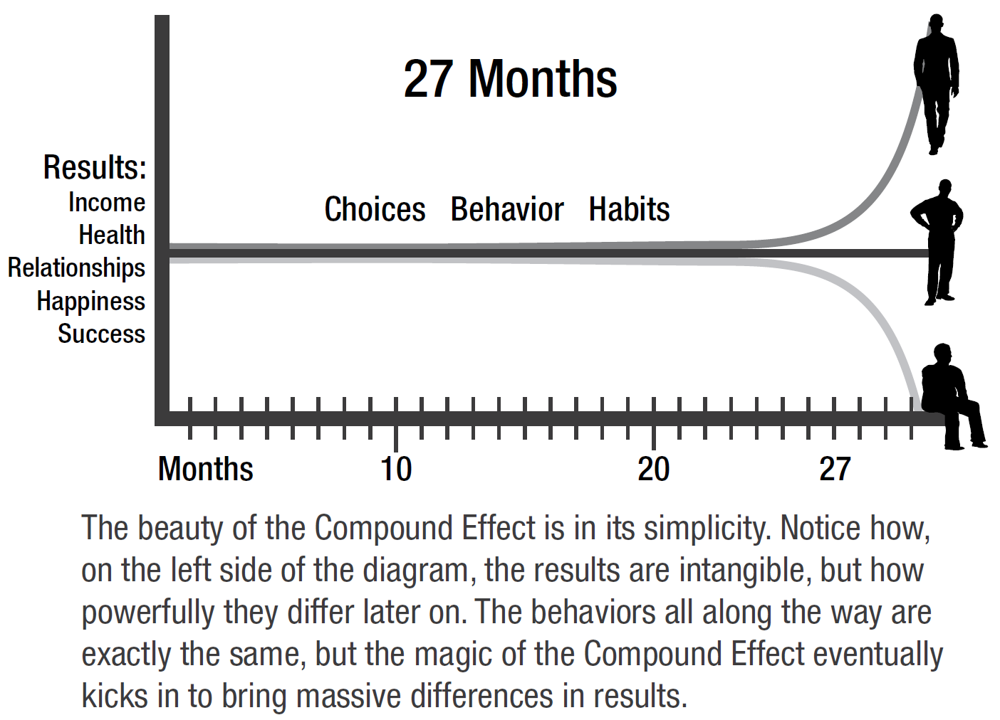

**With enough time and consistency, the outcomes become visible. Better yet, they're totally predictable.**

We've been conditioned by society to believe in the effectiveness of a great display of massive effort, but this only leads to failure. What leads to success is consistent effort.

### Success, Old School

The secret:
- Hard Work, Grit, Fortitude
- Discipline
- Good Habits

Our grandparents didn't watch TV infomercials about how to get thin thighs in 30 days. They **worked 6 days a week, from sunup to sundown, using the skills they learned in their youth and repeatedly throughout their entire life.**

Wealth skips a generation because the children of the rich aren't the ones who developed the discipline and character to create the wealth in the first place.

Nothing fails like success. People get to a certain level of success and get too comfortable i.e. they get complacent.

> Real and lasting success requires work - and lots of it! To avoid failing, never stop doing what made you successful to begin with.

### Microwave Mentality

Understanding the Compound Effect will **rid you of "insta-results" expectation. Promise yourself that you'll let go once and for all the lottery-winner expectations, because for every lottery winner, there are millions of losers.

Begin everyday earlier than others and end later than others. Know in your bones that your only path to success is through a **continuum of**
- mundane
- unsexy
- unexciting
- difficult

**daily disciplines compounded over time.**

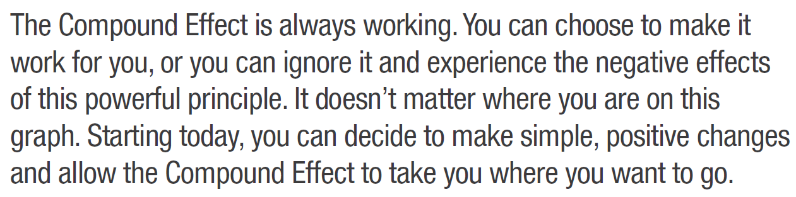

### Summary Action Steps
1. Write out a few excuses you might be clinging to (e.g., not smart enough, no experience, wrong upbringing, don't have the education, etc.). Decide to make up in hard work and personal development to outcompete anyone - including your old self.
2. Be Scott - Write out the half-dozen small, seemingly inconsequential steps you can take every day that can take your life in a completely new and positive direction.
3. Don't be Brad - Write out the small, seemingly inconsequential actions you can stop doing that might be compounding your results downward. 
4. List a few areas, skills, or outcomes where you have been most successful in the past. Consider whether you could be taking those for granted and are not continuing to improve, and are therefore in jeopardy of having that complacency lead to future failure.

-------------------------------------------------------------------------------------------------------------------------------------------------------------------------

## 2. Choices

> Choice - The one thing that controls your life. Change this and you can change your life.

Everyone is born the same. The life we end up with is simply an accumulation of all the choices we make.

Choices are the root of every one of your results. **Each choice starts a behavior that over time becomes a habit.**

You make your choices and then your choices make you.

Become **aware** of and make choices that support the expansion of your life.

Ask yourself and answer this question: 
> "How many of my behaviors have I not 'voted on'? What am I doing that I didn't consciously choose to do, yet continue to do every day."

**Your biggest challenge isn't that you've been intentionally making bad choices. It's that you've been *sleepwalking* through your choices. Half the time, you're not even aware you're making them!**

### Elephants Don't Bite

It's the little things in life that bite you. Mosquitoes bite, elephants don't.

Small poor decisions that feel insignificant can completely throw you off course because you're not mindful of them. They overwhelm you and space you out. They compound against you. WAKE UP and make empowering choices.

### Thanksgiving Year-Round

Make this choice - be grateful and focus on the positives.

Be grateful for
- the people in your life
- your job
- the things you own
- anything you have but are unhappy about

Maintain a thanksgiving journal and fill it with the things you're grateful for. Your gratitude will compound and your happiness will compound.

### Owning 100 Percent

> If there's only one concept you can practice, practice this in every area of life: *"You have to be willing to give 100 percent with zero expectation of receiving anything in return. Only when you're willing to take 100 percent responsibility for making the relationship work will it work. Otherwise, a relationship left to chance will always be vulnerable to disaster."*

You alone are responsible for what you do, don't do or how you respond to what's done to you.

### Getting Lucky

Luck simply comes down to a series of choices.

> The Complete Formula for Getting Lucky:
> Preparation (personal growth) + 
> Attitude (belief/mindset) + 
> Opportunity (a good thing coming your way) +
> Action (doing something about it) = 
> Luck

Preparation: "The more I practice, the luckier I get." - Arnold Palmer

Attitude: See situations, conversations and circumstances as **fortuitous**. You cannot see what you don't look for, and you cannot look for what you don't believe in.

Opportunity: Comes up in its own accord.

Action: Act upon the opportunity.

Luck is an equal-opportunity distributor.

### The High Price of Tuition at UHK (University of Hard Knocks)

> "The day you graduate from childhood to adulthood is the day you take full responsibility for your life." - Jim Rohn

### Your Secret Weapon - Your Scorecard

**The first step towards change is awareness.**

Become conscious of every choice you make today so you can begin to make smarter choices moving forward.

**To become aware of your choices, *track every action* that relates to the area of your life you want to improve. This process forces you to be conscious around your decisions.**

The biggest difference between successful people and unsuccessful people is that successful people are willing to do what unsuccessful people are not.

### Money Trap

Carry a small notepad in your back pocket and write down every single cent you spend.

Tracking is my go-to transformation model for everything that ails me. Tracking brings moment-to-moment awareness to the actions you take in the area of your life you want to improve.

Track your behaviors for at least one whole week. Tracking is the best way to get your life back on track. All winners are trackers. Tracking brings your goals within sight.

To get results, you have to take action. Tracking will revolutionize your life, and ultimately, your lifestyle.

### Keep It Slow and Easy

Start with tracking one habit for one week. Thorough, constant tracking.

> I am going to track _______ on _______. (date/month/year)

Next, track this one area for three weeks.

**Something doesn't become a habit until you practice it for three weeks.**

Start today!

> **Everytime you spend a buck today, it's like taking five dollars out of your future pocket. Always assess things from a future-value standpoint.**

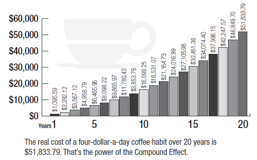

### The Unsung, Unseen Hero

A horse wins by a nose, but gets 10 times the money. Is the horse 10 times faster? No, just a little bit better. But it was the extra effort and discipline that the horse put during practice that made the horse a little better with compounded rewards.

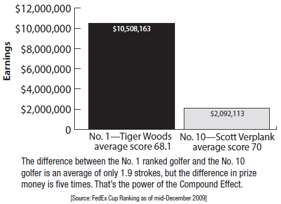

### Take a Walk

I asked Phil to track just one change: 3 times a week, he had to step outside of his office and walk around the building, seek out at least 3 people who he saw doing things right or had heard good things about and give them some personal acknowledgement or appreciation.

Over time, the company's culture, which was earlier unenthusiastic, changed completely and their net profits also grew by more than 30 percent, utilizing the same staff and zero additional investment in marketing.

### Money Tree

Improve your savings by 1% of your income every month. Eg. Kathleen was earning $3,300 per month. Hardy helped her save $33 in the first month by cutting down outside lunch once a week. Next month, he helped her save $66 by changing her cable subscription fee, and so on every month. Withing a year, she was able to save 10% of her income. It also had a ripple effect on her as she started finding more ways to save and now she has her own independent contract service business. She's a millionaire now.

### Time is of the Essence

The earlier you start making small changes, the more powerfully the Compound Effect works in your favor. 

> The key is to start NOW. 0.01 percent improvement on the previous day will have increased your results by 1000% in 10 years.

### Success is a (Half-) Marathon

> Find your why-power and commit to a series of small steps. Think about your happiness and ultimate goal as being warm. You're in the cold initially and every positive choice and positive decision you make in the moment gets them closer to that ultimate goal.

Find your motivation. If you choose just one new habit, you'll get hooked, and all the other behaviors will naturally fall into line.

Start with a small, easy task that requires no major stretch. Increase every day. Always remember your why.

**Your life is a product of your moment-to-moment choices.**

> Step by step, day by day, your choices will shape your actions until they become habits, where practice makes them permanent. Losing is a habit. So is winning. Work on permanently instilling winning habits into your life.

### Summary Action Steps
1. What area, person or circumstance in your life do you struggle with the most? Start journaling all the aspects of that situation that you are grateful for. Keep a record of everything that reinforces and expands your gratitude in that area.
2. Where in your life are you not taking 100 percent responsibility for the success or failure of your present condition? Write down three things you've done in the past that have messed things up. List three things you should have done but didn't. Write out three things that happened to you but you responded poorly. Write out three things you can start doing right now to take back responsibility for the outcomes of your life.
3. Start tracking at least one behavior in one area of your life you'd like to change and improve (e.g., money, nutrition, fitness, recognizing others, parenting, ... any area).

-------------------------------------------------------------------------------------------------------------------------------------------------------------------------

## 3. Habits

> The power that habits will have over your life: "The older they are, the bigger they get, the deeper the roots grow, and the harder they are to uproot. Some get so big, with roots so deep, you might hesitate to even try."

### Creatures of Habit

> "We are what we repeatedly do." - Aristotle

Habit - "An acquired mode of behavior that has become nearly or completely involuntary."

Most people's lives are on autopilot and pulled by their habits.

95% of what we feel, think, do and achieve is a result of a learned habit.

Habits can be helpful - as long as they're good habits.

> All great achievers share one common trait - good habits. A daily routine built on good habits is what separates the most successful amongs us from the rest.

Like Larry Bird, you can **condition your automatic and unconscious responses to be those of a developed champion.**

> Become a creature of champion habits. Make up for what you lack in innate ability with
> - discipline
> - hard work
> - good habits.
> With enough practice and repetition, any behavior, good or bad, becomes automatic over time.

Even if we unconsciously develop bad habits, we consciously decide to change them.

> Since you learned every habit you have, you can also unlearn the ones that aren't serving you well.

### Start by Thinking Your Way out of the Instant Gratification Trap

We think we're a rational species, but why are we so irrationally enslaved by so many bad habits?  
It's because our need for immediate gratification can turn us into the most reactive, nonthinking animals around.

The payoff or instant gratification derived from bad habits often far outweighs what's going on in your rational mind concerning long-term consequences. However, they activate the negative Compound Effect and are devastating in the long term.

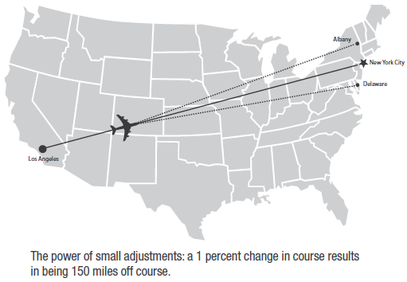

Uprooting bad habits that have grown into mighty oaks is going to be ardous and difficult; to see the process through will require something greater than even the most relentless determination - willpower alone won't cut it.

### Finding Your Mojo - Your Why-Power

Forget about willpower. It's time for *why-power.*

> Your choices are only meaningful when you connect them to your desires and dreams. The wisest and most motivating choices are the ones aligned with that which you identify as your purpose, your core self, and your highest values. You've got to want something, and know *why* you want it, or you'll end up giving up too easily. Your *why* must be something that is *fantastically motivating - to you*.

You MUST know your why.

### Why Everything's Possible

Your *why* gets you to stick through the grueling, mundane and laborious. All of the *hows* will be meaningless until your *whys* are powerful enough.

> When the reason is big enough, you'll be willing to perform almost any *how*.

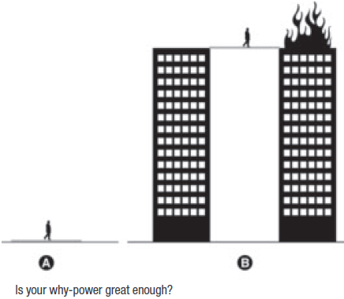

Look beyond the motivation of monetary and material goals. They can't really recruit your heart, soul and guts into the fight. Focus on fulfillment, not just on achievement. 

> Success without fulfillment is failure.

### Core Motivation

> The access point to your why-power is through your *core values*. Your core values define both who you are and what you stand for. They're your internal compass. They act as a filter through which you run all of life's demands, requests and temptations, making sure they're leading you toward your intended destination. Nothing creates more stress than when our actions and behaviors aren't congruent with our values. When faced with a choice, ask yourself, "Does this align with my core values?".

### Find Your Fight

> Enemies give us a reason to stand tall with courage. Having to fight challenges your skills, your character and your resolve. It forces you to assess and exercise your talents and abilities. Without a motivating fight, we can become fat and lazy; we lose our strength and purpose.

Rather than letting past hurful experiences sap our energy and sabotage our success, we can use them to fuel positive, constructive change. 

### Goals

Where do you want the Compound Effect to take you? What goals, dreams, and destinations do you desire?

> "If you are not making the progress that you would like to make and are capable of making, it is simply because your goals are not clearly defined. Whatever you vividly imagine, ardently desire, sincerely believe, and enthusiastically act upon... must inevitably come to pass." - Paul J. Meyer

**The one skill most responsible for the abundance in my life is learning how to effectively set and achieve goals. Something almost magical happens when you organize and focus your creative power on a well-defined target.**

> The person who has a clear, compelling, and white-hot burning why will always defeat even the best of the best at doing the *how*.

### How Goal Setting Actually Works: The Mystery 'Secret' Revealed

> "Law of Attraction" - Our brain is always trying to align our outer world with what we're seeing and expecting in our inner world. We start seeing things only when our brain desires them and it starts paying attention to them. It's not like those things didn't already exist, but it's just that we hadn't desired them and so our brain hadn't paid attention to them. When you define your goals, you give your brain something new to look for and focus on.

List your most important goals in all aspects of life today. Be wary of the high price of putting too much focus on any single aspect of your life, to the exclusion of everything else. Go for whole-life success - balance in all aspects of life that are important to you.

### Who You Have to Become

> The first question to be addressed: "Who do I need to become?"
> "If you want to have more, you have to *become* more. Success is not something you pursue. What you pursue will elude you; it can be like trying to chase butterflies. Success is something you attract by the person you become." - Jim Rohn

Instead of looking for a girl with all the attributes you desire, ask yourself "What kind of man would a woman like this be looking for? Who do I need to become to be attractive to a woman of this substance?" and become that person.

### Behave Yourself

> What stands between you and your goal is your *behavior*. What habits and behaviors do you need to subtract from and add to your life?
> YOU -> CHOICE (decision) + BEHAVIOR (action) + HABIT (repeated action) + COMPOUNDED (time) = GOALS

Become aware of your behavior and track it.

Story of an executive who spent 3.5 hours watching and listening to news everyday. He was neither an economist nor did he have a job which required him to be up to date with news all the time, but he still spent so much time on news because it had become a habit to him. Hardy advised him to turn off the TV and radio, cancel his newspaper subscription and set up an RSS feed so that he could select and receive only the news he deemed important for his business and personal interests. Doing so immediately cleared out 95 percent of the mind-cluttering and time-sucking noise. Now, he felt less stressed and more inspired and focused. 

> One small, simple change in habit, one giant leap forward in balance and productivity!
> Get out your little notebook and write out your top three goals. Now, make a list of the bad habits that might be sabotaging your progress in each area. *Write down every one.* Habits and behaviors never lie. Let's uproot those sabotaging bad habits and plant new, positive, and healthy ones in their place.

### Game Changers: Five Strategies for Eliminating Bad Habits

If you want to sail your life in a new direction, you have to first pick up the anchors of bad habits that have been weighing you down.

> The key is to make your why-power so strong that it overwhelms your urges for instant gratification.

1. Identify Your Triggers

Look at your list of bad habits. For each one you've written down, identify what triggers it.

Figure out "The Big 4's"
- who
- what
- where
- when 

underlying each behavior.

Get out your notebook or use the Bad Habit Killer Worksheet and **write down your triggers.**  
This increases your awareness of your bad habits.

2. Clean House

Literally and figuratively. **Get rid of whatever enables your bad habits.**

Eg. If you’re trying to curb your spending, take an evening and cancel every catalogue or retail offer that flies in through your mailbox or your inbox, so you won’t even need to muster the discipline to walk it from the front door to the recycle bin. If you want to eat more healthfully, clean your cupboards of all the crap,
stop buying the junk food—and stop buying into the argument that it’s “not fair” to deny the other people in your family junk food just because you don’t want it in your life. Trust me; everyone in your family is better off without it. **Don’t bring it into the house, period.**

3. Swap It

Look again at your list of bad habits. How can you alter them so that they're not as harmful?

Either replace them with healthier habits or get rid of them altogether?

Eg. if you crunch through a bag of chips while watching TV, replace the bag of chips with some crunchy food that is healthy - something like carrots, celery sticks and raw brocolli spears.

See what behaviors you can replace, delete or swap out.

4. Ease In

For some of your long-standing and deep-rooted habits, it may be more effective to take small steps to ease into unwinding them.

5. Or Jump In

For some people, it's easier to change a great many bad habits at once. This is an exception. If you're like this, then jump right in and let go of all the bad habits immediately.

Sometimes, it's actually better to take the big plunge right away rather than easing in. It might be paintful at first, but over time, it will be exhilarating.

### Run a Vice Check

How can you tell whether a bad habit is becoming the boss of you? Go on a "vice fast" for 31 days. If you find it seriously difficult to abstain for those 31 days, you may have found a habit worth cutting out of your life.

### Game Changers: Six Techniques for Installing Good Habits

Now that we've eliminated bad habits, we need to create new choices, behaviors and habits that will take you in the direction of your greatest desires.  
This requires an entirely different skill set.

It requires effort, time and practice.

> "You will never change your life until you change something you do daily. The secret of your success is found in your daily routine." - John C. Maxwell

**If we bring special attention to a new habit *daily* for the first 3 weeks, we have a far better chance of making it a lifelong practice.**

The truth is, you can change a habit in a second, or you can still be trying to break it after ten long years.

> The key is staying aware. If you really want to maintain a good habit, make sure you pay attention to it at least once a day, and you're far more likely to succeed.

1. Set Yourself Up To Succeed

Any new habit has to work inside your life and lifestyle. Modify your environment in such a way that it will help you succeed in your habit. 

Eg. find a gym near you that's open during the time that's convenient for you, rather than something 30 miles away and is only open when you're busy at work.

2. Think Addition, Not Subtraction

> "The Add-in Principle. It's not so much what you attempt to take out of your diet. It's what you put in instead. Rather than thinking about what you're taking out of your diet, think about what you can have instead." - Montel Williams - wildly effective tool for anyone with a goal.

3. Go for a PDA: Public Display of Accountability

Once you put it out there on public record, you know that you'll be held responsible for any action that rolls back on your promises and praised for any progress towards your goal.

Tell your family, tell your friends, tell social media.

4. Find a Success Buddy

There are few things as powerful as two people locked up arm in arm marching toward the same goal.

Get a success buddy, someone who will keep you accountable as you cement your new habit while you return the favor.

5. Competition & Camaraderie

There's nothing like a friendly contest to whet your competitive spirit and immerse yourself in a new habit with a bang.

6. Celebrate!

All work and no play makes Jack a dull boy, and it's recipe for backsliding. There should be time to celebrate, to enjoy some of the fruits of your victories along the way.

> You can't go through this thing sacrificing yourself with no benefit. You've got to find little rewards to give yourself every month, every week, every day - even something small to acknowledge that you've held yourself to a new behavior.

### Change is Hard: Yippee!

> There is one thing that 99% of "failures" and "successful" folks have in common - they all hate doing the same things. The difference is successful people do them anyway.

Change is hard. Ordinary is easy. Extra-ordinary is what will separate you from the crowd.

> "The ultimate measure of a man is not where he stands in moments of comfort and convenience, but where he stands at times of challenge." - Dr. Martin Luther King Jr.

When you press on despite difficulty, tedium, and hardship, that's when you earn your improvement and gain strides on the competition. If it's hard, awkward, or tedious, so be it. Just do it. And keep doing it, and the magic of the Compound Effect will reward you handsomely.

### Be Patient

Patterns of thoughts and actions repeated many times create a neuro-signature or a "brain groove", or a series of interconnected neurons that carry the thought patterns of a particular habit. Attention feeds the habit. If we stop giving attention to the bad habits, those grooves weaken.

When we form new habits, we drive new grooves deeper with each repetition, eventually overpowering the previous ones.

Be patient with yourself. If you fall off the wagon, brush yourself off and get back on. No problem. We all stumble. Just go again and try another strategy; reinforce your commitment and consistency.

> When you press on, you will receive huge payoffs. 

### Summary Action Steps
1. Identify your three best habits - those that support your most important goal. Identify your three bad habits that take you off course from your most important goal. Identify three new habits you need to develop to put you on track towards your most important goal. (Download)
2. Identify your core motivation. Discover what gets you fired up and keeps you fired up to achieve big results. (Download)
3. Find your why-power. Design your concise, compelling and awe-inspiring goals. (Download)

-------------------------------------------------------------------------------------------------------------------------------------------------------------------------

## 4. Momentum

> "Big Mo" or Momentum is one of the most powerful and enigmatic forces of success. You can't see or feel Big Mo, but you know when you've got it. It can catapult you into the stratosphere of success. 

### Harnessing the Power of Big Mo

> Newton's First Law: Law of Inertia: Objects at rest tend to stay at rest unless acted on by an outside force. Object in motion tend to stay in motion unless something stops their momentum.

Couch potatoes tend to stay couch potatoes. Achievers continue busting their butts and achieving more and more.

It's not easy to build momentum, but once you do, look out! Remember how the merry-go-round is set in motion. Initially it's hard to get it going, but once it gets going, it keeps spinning for quite some time before it starts slowing down. Again, we put some effort to set it in motion and then it keeps going for some time.  
The same thing happens when a rocket ship launches. It consumes the most amount of fuel when it tries to get off the ground, after which it keeps going.

Adopting any change happens the same way. 

> The first step is difficult, the next steps are slow, but once a newly formed habit has kicked in, Big Mo joins the party. Once you get momentum, you will be hard to stop - virtually unbeatable - even though you're now putting out considerably less effort while receiving greater results. When it rains, it pours.

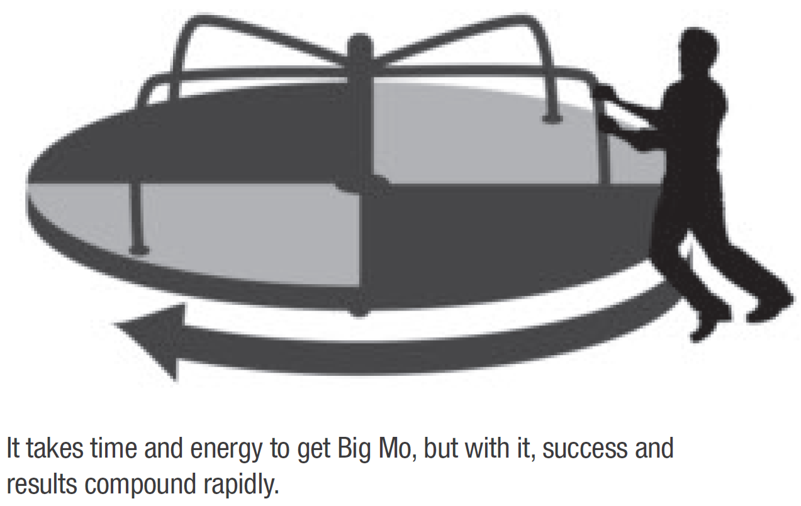

> How do you get Big Mo to pay you a visit? You build up to it.

You get into the groove, the "zone", by doing the things we've covered so far:
1. Making new choices based on your goals and core values.
2. Putting those choices to work through new positive behaviors.
3. Repeating those healthy actions long enough to establish new habits.
4. Building routines and rhythms into your daily disciplines.
5. Staying consistent over a long period of time.

> What do Michael Phelps, Apple, Google and YouTube have in common? They were doing the same things before and after they achieved momentum. Their habits, disciplines, routines and consistency were the keys that unlocked momentum for each. And they became unstoppable when Big Mo showed up to their party.

### Routine Power

Some of our best intentions fail because we don't have a system of execution.

> You new attitudes and behaviors must be incorporated into your monthly, weekly and daily routines to affect any real, positive change. A routine is something you do every day without fail, so that eventually, like brushing your teeth or putting on your seatbelt, you do it without conscious thought. These routines ease life's stresses by making our actions automatic and effective. To reach new goals and develop new habits, it's necessary to create new routines to support your objectives. The greater the challenge, the more rigourous our routines need to be.

Soldiers' routines are so well-rehearsed that they can instinctively act with precision in the middle of the chaos of combat and carry out their duties even under the threat of imminent death.

Without proper routines built into your schedule, your life can be unruly and unnecessarily hard.

Eg. Golfer Jack Nicklaus, Tennis player Rafael Nadal all have their routines that they religiously follow before every shot and every serve.

Varying their routine stunts their rhythm and consistency and they're never able to catch momentum, which leads to their collapse.

Daily routines are the only way we can predictably regulate our behavior. There simply isn't any way around it. A routine is exceptionally powerful.

To create profitable and effective routines, you must first decide what behaviors and habits you want to implement. Review your goals from Chapter 3, as well as the behaviors you want to add and subtract. Now, figure out your best routine. Be intentional about what components belong. Then, cast the routine in concrete - no argument.

### Bookend Your Days

The become world-class, build your performance around world-class routines.

> It can be futile to predict or control what will show up in the middle of your workday. But **you can almost always control how your day starts and ends**.

### Rise & Shine

My morning routine sets me up for the entire day. Because it happens every morning, it is locked in and I don't have to think about it.

The rest of the day can take a million different shapes, but as long as I go through my morning routine, a majority of the key disciplines I need to be practicing are taken care of, and I'm properly grounded and prepared to perform at a much higher level than if I started each day erratically - or worse, with a set of bad habits.

Eg. Wake up early at 4:00 AM, think of everything you're grateful for. Then, send a mental love letter (a.k.a prayer or blessing) to one person (anyone - friend, relative, co-worker, family member, God, etc.). Then, think about your No.1 goal and decide which 3 things you're going to do on this day to move closer towards reaching it. Then, prepare coffee and stretch. Then, with the coffee, read something positive and instructional for 30 minutes. The, for 1 hour, work on your most important project without any distractions. Then, calibrate your day for 15 minutes - brush over your top 3 1-year and 5-year goals, key quarterly objectives, top goal for the week and the month. Then, set your top 3 MVPs (Most Valuable Priorities) for that day. Then, open email and send a flurry of tasks and delegations to get the rest of your team started on their day. Then, close e-mail and go to work on your MVPs.

### Sweet Dreams

"Cash out" your day's performance in the evenings.
- Compared to your plan for the day, how did it go?
- What do you need to carry over to tomorrow's plan?
- What else needs to be added, based on what showed up throughout the day?
- What's no longer important and what needs to be scratched out?
- Log into your journal, any new ideas, ah-ha's or insights you picked up throughout the day.
- Read at least 10 pages of an inspirational book before going to sleep.

All hell can break loose throughout the day, but because I control the bookends, I know I'm always going to start and finish strong.

### Shake It Up

Interrupt your routines once in a while. Otherwise, life gets stale, you plateau and Big Mo is a no-show. Challenge yourself and freshen up your experience.

This can make you feel alive, recapture your passion and offer you a fresh perspective.

> Look at your routines. If something that used to energize you has become same-old/same-old, or is no longer generating powerful results, switch it up.

### Getting into a Rhythm: Finding Your New Groove

Once your daily disciplines have become a routine, you want the succession of those steps to create a rhythm.

> When your disciplines and actions jibe into a regular weekly, montly, quarterly and yearly rhythm, it's like laying a welcome mat at the front door for Big Mo. Envisioning your success as an unstoppable locomotive may help you stay enthusiastic about getting into your own rhythm.

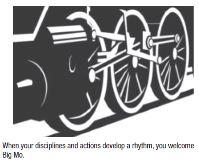

> Along with my daily rhythms, I also plan ahead. Even when something's a high priority for you, if it isn't scheduled on your calendar, it often doesn't happen.

The author has schedules every week for Date Night, Family Day and Relationship Review.

> Life is a collection of experiences. Our goal should be to increase the frequency and intensity of the good experiences.

### Registering Your Rhythm

> "Rhythm Register" - helps keep track of the rhythm of a new behavior.

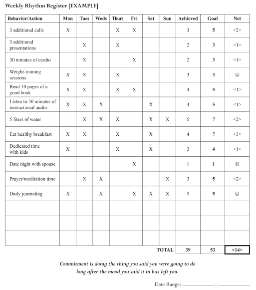

### The Rhythms of Life

> When people get started on a new endeavor, they almost always overdo it. You need to find a program that you can absolutely, positively do in the long term without renegotiation. Think about the rhythms you can do for the rest of your life. Doing too much too soon sets you up for failure.

Set routines that match your why. If you want to get in shape, you don't have hire a personal trainer and work out 2 hours every day of the week until you see your abs. It's enough to workout for 1 hour a day for three days a week.

> Remember, consistency is a critical component of success.

### The Power of Consistency

> My ability to be consistent is the one discipline that gives me a competitive advantage. Nothing kills Big Mo quicker and with more certainty than a lack of consistency. The time and energy it takes to repeatedly stop and start and get back to momentum make your trip at least ten times as long. In fact, most likely you wouldn't even make it - you'd run out of fuel (energy, motivation, belief, will). It's far easier and requires a lot less energy to take off once and maintain a regular speed (even if slower than almost everyone else) all along the way.

### The Pump Well

> When you start thinking about slacking off on your routines and rhythms, consider the massive cost of inconsistency. It is not the loss of the single action and tiny results it creates; it is the utter collapse and loss of momentum your entire progress will suffer.

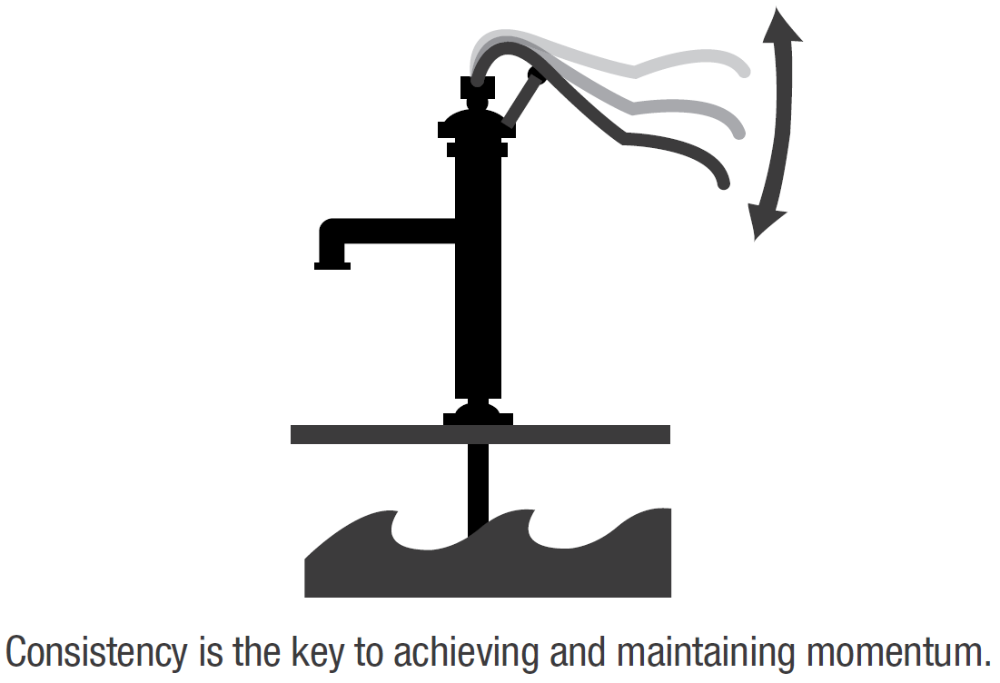

Most people give up pumping after a few minutes when they don't get any water, but wise people persevere. After some time, a few drops of water start coming from the pump. Even then, a lot people ridicule it and say that after so much effort, there's been just a few drops of water, but **wise people persist even further. And here's where the magic happens: If you continue to pump, it doesn't take long before you'll get a full and steady stream of water.** You have your success! Now that the water is flowing, you no longer need to pump the lever as hard or as quickly. All you have to do is **pump the lever consistently with steady pressure.** That's the compound effect. Now, if you let go of the lever for too long, the water falls back down into the ground, and you're back to square one. Mo is gone, water is at the bottom. The only way to get it back up is to pump it really hard all over again. 

> Winning the race is all about pace. Be the tortoise. The person, who, given enough time, will beat virtually anybody in any competition as a result of positive habits and behaviors applied consistently. That'll put the mojo in your momentum and keep it there!

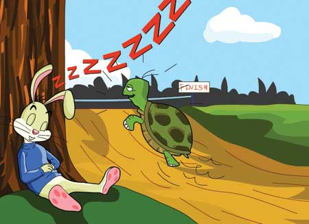

### Summary Action Steps
1. Build your bookend morning and evening routines. Design a predictable and fail-safe world-class routine schedule for your life.
2. List three areas of life in which you are not consistent enough. What has this inconsistency cost you in life thus far? Make a declaration to stay headfast in your new commitment to consistency.
3. On your Rhythm Register, write down a half-dozen key behaviors you want to establish a rhythm with and eventually create momentum - Big Mo. (Download)

-------------------------------------------------------------------------------------------------------------------------------------------------------------------------

## 5. Influences

You alone are 100% responsible for your choices, actions and ultimately your life. That said,
> you must also realize that your choices, behaviors and habits are influenced by very powerful external forces. Everyone is affected by 3 kinds of influences:
> 1. Input (what you feed your mind)
> 2. Associations (the people with whom you spend your time)
> 3. Environment (surroundings)

Most of us aren't aware of the subtle control these forces have on our lives.

> For you to sustain your positive trajectory towards your goals, you'll need to understand and govern these influences so that they support rather than derail your journey towards success.

### I. Input: Garbage In, Garbage Out

If you want your brain to perform at its peak, you have to vigilant about what you feed it. Controlling the input has a direct and measurable impact on your productivity and outcomes. It's difficult because so much of what we take in is unconscious. It's a never-ending battle to be selective and to stand guard against any information that can derail your creative potential.

> Your brain is not designed to make you happy. It has one aim: survival. It's programmed to seek out the negative. Left to its own devices, your mind will traffic in the negative, worrisome, and fearful all day and night. We can't change our DNA but we can change our behavior. We can protect our mind by being disciplined and practive about what we allow in. (Input Infleunces Sheet - Download)

### Don't Drink Dirty Water

> You get in life what you create. **Expectation drives the creative process.** What do you expect? You expect whatever it is you're thinking about. Your thought process, the conversation in your head, is at the base of the results you create in life.

> What are you thinking about? What is influencing and directing your thoughts? The answer: whatever you're allowing yourself to hear and see. Your mind is like an empty glass. It will hold whatever you put into it. Just like a dirty glass, if you flush it with clean, clear water under a faucet long enough, eventually you'll end up with a glass of pure, clear water. Positive, inspirational and supportive input and ideas are the clear water.

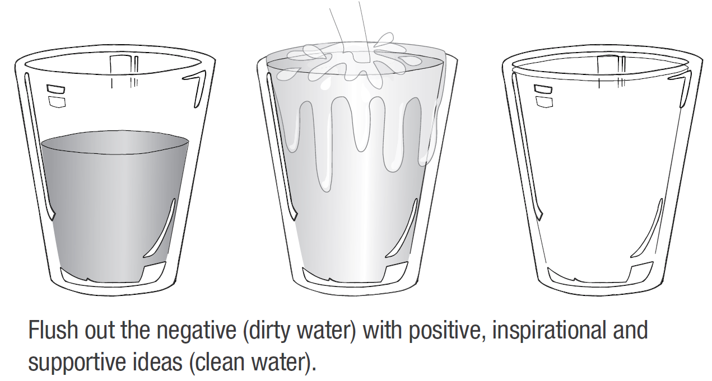

#### Step 1. Stand Guard

Unless you decide to hole up in a cave or on a desert island, you're going to get dirty water in your glass. Take steps to limit your exposure to negative input, like cancelling subscriptions, turning off the radio, etc.

> Commercials prey on our psychology, our fears, pains, needs and weaknesses. TV and media are the biggest reasons for our lack of progress.

### Put Yourself on a Media Diet

The media thrives on taking us hostage. When it comes to sensationalism, our basic nature can't resist. The media masters understand that and use shocking and sensationalist headlines to draw attention.

> The competition for your attention has never been bloodier and the media jockeys continually up the ante in shock value. We hear very little about the million positive things that happen during the day from these media jockeys, but hear a million times about the single bad thing that happened during the day. The media gives us a very perverted view of the world and slowly our minds start believing it. This warped and narrow view of what's not working has a severe influence on your creative potential. It can be crippling.

### My Personal Junk Filter

I have a rigorous mental diet. I don't watch or listen to *any* news and I don't read any newspapers or news magazines.

> 99% of all news has no bearing on my personal life or goals.

I have subscribed to very few feeds identifying the news and industry updates that *do* pertain to my direct interests and goals. I can finish reading them in just 15 minutes a day.

#### Step 2: Enroll in Drive-Time U

> It's not enough to eliminate negative input. To move in a positive direction, you must flush out the bad and fill up on the good.

Turn your car into a mobile classroom. 

# I would skip this section altogether. I find most of the advice in this section about friendship and personal board of advisors terrible. "A friend in need is a friend indeed." If your friends are going through bad phases, it is your duty to advice them and bring them back on track. You have to lift everyone up as you grow. You don't choose friendships based on how your friends will be beneficial to you. You just don't do that. Your relationships with your friends is like Krishna's with Sudama/Kuchela, Draupadi, Arjuna and Uddhava, and Rama's friendship with Guha, Sugriva and Vibhishana.

# "We become the combined average of the 5 people we hang out the most with." - For most people, the 5 closest people would from be their family - Parents, Spouse, Siblings, Children.

### II. Associations: Who's Influencing You?

> Birds of a feather flock together. 

Your "reference group" is the set of people with who you habitually associate. They determine 95% of your success or failure in life. We become the combined average of the 5 people we hang out the most with.

> Your associations don't shove you in a direction; they nudge you ever so slightly over time. You cannot hang out with negative people and expect to live a positive life.

Jot down the names of the 5 people you hang around with the most. Also, write down their main characteristics, both positive and negative. What's their average health and bank balance? What's their average relationship like? Look at the results and ask yourself, "Is this list okay for me? Is this where I want to go?"

Evaluate and shift your associations into 3 categories:
- dissociations
- limited associations
- expanded associations

This is a lifelong process.

### Dissociations

There are some people you might need to break away from. Completely. This might not be an easy step to take, but it's essential. Breaking away won't be easy.

### Limited Associations

There are some people you can spend 3 hours with, but not three days. Others you can spend three minutes with, but not three hours.

Always remember that the influence of associations is both powerful and subtle.

Decide how much you can "afford" to be influenced, based on how those people represent themselves.

### Expanded Associations

Identify people who have positive qualities in the areas of life where you want to improve and spend more time with them.

### Find a Peak-Performance Partner

Team up with a peak-performance partner, someone as equally committed to study and personal growth as you. Get and give unbiased, honest, outside perspective.

Find people who care enough about you to be brutally honest with you. 

Ask them feedback about yourself.
- How do I show up to you?
- What do you think my strengths are?
- In what areas do you think I can improve?
- Where do you think I sabotage myself?
- What's one thing I can stop doing that would benefit me the most?
- What's one thing I should start doing?

### Invest in Mentorship

You're never too good for a mentor. It pays to invest in your improved performance.

> You get up everyday to teach and to be taught. “The first thing you want to remember with a mentor is that it doesn’t need to take a lot of their time.
The best advice I’ve ever gotten is in short clips, having lunch or breakfast with somebody, just telling them what I’m working on and asking their advice and all. You will be amazed how successful businesspeople are willing to be mentors to people when it’s not taking a lot of time.” - Ken Blanchard

> “An individual needs to be open to being mentored. It is our responsibility to be willing to allow our lives and our minds to be touched, molded, and strengthened by the people who surround us.” - John Wooden

### Develop Your Own Personal Board of Advisors

Seek out a dozen positive people who have achieved the success you want to create in your own life, reach out to them once a week, solicit ideas, run thoughts by them and ask for feedback and input.

### III. Environment: Changing Your View Changes Your Perspective

For a sapling to become a great oak, it needs great space.

Environment doesn't just refer to the space around you, it's everything that surrounds you.

> Creating a positive environment to support your success means clearing out all the clutter in your life - both physical and psychic clutter. You get in life what you *tolerate.* *You will get in life what you accept and expect you are worthy of.*

-------------------------------------------------------------------------------------------------------------------------------------------------------------------------

## 6. Acceleration

One of life's greatest questions: "Do you push through the pain and continue on or will you crack like a walnut and give up?"

> "When you open a gap and your competitors don't respond, it tells you something. They're hurting. And when they're hurting, that is when you take them." - Lance Armstrong
> When you've prepared, practiced, studied and consistently put in the required effort, sooner or later you'll be presented with your own moment of truth. In that moment, you will define who you are and who you are becoming. It is in these moments where growth and improvement live.

### Moments of Truth

> "There's a point in every race when a rider encounters his real opponent and understands that it's himself. In my most painful moments on the bike, I am at my most curious, and I wonder each and every time how I will respond. Will I discover my innermost weakness, or will I seek out my innermost strength?" - Lance Armstrong

> It's not getting to the wall that counts; it's what you do *after* you hit it. Hitting a wall isn't an obstacle; it's an opportunity.

> It is what you do after you do your best that creates victories. **It's the extra effort after you've done your best that is the difference maker.**

> "This is perfect attacking weather, mainly because I know the others don’t like it. I believe that nobody in the world is better at suffering. It’s a good day for me." - Lance Armstrong

> "Don't wish it were easier; wish you were better." - Jim Rohn

When you hit the wall in your disciplines, routines, rhythms, and consistency, realize that’s when you are separating yourself from your old self, scaling that wall, and fi nding your new powerful, triumphant, and victorious self.

### Multiplying Your Results

Speeding up the Compound Effect - just a little bit more effort can add exponentially to your outcomes.

> After you reach your daily/weekly/monthly target, do a little more. If your target is to do 12 reps of weight lifting everyday, do 3 to 5 more after you've hit 12, even if you've hit your maximum. These reps done after you hit your max will *multiply* your results. This expands your limits and this is where real growth happens.

> "The Cheating Principle" - "Once you reached your maximum number of lifts in perfect form, adjusting your wrists or leaning back to recruit other muscles to assist
the working muscles (cheating a little) would allow you to do five or six more reps, which would signifi cantly improve the results of that set. (You can also achieve this by having a workout partner who assists the last few reps you couldn’t have done on your own.)"- Arnold Schwarzenegger 

> Take the magic penny we talked about in Chapter 1, the one that doubles in value each day, showing you the result of small compounded actions. If you just doubled that penny one extra time per week during those same thirty-one days, the compounded penny would result in $171 million instead of $10 million. Again, just extra effort in four days and the result was many times greater. That is how the math of doing just a little bit more than expected works.

> Viewing yourself as your toughest competitor is one of the best ways to multiply your results. Go above and beyond when you hit the wall.

### Beat the Expectations

Another way to multiply your results is pushing past what other people expect of you—doing more than “enough.”

> You can do more than expected in every aspect of your life. Go for the "WOW" everytime.

### Do the Unexpected

Common things deliver common results.

> There's nothing wrong with ordinary. I just prefer to shoot for extraordinary. The wow-factor makes a statement and multiplies the impact of your efforts.

Everyone sends Christmas cards, so it really doesn't have much emotional impact. So, I choose to send Thanksgiving cards instead.

> In our attention-deficit, propaganda-saturated society, sometimes doing the unexpected is required to get your voice heard. If you have a cause or ideal worthy of attention, do what it takes, even the unexpected, to make your case heard. Add a little audacity to your repertoire.

### Do Better Than Expected

Find the line of expectation and then exceed it, even when it comes to small stuff. Do this through tireless preparation. 

> Doing better than expected becomes a big part of your reputation. Your reputation for excellence multiplies your results in the marketplace many times over. Remember, the *multiplier* keeps growing. **It takes very little extra to be extraordinary.**

In a world where most things don’t meet expectations, you can signifi cantly accelerate your results and stand out from the pack by doing better than
expected.

> "I say no idea is worthwile if it doesn't start with 'Wow!'." - Robert Schuller

### Summary Action Steps
1. When do you hit your moments of truth (e.g., making prospecting calls, exercising, communicating with your spouse or kids)? Identify so you know when to push through to find new growth and where you can separate yourself from others and your old self.
2. Find three areas in your life where you can do "extra". (e.g., weight lifting reps, calls, recognition, sentiments of appreciations, etc.)
3. Identify three areas in your life where you beat the expectations. Where and how can you create "wow" moments?
4. Identify three ways you can do the unexpected. Where can you differentiate from what is common, normal, or expected?

-------------------------------------------------------------------------------------------------------------------------------------------------------------------------

## Conclusion

Learning without execution is useless. Motivation without action leads to self-delusion. Take immediate action on your new insights and knowledge. Ideas uninvested are wasted.

“Look back on your life five years ago. Are you now where you’d thought you’d be five years later? Have you kicked the bad habits you had vowed to kick? Are you in the shape you wanted to be? Do you have the cushy income, the enviable lifestyle, and the personal freedom you expected? Do you have the vibrant health, abundant loving relationships, and the world-class skills you’d intended to have by this point in your life?” If not, why? Simple—choices. It’s time to make a new choice—choose to not let the next five years be a continuum of the last. Choose to change your life, once and for all.

I have one more valuable success principle to pass along to you.

> Whatever I want in life, I’ve found that the best way to get it is to focus my energy on giving to others. 

If I want to boost my confidence, I look for ways to help someone else feel more confident. If I want to feel more hopeful, positive, and inspired, I try to infuse that in someone else’s day. If I want more success for myself, the fastest way to get it is to go about helping someone else obtain it. The ripple effect of helping others and giving generously of your time and energy is that you become the biggest beneficiary of your personal philanthropy.