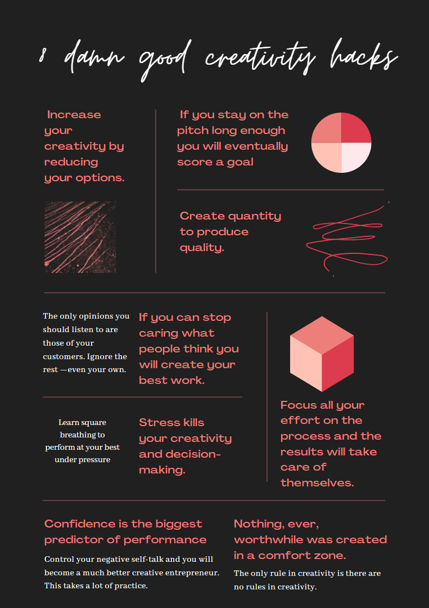

# Creativity Hacks

## 8 Creativity Hacks Illustrated

Source: [https://www.reddit.com/r/Entrepreneur/comments/nig4p6/8_damn_good_creative_hacks/](https://www.reddit.com/r/Entrepreneur/comments/nig4p6/8_damn_good_creative_hacks/)

## Blue Sky Thinking

- [4 Reasons Why Blue-Sky Thinking Will Power You To Spectacular Results!](https://www.linkedin.com/pulse/4-reasons-why-blue-sky-thinking-power-you-spectacular-srinivasan-r)
- [The beauty of blue sky thinking](https://ideadrop.co/idea-management/beauty-blue-sky-thinking/)
- [How to do blue-sky thinking the Google way](https://ravengate.co.uk/how-to-do-blue-sky-thinking-the-google-way-2)

## Get Back Creativity

- [Where has your creativity gone? (And how to get it back)](https://ravengate.co.uk/where-has-your-creativity-gone-and-how-to-get-it-back)

