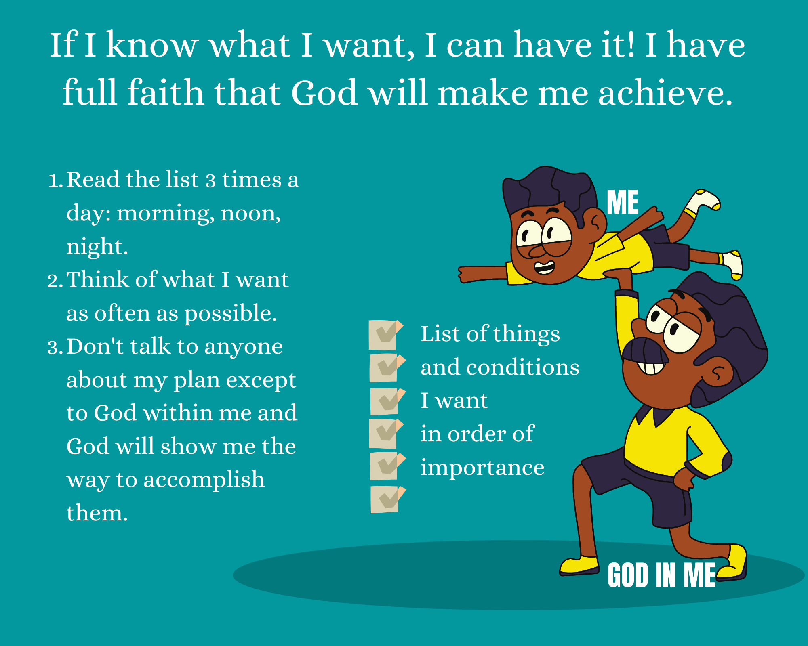

# It Works - The Famous Little Red Book that Makes Your Dreams Come True - by R.H.Jarrett

## Mind Map

## Notes

> If I know what I want, I can have it.

### What is the real secret of obtaining desirable possessions?

God is within me and wants to help me get what I earnestly want. Occasional wishing or half-hearted wanting does not form a perfect connection or communication with God.

### The Plan

Write down on paper in order of their importance the things and conditions I want. Don't be afraid of wanting too much. Change the list (add/subtract/modify) until I have it about right. This may take a few days.

> 3 positive rules of accomplishment:
> 1. Read the list of what I want 3 times each day: morning, noon and night (after waking up, before lunch, before sleep)
> 2. Think of what I want as often as possible.
> 3. Don't talk to anyone about my plan except to the Great Power within me which will unfold to my Objective Mind the method of accomplishment.

Don't doubt that I will find a way to get the things on my list.

Be as specific and detailed as possible about each item.

When I achieve things on my list, thank the Omnipotent Power within and outside me and continue the process.

#### Caution

Remember Karma. Anything I want will happen. So, it would be best to desire only good for me and others.

Accomplish lesser things first, then take the next step.

Help others unconditionally.

### In Conclusion

Read the book over and over again.

Memorize the 3 simple rules.

Test them now on what you want most this minute.