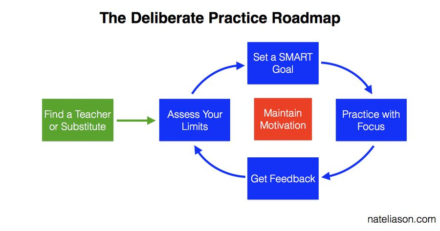
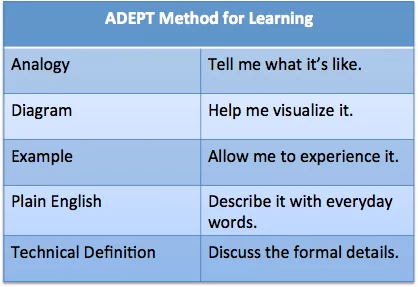
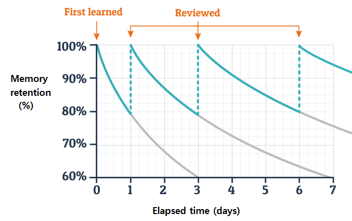
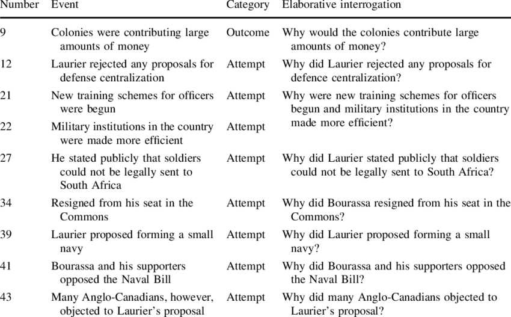

# Techniques to Learn Quicker and Faster

Author: [Alex Brogan](https://mobile.twitter.com/_alexbrogan)

Source (Twitter Threads):
- [https://mobile.twitter.com/_alexbrogan/status/1512830220906151942](https://mobile.twitter.com/_alexbrogan/status/1512830220906151942)
- [https://mobile.twitter.com/_alexbrogan/status/1509206345697927170](https://mobile.twitter.com/_alexbrogan/status/1509206345697927170)

## Learn Quicker (DASCET)

1. Deliberate Practice
    - Deliberate practice involves **focused attention on the micro-components of a skill**, specific goals, and feedback on performance from an expert.
    - 
2. The ADEPT Method
    - A method to teach yourself a difficult idea, or explain one to others.
    - 
3. Spaced Repetition
    - Memories weaken over time.
    - Combat this through spaced repetition: repeated exposure to the information to be learned over time.
    - 
4. Chunking
    - The process of taking individual pieces of information and grouping them into larger units to make them easier to remember. 
    - 
5. Elaborative Interrogation
    - Involves generating an explanation for why an explicitly stated fact or concept is true. 
    - It's asking yourself questions about how and why things work, and then producing the answers to these questions.
    - Learning the "Why" aids retention significantly.
    - 
6. The Textbook Method
    - Write your own textbook chapter on a topic.
    - It requires a deep understanding of the concepts and how they fit together. 
    - You're forced to be consise and to create a clear mental structure of the topic.
    - There's no hiding behind knowledge gaps.

## Learn Faster (PI OR QFS)

1. Project-Based Learning 
    - Ask, what project can you do to learn the skill or topic of knowledge?
2. Immersive Learning 
    - Involves surrounding yourself directly in the environment where the skill will be used. Eg: Moving to a country to learn the native language.
3. The Overkill Approach 
    - Involves putting yourself in a high-demand environment, so you're unlikely to miss important feedback lessons.
    - More feedback = more learning.
4. Retrieval
    - The hard thing to do when learning is actively trying to recall without re-reading or viewing.
5. The Question-Book Method
    - Rephrase notes as questions to be answered later—this engages the retrieval muscle.
    - When reading a book, restate the big idea of a chapter or section as a question.
6. The Feynman Technique
    - STEP 1 - Pick and study a topic
    - STEP 2 - Explain the topic to someone, like a child, who is unfamiliar with the topic
    - STEP 3 - Identify any gaps in your understanding 
    - STEP 4 - Review and Simplify! Convey it to others. Test-and-learn. Iterate and refine your story or narrative accordingly.
7. Spaced Repetition
    - Spreading learning sessions over more intervals over longer periods of time.
    - If you have 10 hours to learn something, it makes more sense to spend 10 days studying one hour each than to spend 10 hours studying in one burst.
    - Repeat to remember.