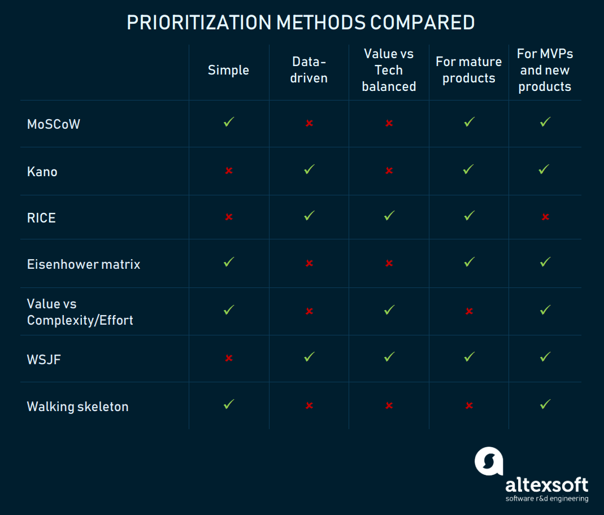

# Prioritization

## The Most Popular Prioritization Techniques and Methods: MoSCoW, RICE, KANO model, Walking Skeleton, and others

Prioritizing tasks in a project backlog is one of a product manager’s responsibilities.

Recommended criteria to keep in mind whilie considering prioritization methods: (SD BU - Simplicity, Data-Driven and Data Availability, Balance between tech constraints and business value, Use case)

- **Simplicity**: 
    - The simpler the method, the **faster** you prioritize.
- **Data-driven prioritization**
    - Some methods rely more on assumptions than on proved data, some not. 
    - While it looks like data-driven is the way to go, there are many cases when **you don’t have data or don’t have time for complex data-backed prioritization**.
- **The balance between technology constraints and business value**
    - It’s cool to create things that customers love and are ready to pay for. 
    - So, there are methods that put the value on top, but they may lack technical consideration. 
    - **The feature sometimes looks extremely important in business terms, but equally difficult in terms of development.**
    - If the method suggests you grab the low-hanging fruit – i.e. choose tasks that will bring value fast – it may be a go-to approach.
- **Best use case**
    - Prioritizing for an **MVP** and for a **mature product** may be drastically different.

These methods are not mutual and can complement each other.

> Mind map coming here!

## MoSCoW method: the simplest and most widespread approach for small products

## Kano Model: customer-driven prioritization

## RICE: balanced, but time-consuming method for mature products

## Eisenhower matrix: a straightforward way for time-management

## Value vs Complexity/Effort matrix: a lightweight approach to balance tech and value

## Weighted Shortest Job First (WSJF): lean but time-consuming way to introduce minimum marketable features

## Walking Skeleton: the best way to prioritize MVP stories

Source: [The Most Popular Prioritization Techniques and Methods: MoSCoW, RICE, KANO model, Walking Skeleton, and others](https://www.altexsoft.com/blog/business/most-popular-prioritization-techniques-and-methods-moscow-rice-kano-model-walking-skeleton-and-others/)