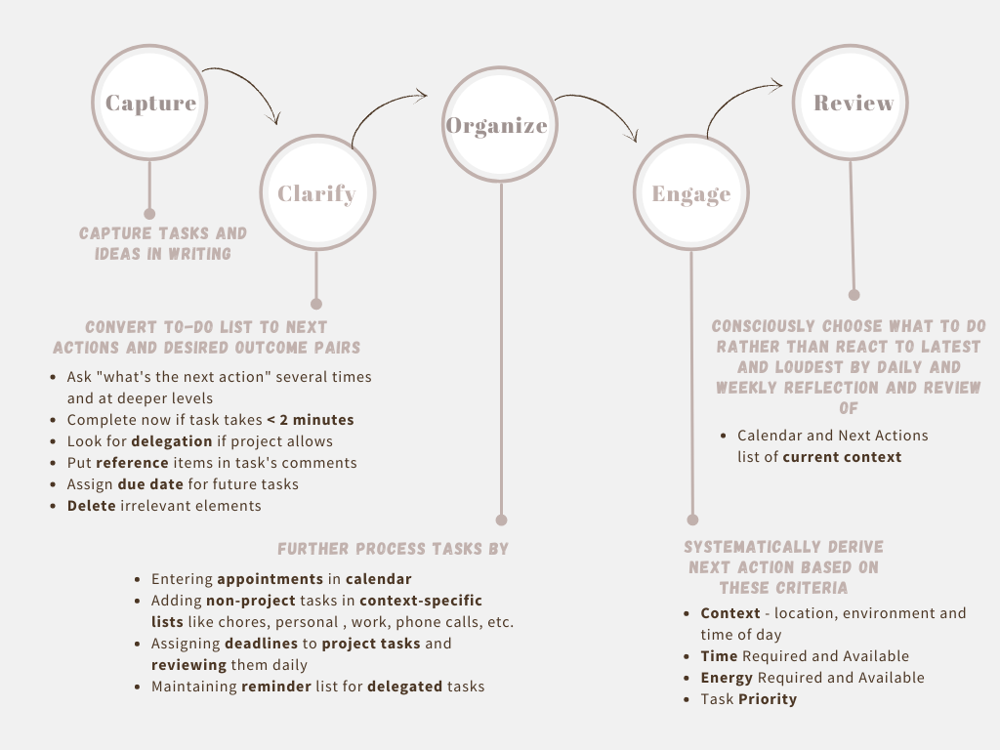

# How to Use the Getting Things Done (GTD) Method

Source: [https://www.makeuseof.com/productivity-101-use-getting-things-done-method/](https://www.makeuseof.com/productivity-101-use-getting-things-done-method/)

