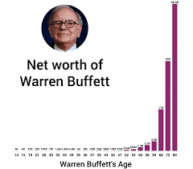

# [How To Double Your Money In The Market](https://www.youtube.com/watch?v=I1_wcYe6LGg)

## The Rule of 72 - How long do you think it would take for you to double your money in the market?

Teaches new investors about compound rates of return by employing the rule of 72.

**The formula:**

> **Years needed for money to double = 72/(% interest p.a.)**

Eg. FD interest rate = 6.2% p.a.
Time taken for money to double = 72/6.2 = 11.62 years

Try this: [https://scripbox.com/plan/fd-calculator](https://scripbox.com/plan/fd-calculator)

Enter FD amount as 10,000

Enter FD Period as 10 years

Enter Interest Rate as 6.2 %.

You'll see on the graph that at the end of 10 years, the **maturity value** is almost double that of your FD amount.

---------------

> Doubling one's money throughout their life multiple times is the only chance most people have of getting rich.

Doubling is a little harder to conceive of especially because of the time necessary to allow things to double.

> **Compounding - how small numbers become very big over time. Exponential growth rather than linear growth. Most important concept in investing.**

> **Average annual return** for the US stock market since World War II is **11.2%**.

Over the **74 year** period since the end of WW II (in 2021), the **total return percent** is **270,000%**.

-----------------------------

My calculation: 
> Compound interest formula: 

> **A = P (1 + r/n)^nt**

> let's say our Principal, P = $1

> r = 11.2% p.a ==> r/n = 0.112 (because, n = 1 year)

> t = 74 years

> ==> A = 1(1+0.112)^74 = 2580.79944237

> Total return percentage = 100 * (final amount - initial amount)/initial amount

> i.e. 100*(2580.79944237 - 1)/1 = 257979.944237% (approx. **257,980%**)

-----------------------------

**The accumulation of wealth is quiet and steady for most investors, but nevertheless it's extremely powerful.**

Your money could double and double over again with a simple portfolio of **stock and bond funds.**

The best part is that they're always adding. So, the new contributions may only be working on their first double, while older contributions may already be on their 2nd or 3rd rounds.

## Story from the creation of chess

The creator of Chess asked the king for a single grain of rice to be placed on the chess board, then 2 on the second, 4 on the 3rd and **each square doubling along the way.** All he wanted was the rice on the 64th square.

My calculation:

Answer would be: 2^63 (because only 1 grain of rice i.e. 2^0 is on the first square and not 2 grains i.e. 2^1, 2^0 on 1st square represents 2^(n-1))

## Dominos and the Empire State Building

If we lined up dominos and each domino gets 50% bigger, how many dominos before you can knock over the Empire State Building? **Answer: 32**

Almost 95% of all the money Warren Buffett made was made after his age of 60.

Warren Buffet's net worth:

1990 - $3.3 Bn.

2019 - $84.7 Bn.

His net worth has doubled 4.5 times in the last 30 years.

