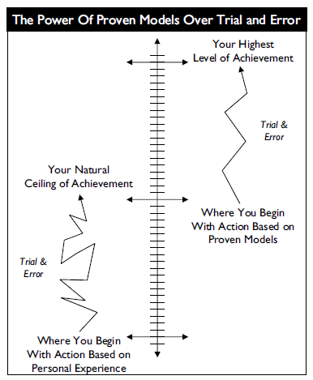
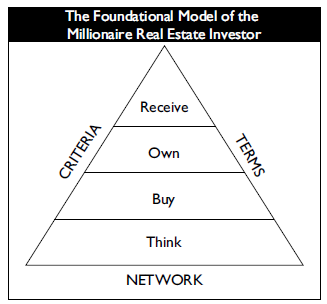
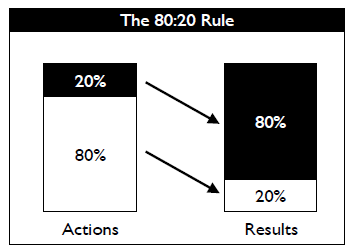

# [The Millionaire Real Estate Investor](https://www.goodreads.com/en/book/show/136205.The_Millionaire_Real_Estate_Investor)

Author: [Jay Papasan](https://www.jaypapasan.com/)

Contents
1. Charting the Course
    - Overview
    - Mythunderstandings
2. The Four Stages
    - Think a Million
    - Buy a Million
    - Own a Million
    - Receive a Million
3. Staying on Top
    - Putting it all together
    - Profiles of Real-life Millionaire Real Estate Investors

# Part One: Charting the Course

## Preface

Value money for the good it can do and not for what it can buy.

A big part of making money is about 
- work ethic
- patience
- having a good plan

> ***Little money comes easy - big money doesn't. The best outcomes - in any of life's endeavors - are almost always the result of a big plan powered by persistent effort over time.***

This book is about plans that create big money and succeed big. Real estate investing can be an awesome avenue to wealth.

## Introduction

*"Ideas are the beginning points of all fortunes."* - Napoleon Hill

### Are You Ready?

Real learning begins only when the student is open to the message.

What successful real-estate investors have in common:
- a burning desire and a readiness to 
    - change their lives
    - succeed on their own 
- without a
    - job
    - boss
    - pension plan
    - safety net

> *Their **drive** and **will to succeed** were **strong** enough to lead them to **do the right things day in and day out for months and years** as their **net worth steadily grew**. They were **ready** and they were **willing**. They got a **plan**, and they **implemented** it with **persistence** and **patience**.*

> ***There are no express elevators to the top in financial wealth building—just a long flight of steps. But it is a worthy journey, and reaching the top takes both patience and perseverance.***

### Money (Opportunity, in a more general sense) Lives On The Other Side of Fear

| Downside of fear                    | Upside of fear                               |
|:------------------------------------|:---------------------------------------------|
| Keeps us from getting what we want. | Makes us move faster than we ever imagined. |
| Prevents us from taking action.     | Gives us a positive focus that galvanizes us to take positive action. |
| Costs us precious opportunities.    | Points out what is most important to us. |
| Building block of future regret.    | Shows us what's matters most to us. |
| Blinds us to possibilities.         |     |
| Keeps us stuck.                     |     |

> ***Don't be afraid of fear. Acknowledge the fears I have, respect it, keep going, and move past it. Knowledge and insight can wash away more fear than anything else can. When we have the confidence that comes from understanding what to do, why we should do it, and how to do it right, most of our uncertainty will be left behind.***

### Anyone Can Do It - Not Everyone Will

Creating wealth is about recognizing that **wealth and riches are not the same**, that the gap between a good deal and a great deal is a vast chasm created by a lack of wisdom.

Confront self-doubt and step past it to the opportunities that lie unrealized before us.

Learn to think like a millionaire and take action.

## Overview

### Champions Take Luck Out Of The Game

We can't count on luck as it is beyond our control. 

> ***Champions make luck unnecessary by using proven strategies and time-tested models.***

How do we take luck out of the real real estate investing game? 
- First, we **learn to play** the game. 
- Second, we **learn to win** the game. 

Playing well and winning consistently both start with learning proven, time-tested models.

### Big Models - Big Goals - Big Success

The way we do things matters a lot to the outcome we achieve.

By being intentional and purposeful, we start to find success in the things we pursue.

When the outcome really does matter, this kind of careful approach makes all the difference. Our own learning and experience aren't always enough. We also need to learn from others - books, teachers, mentors and consultants. Learning from others is faster.

> ***If we look to the very best people in a field and study what they do, we often can repeat their success. The key is to learn how they achieved their goals and then understand why they did it that way. When we grasp these two things, we can start where they left off.***

Every success story worth exploring has three fundamental parts: 
- what a person thought he or she could do
- how that person did it
- what that person accomplished

This process — think, plan, produce — is basis for a success formula:

> ***Big Goals powered by Big Models lead to Big Success. The Big Goals push us to think big and see new possibilities for our life. Big Models make those possibilities more probable by giving our actions the foundation of proven, time-tested methods.***

Proven models can help us raise our level of achievement dramatically in a relatively short period of time.

Models help us avoid known stumbling blocks and reach our objectives faster than we could alone.

> ***To move forward in life, everyone has to learn from mistakes. The only question is whose: ours or those of the great achievers who lived before us?***

A proven model is simply a method or system used to produce desirable, repeatable results. Although no model can guarantee success, a proven model built on the best practices of high achievers almost always will maximize our chances for big success over time. They also give us confidence in our actions, an understanding of whether we are doing the right things.

Use these models to maximize the effectiveness and efficiency of our actions. That is how we get what we want more predictably, more of the time.

### Mornings With Michael

*"Michael encouraged me to keep a personal balance sheet, a one-page document that summarized my net worth. Each meeting he’d ask me one simple question: **'Gary, how can you make your net worth grow?'** One of the things I learned was the simple difference between financial riches and financial wealth. Being rich is about having money. You can have a job and be very rich. **The problem with this is that the money stops coming to you when you stop working for it. Financial wealth, by contrast, is about owning assets, such as businesses or real estate, that generate money for you.** Those assets can have aspects of a 'job' in that they demand some of your time, but the dollars they generate are generally disproportionate to the time you invest. Quickly, Michael taught me that I wanted to be financially wealthy instead of just rich."*

Most timeless truths are incredibly simple and obvious yet overlooked by those not ready to see.

### 3 Areas Of Focus For The Millionaire Real Estate Investor - Criteria, Terms, Network

> ***Focus is the key to great success, more than effort, experience, or even natural ability.***

Look at the highest achievers in any field and you’ll discover that they have powerful focus; just as important, you’ll learn that they **focus on the right things: the handful of truly important issues that make the biggest difference. They know what matters and when it matters most.**

The Dynamic Trio of Investing - Criteria, Terms, Network
- Our Criteria (**What** we buy) **identify potential** deals. Criteria define an opportunity.
    - **Opportunity filter**. Ultimately about identifying **predictable value**.
    - Immutable facts and **non-negotiable** things about the property. **Narrows our choices** to the properties that represent the **greatest opportunity and least risk**.
    - The things we ultimately list on our All Properties Bulletin when we're hunting for the next opportunity. Eg. Single-family/Multi-family property, construction, location, features, amenities.
    - Good criteria are the backbone of successful real-estate investing. Bad criteria (or no criteria at all) have been the downfall of many a would-be investor.
- Our Terms (**How** we buy it) **determine** the **real** deals. Terms define how we turn opportunities into deals. Terms are about **maximizing financial value**.
    - Once a property meets our Criteria, Terms determine its value to us both now and for the future. Terms are where a great deal can be created from even the most modest Criteria.
    - **Negotiable aspects** of a purchase, including everything from the **offer price, down payment, and interest rate to conveyances, occupancy, and closing costs.**
    - Skillful **negotiation** of Terms can lead to a **better equity position, improved cash flow**, and sometimes both. It’s about **how much money we need to acquire a property and close a transaction and how much the property will yield over time.**
    - It is about **understanding the financial fundamentals of a transaction**, knowing which elements are flexible, and being systematic about getting all you can from every deal. 
    - It’s also about knowing when to walk away. **You buy right and let the market go to work for you as opposed to buying less than right and hoping the market will save you.**
- Our Network (**Who** helps us) **supports all** our deals.
    - Network is a **leverage**: **the fact that we can accomplish more with qualified help than we can accomplish alone.**
    - From real estate agents to contractors and property managers, we will need help.
    - Network will come first in our investing career, as we'll rely on those people to help get our investment career launched safely, reliably, and profitably.

### 4 Stages Of Growth On The Path To A Million

The path of the Millionaire Real Estate Investor is a progression through four stages in the following order
- Think a Million
    - The bigger I think, the more I can accomplish.
    - What I hold in my mind is what shows up in my life.
- Buy a Million
    - Get a thorough understanding of the best models for investing in real estate and, more fundamentally, **an understanding of money: the ways it is made and the ways it can be lost**.
    - Equip ourselves with the working models we need to purchase investment properties with a market value of a million dollars or more.
    - Applies the power of Criteria, Terms, and Network to launch your career in investing.
- Own a Million
    - Have an equity position of a million dollars or more in our properties.
    - This is when we'll realize that the investing we've done has blossomed into a bona fide business. With this transformation comes a set of issues specific to that level of ownership.
        - Acquiring properties through credit potentially becomes more difficult, cash becomes a commodity, and managing your investments could require help from several quarters. 
    - Involves dealing with and often balancing cash flow with asset or equity buildup. 
        - May involve selling, trading up, or exchanging.
    - Involves understanding the surprisingly simple realities of tax and owner entity issues.
    - By understanding these issues from the beginning, we can plan for them.
- Receive a Million (Annual income of a million dollars from our investments)
    - A place where only the best have gone.
    - Pivotal to this stage is that our investment business be designed so that we can choose to get out of the day-to-day work and enjoy the benefits of what we've created.

