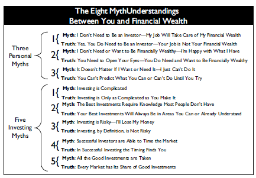
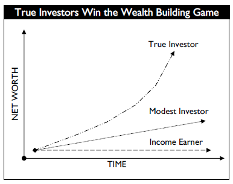
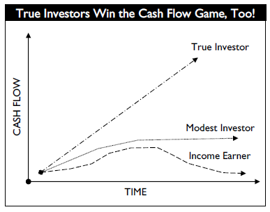
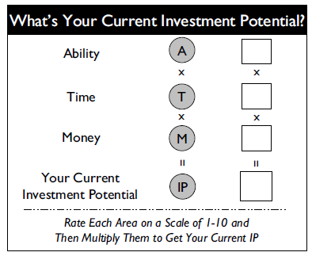

# [The Millionaire Real Estate Investor](https://www.goodreads.com/en/book/show/136205.The_Millionaire_Real_Estate_Investor)

Author: [Jay Papasan](https://www.jaypapasan.com/)

Contents
1. Charting the Course
    - Overview
    - Mythunderstandings
2. The Four Stages
    - Think a Million
    - Buy a Million
    - Own a Million
    - Receive a Million
3. Staying on Top
    - Putting it all together
    - Profiles of Real-life Millionaire Real Estate Investors

# Part One: Charting the Course

## Preface

Value money for the good it can do and not for what it can buy.

A big part of making money is about 
- work ethic
- patience
- having a good plan

> ***Little money comes easy - big money doesn't. The best outcomes - in any of life's endeavors - are almost always the result of a big plan powered by persistent effort over time.***

This book is about plans that create big money and succeed big. Real estate investing can be an awesome avenue to wealth.

## Introduction

*"Ideas are the beginning points of all fortunes."* - Napoleon Hill

### Are You Ready?

Real learning begins only when the student is open to the message.

What successful real-estate investors have in common:
- a burning desire and a readiness to 
    - change their lives
    - succeed on their own 
- without a
    - job
    - boss
    - pension plan
    - safety net

> *Their **drive** and **will to succeed** were **strong** enough to lead them to **do the right things day in and day out for months and years** as their **net worth steadily grew**. They were **ready** and they were **willing**. They got a **plan**, and they **implemented** it with **persistence** and **patience**.*

> ***There are no express elevators to the top in financial wealth building—just a long flight of steps. But it is a worthy journey, and reaching the top takes both patience and perseverance.***

### Money (Opportunity, in a more general sense) Lives On The Other Side of Fear

| Downside of fear                    | Upside of fear                               |
|:------------------------------------|:---------------------------------------------|
| Keeps us from getting what we want. | Makes us move faster than we ever imagined. |
| Prevents us from taking action.     | Gives us a positive focus that galvanizes us to take positive action. |
| Costs us precious opportunities.    | Points out what is most important to us. |
| Building block of future regret.    | Shows us what's matters most to us. |
| Blinds us to possibilities.         |     |
| Keeps us stuck.                     |     |

> ***Don't be afraid of fear. Acknowledge the fears I have, respect it, keep going, and move past it. Knowledge and insight can wash away more fear than anything else can. When we have the confidence that comes from understanding what to do, why we should do it, and how to do it right, most of our uncertainty will be left behind.***

### Anyone Can Do It - Not Everyone Will

Creating wealth is about recognizing that **wealth and riches are not the same**, that the gap between a good deal and a great deal is a vast chasm created by a lack of wisdom.

Confront self-doubt and step past it to the opportunities that lie unrealized before us.

Learn to think like a millionaire and take action.

## Overview

### Champions Take Luck Out Of The Game

We can't count on luck as it is beyond our control. 

> ***Champions make luck unnecessary by using proven strategies and time-tested models.***

How do we take luck out of the real real estate investing game? 
- First, we **learn to play** the game. 
- Second, we **learn to win** the game. 

Playing well and winning consistently both start with learning proven, time-tested models.

### Big Models - Big Goals - Big Success

The way we do things matters a lot to the outcome we achieve.

By being intentional and purposeful, we start to find success in the things we pursue.

When the outcome really does matter, this kind of careful approach makes all the difference. Our own learning and experience aren't always enough. We also need to learn from others - books, teachers, mentors and consultants. Learning from others is faster.

> ***If we look to the very best people in a field and study what they do, we often can repeat their success. The key is to learn how they achieved their goals and then understand why they did it that way. When we grasp these two things, we can start where they left off.***

Every success story worth exploring has three fundamental parts: 
- what a person thought he or she could do
- how that person did it
- what that person accomplished

This process — think, plan, produce — is basis for a success formula:

> ***Big Goals powered by Big Models lead to Big Success. The Big Goals push us to think big and see new possibilities for our life. Big Models make those possibilities more probable by giving our actions the foundation of proven, time-tested methods.***

Proven models can help us raise our level of achievement dramatically in a relatively short period of time.

Models help us avoid known stumbling blocks and reach our objectives faster than we could alone.

> ***To move forward in life, everyone has to learn from mistakes. The only question is whose: ours or those of the great achievers who lived before us?***

A proven model is simply a method or system used to produce desirable, repeatable results. Although no model can guarantee success, a proven model built on the best practices of high achievers almost always will maximize our chances for big success over time. They also give us confidence in our actions, an understanding of whether we are doing the right things.

Use these models to maximize the effectiveness and efficiency of our actions. That is how we get what we want more predictably, more of the time.

### Mornings With Michael

*"Michael encouraged me to keep a personal balance sheet, a one-page document that summarized my net worth. Each meeting he’d ask me one simple question: **'Gary, how can you make your net worth grow?'** One of the things I learned was the simple difference between financial riches and financial wealth. Being rich is about having money. You can have a job and be very rich. **The problem with this is that the money stops coming to you when you stop working for it. Financial wealth, by contrast, is about owning assets, such as businesses or real estate, that generate money for you.** Those assets can have aspects of a 'job' in that they demand some of your time, but the dollars they generate are generally disproportionate to the time you invest. Quickly, Michael taught me that I wanted to be financially wealthy instead of just rich."*

Most timeless truths are incredibly simple and obvious yet overlooked by those not ready to see.

### 3 Areas Of Focus For The Millionaire Real Estate Investor - Criteria, Terms, Network

> ***Focus is the key to great success, more than effort, experience, or even natural ability.***

Look at the highest achievers in any field and you’ll discover that they have powerful focus; just as important, you’ll learn that they **focus on the right things: the handful of truly important issues that make the biggest difference. They know what matters and when it matters most.**

The Dynamic Trio of Investing - Criteria, Terms, Network
- Our Criteria (**What** we buy) **identify potential** deals. Criteria define an opportunity.
    - **Opportunity filter**. Ultimately about identifying **predictable value**.
    - Immutable facts and **non-negotiable** things about the property. **Narrows our choices** to the properties that represent the **greatest opportunity and least risk**.
    - The things we ultimately list on our All Properties Bulletin when we're hunting for the next opportunity. Eg. Single-family/Multi-family property, construction, location, features, amenities.
    - Good criteria are the backbone of successful real-estate investing. Bad criteria (or no criteria at all) have been the downfall of many a would-be investor.
- Our Terms (**How** we buy it) **determine** the **real** deals. Terms define how we turn opportunities into deals. Terms are about **maximizing financial value**.
    - Once a property meets our Criteria, Terms determine its value to us both now and for the future. Terms are where a great deal can be created from even the most modest Criteria.
    - **Negotiable aspects** of a purchase, including everything from the **offer price, down payment, and interest rate to conveyances, occupancy, and closing costs.**
    - Skillful **negotiation** of Terms can lead to a **better equity position, improved cash flow**, and sometimes both. It’s about **how much money we need to acquire a property and close a transaction and how much the property will yield over time.**
    - It is about **understanding the financial fundamentals of a transaction**, knowing which elements are flexible, and being systematic about getting all you can from every deal. 
    - It’s also about knowing when to walk away. **You buy right and let the market go to work for you as opposed to buying less than right and hoping the market will save you.**
- Our Network (**Who** helps us) **supports all** our deals.
    - Network is a **leverage**: **the fact that we can accomplish more with qualified help than we can accomplish alone.**
    - From real estate agents to contractors and property managers, we will need help.
    - Network will come first in our investing career, as we'll rely on those people to help get our investment career launched safely, reliably, and profitably.

### 4 Stages Of Growth On The Path To A Million

The path of the Millionaire Real Estate Investor is a progression through four stages in the following order
- Think a Million
    - The bigger I think, the more I can accomplish.
    - What I hold in my mind is what shows up in my life.
- Buy a Million
    - Get a thorough understanding of the best models for investing in real estate and, more fundamentally, **an understanding of money: the ways it is made and the ways it can be lost**.
    - Equip ourselves with the working models we need to purchase investment properties with a market value of a million dollars or more.
    - Applies the power of Criteria, Terms, and Network to launch your career in investing.
- Own a Million
    - Have an equity position of a million dollars or more in our properties.
    - This is when we'll realize that the investing we've done has blossomed into a bona fide business. With this transformation comes a set of issues specific to that level of ownership.
        - Acquiring properties through credit potentially becomes more difficult, cash becomes a commodity, and managing your investments could require help from several quarters. 
    - Involves dealing with and often balancing cash flow with asset or equity buildup. 
        - May involve selling, trading up, or exchanging.
    - Involves understanding the surprisingly simple realities of tax and owner entity issues.
    - By understanding these issues from the beginning, we can plan for them.
- Receive a Million (Annual income of a million dollars from our investments)
    - A place where only the best have gone.
    - Pivotal to this stage is that our investment business be designed so that we can choose to get out of the day-to-day work and enjoy the benefits of what we've created.

## (3+5) Mythunderstandings

> *"Fears are educated into us, and can, if we wish, be educated out." - Dr. Karl A. Menninger*

> *"There’s never a perfect time to start, so people should just start. Because there are always deals. You just learn your market and always buy below value, and you can’t go wrong." - Jimmy and Linda McKissack, Millionaire Real Estate Investors, Highland Village, TX*

Fears and doubts undermine our confidence and our actions and ultimately can drive a powerful wedge between us and our dreams.

### PERSONAL MYTH 1: I don't need to be an investor — my job will take care of my financial wealth.
### TRUTH: Yes, I do need to be an investor - my job is not my financial wealth.

Almost without fail, at one time or another, high-achieving investors had to confront a persistent fear or a nagging doubt about investing that later proved to be unfounded.

The image I have of myself as an investor becomes the lens through which I see the world of investing, and that self-image will either guide or misguide me.

Only a tiny percentage of people, probably less than 1 percent, like highly paid athletes, actors, musicians,
and executives make enough income from their jobs to become financially wealthy.

Prosperity can provide a false sense of security and makes people think they don't need to invest.

A high income doesn’t necessarily translate to financial wealth if I spend propotionately and don't invest.

  

> *No matter how I make my money or how much I make, if I don’t take an active role in my financial planning and money management, I'm at grave risk of seeing my investments underperform or, worse, be lost. Not acting like an investor or not being active in my investments is one of the most financially foolish positions I can take.*

Choosing the path to financial wealth will require that I live off less than I make and consume less than the world tells me to. I can’t let the media and advertisers set my values for me. Don’t get caught keeping up with the Joneses. 

> *The faster I reach a position where I can begin my investment career, the faster I'll be able to achieve financial independence. Start early and start small.*

Earning money in a job and saving some of it or sticking it in the company retirement plan does not make me an investor.

> Wake up in the morning telling myself, **"I'm an investor. I'm building financial wealth. Today's the day I could find an opportunity and make a deal!"**

### PERSONAL MYTH 2: I don't need or want to be financially wealthy - I'm happy with what I have.
### TRUTH: I need to open my eyes - I do need and want to be financially wealthy.

I cannot predict what life will offer down the road for good or for bad. Some needs are also about seizing valuable opportunities to move forward in life and that sometimes I may want money beyond my current needs and necessities. It is really difficult to find more money just because I all of a sudden want or need it. Small money comes easily — big money does not. Becoming an investor — someone who pursues financial wealth building every day — is all about preparing for the minimums and maximums in my life. 

There are two types of people in the world:
- First, there are those who (because they chose not to build financial wealth) have limited opportunities to care for themselves and their loved ones. 
- Second, there are those who (because they chose to pursue financial wealth as an investor) have much larger opportunities to care not only for themselves and their loved ones but also for so much more. 

It’s the difference between a focus on the minimums life can require and a focus on the maximums life can offer. It comes down to what kind of person you want to be and the life you want to lead.

Most people are taught to live within their means, but instead of forgetting my dreams and living within my means, try pursuing the means to live my dreams.

### PERSONAL MYTH 3: It doesn't matter if I want or need it - I just can't do it.
### TRUTH: I can't predict what I can or can't do until I try.

People who would rather not set themselves up for disappointment by going for it are the very ones destined for disappointment.

The moment I buy into the idea that I can’t achieve financial wealth, I put myself on the path to complacency, compromise, and, ultimately, regret.

There are basically two ways people view their financial potential. There are those who think in terms of 
- what’s financially probable
- what’s financially possible

Probability thinkers base their view of their future financial selves on their past history and current capabilities. As a result, when they are presented with a new opportunity that doesn’t fit their preconceived notions of their financial potential, they often conclude that they simply "can't do it." For them, their financial future is determined, predictable, and ultimately static.

Possibilities thinkers, in contrast, rarely utter the words "I can't do it." They set aside any limiting notions they might have about their financial potential and base their view of their future financial selves on what they imagine themselves to be capable of accomplishing. They take into account that they might have to learn new things, acquire new skills, or change their habits to reach their full financial potential. For them, their financial future is flexible, active, and, ultimately, alive.

Many of the real estate investors told stories about how before becoming investors they would have been voted least likely to become financially wealthy by the world.

Most big things start small. In the end, what I actually need to become a successful investor is a lot less than what I think I need.

Over time, each of those three areas can grow and my power as an investor will increase.

> ***The hidden secret is that the three factors are multipliers of each other. My self-assessment in these three areas often dictates my strategy.***

If I double my time, even if my ability and money remain the same, I double my current investment potential.  
If I double my ability and my time, I quadruple my current investment potential.  
If I double each of the three (2 x 2 x 2 = 8), I increase my current investment potential eightfold.

> *"It takes patience and perseverance, but you can make it big on little deals. You’re not going to get rich overnight, but you will slowly." - Will Stewart, Millionaire Real Estate Investor, Sugar Hill, GA*

Time and money often are strongly connected, in that time can be used to earn money and money can be spent to buy time.

Similarly, ability can be had with time (think books and seminars) or bought with money (think consultants).

### INVESTING MYTH 1: Investing is Complicated
### TRUTH: Investing is only as complicated as I make it

Investing is complicated, but not as complicated as people make it out to be. The trick is to step back and identify the aspects that matter the most.

> *"People try to overcomplicate real estate investing. You can’t pay $5,000 a month if you’re not making $5,000 a month." - Jimmy Napier, Millionaire Real Estate Investor, Chipley, FL*

> ***Learning is that it is always progressive. It builds on itself step by step. On a practical basis, what I know is that I never need to know everything in order to do something. I just need to know the right things to do at any given moment. Over time, given enough chances to study and experience something, I naturally and progressively will learn everything I need to know to do it well. That is how I become an expert.***

Great investing can be learned if I take it slowly, start with the basics, and follow proven models.

### INVESTING MYTH 2: The best investments require knowledge most people don't have
### TRUTH: My best investments will always be in areas I can or already do understand

> ***Investing in what I don’t know or understand isn’t investing at all. Doing that is like taking a shot in the dark, and I'll need luck to hit anything worthwhile, much less my intended target. To me, the real nature of investing is always to invest in what I know and fully understand. Choose an area that I already know or one that greatly interests me and commit myself to becoming an expert in it over time.***

> *"Real estate provides investors with a tangible investment that is easy for anyone to understand. If profits were lower than expected this quarter, was that because it was a colder-thanusual winter, driving up heating expenses? Or did a pipe burst? These are issues that any investor can understand." - Paul Morris, Millionaire Real Estate Investor, West Hollywood, CA*

### INVESTING MYTH 3: Investing is risky - I'll lose my money.
### TRUTH: Investing, by definition, is not risky

> *"Invest—To commit (money or capital) in order to gain a financial return."*

> ***Great investors don’t think of investing as risky. For them it’s not about ignoring risk; instead, it’s about following sound investment principles and models. By doing that, they take the risk out of the game.***

In investing, I make my money going in. In most cases this means buying something of value for terms that immediately create a profit for me. This way I go into the deal knowing I don’t need the market to bail me out. These are the "no-risk" deals.

It is about having sound criteria, the patience to find the right opportunity, and a willingness to take the correct action quickly. Always minimize risk while maximizing return. Investing can never be absolutely risk-free, but it doesn't have to be risky.

> *"One great thing about real estate is that it’s forgiving if you keep it." - Will Stewart, Millionaire Real Estate Investor, Sugar Hill, GA*

### INVESTING MYTH 4: Successful investors are able to time the market
### TRUTH: In successful investing, the timing finds me

I can't truly time anything. When people say that timing is important, they are correct. Timing is not only important, it's critical to investment success. 

The economy is cyclical. Markets are cyclical. And buying and selling opportunities are created by the ebb and flow of the cycles. 

Finding the best time to buy or sell is called timing. What is misunderstood is the way timing actually is accomplished.

| What timing is NOT                                   | What timing is                                                 |
|:-----------------------------------------------------|:---------------------------------------------------------------|
| Active observation                                   | Being in the game                                              |
| Being reactive to opportunity (Pasive, then active)  | Active-active all the time                                     |

The best deals come from the best opportunities, and the best opportunities go fast. This is where the phrase "a window of opportunity" comes from. Investors recognize and seize these opportunities because they are always engaged in the game and close to the action.

> ***"Generally, real estate is cyclical. You have to buy in a way that lets you afford the cycles. And you have to know where you are in the cycle." - Charles Brown, Millionaire Real Estate Investor, Austin, TX***

> ***"There is no crystal ball that tells you what the market will do. So you need to know the fundamentals of a property: what it will do in a good market, and what it will do in a bad market." - Robert Kiyosaki, Best-selling author and millionaire investor, Scottsdale, AZ***

**Successful timing is made possible by time spent on the task over time.** Being active and engaged doesn't mean I'm always buying and selling. What it does mean is that I'm consistently searching with my Criteria, watchful for the moment when opportunity surfaces. 

This is what we mean when we say that timing finds us. I can never know the absolute best time to act except after the fact. 

> Better to look at it like this: ***Any time an opportunity meets my strict Criteria and I act, I have timed the market successfully. Timing isn't about being in the right place at the right time; it's about being in the right place all the time.***

> "It doesn’t matter what the market's doing. You’re going to buy what the market gives you." -  Bill O'Kane, Millionaire Real Estate Investor, Chicago, IL

### INVESTING MYTH 5: All the good investments are taken
### TRUTH: Every market, in every time, has its share of good investments

> ***Opportunities are always there in every market and in every time.***

Rest assured: All the good investments will be taken. The only question is by whom. As simple as it sounds, the truth is that those who take them are those who best understand the conditions that create them.

***There are two fundamental forces at work — economic ones and personal ones — and they are always present, always at work, and always influencing the marketplace.***
- Basic economic forces show up in the form of things such as 
    - job growth
    - interest rates
    - population shifts
    - area revitalization. 
    - These are the things most people think of when they think of the forces that create investment opportunities.
- What is often overlooked, however, is a second set of human, or personal, forces that are always present and can create additional and significant investment opportunities. Some arise from 
    - positive circumstances such as 
        - relocation
        - marriage
        - family growth. 
    - Others arise from negative conditions such as 
        - divorce
        - death
        - debt. 

> ***In my experience, those who declare that all the good deals are taken are almost always overlooking this second set of human forces and the unique opportunities they create. Because personal forces are always at work, these opportunities are constantly being created.***

The opportunities are gone only for those who assume they are. I'm too late only if I believe I'm too late.

> *"When markets go down, opportunities go up for smart real estate investors—if you know what you're doing. I would much rather play the downturn than the upturn." - Harry S. Dent, Jr., Best-selling author and economist, Burlington, VT*

## The Law of Momentum: Compounding My Success

Everything big starts small. Step past short-term thinking and look at the larger implications of small investments.

> ***"There's room for the little fellow in this business. Houses are too small for big guys to get started in." - Jack Miller, Millionaire Real Estate Investor, Reno, NV***

> ***Compounding -  What starts small and grows slowly builds in size and momentum over time.***

> ***Any form of investing is about putting my money to work and letting it work for me over time.*** 

Real estate investing is no different. What distinguishes it from other investments is that the **original value of my asset tends to be large and, through the magic of leverage, can be purchased for less**. 

For example, if I bought a $100,000 investment house each year by putting $10,000 down and achieved only a modest 5 percent rate of return on the total value of the assets, I'd be a millionaire in less than a decade.

> ***With each asset you add to your portfolio, your portfolio grows. As your investments grow, so do your buying power and your investment knowledge. That’s the foundation for bigger and ever-increasing investments.***

The trick is to get started and then let the power of growth on growth take you higher.

------------------------------------------------------------------------------------------------------------------------------

# Part Two: The Four Stages

