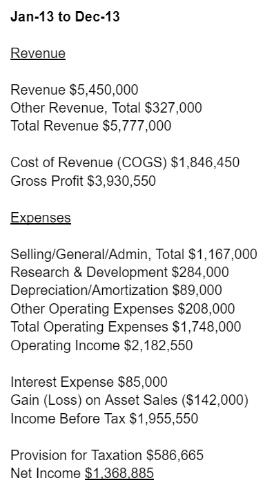
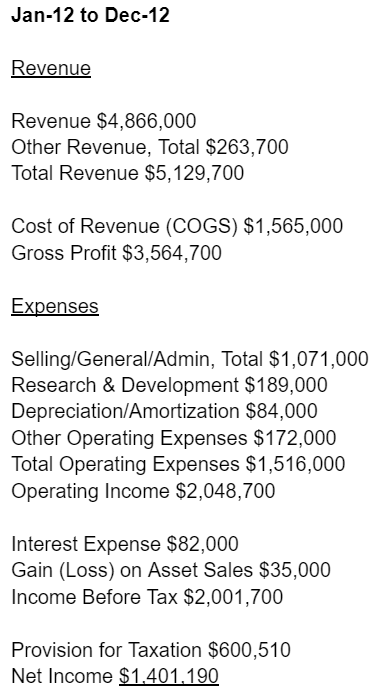
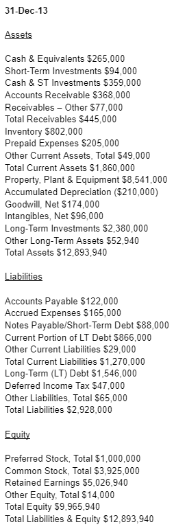
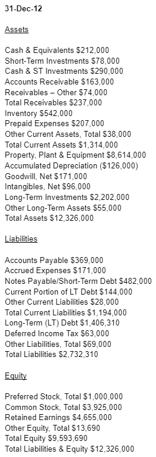
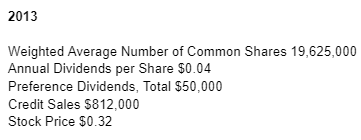
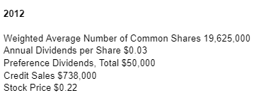

# [Ratio Analysis Fundamentals - How 17 Financial Ratios Can Allow You to Analyse Any Business on the Planet](https://www.goodreads.com/en/book/show/19031273-ratio-analysis-fundamentals)

Author: Axel Tracy

## The 17 Financial Ratios

| Profitability | Liquidity             | Leverage                                      | Efficiency | Valuation |
|:--------------|:----------------------|:----------------------------------------------|:---------------|:-----------------|
| Profit Margin | Current Ratio         | Debt Ratio                                    | Inventory Turnover | Earnings per share (EPS) |
| Gross Profit Margin | Acid-test Ratio | Debt to Equity Ratio                          | Accounts Receivable Turnover | Price/Earnings (P/E) Ratio |
| Return on Assets | Cash Ratio         | Times Interest Earned/Interest Coverage Ratio | Days' Sales in Receivables | Dividend Yield |
| Return on Equity |                    |                                               | | Payout Ratio |

## Example Financial Statements

### Income Statements

  

### Balance Statements

 

### Other Company Information

 

